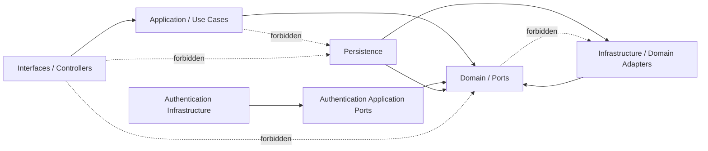

# Architecture Protection

Version: 1.1
Sprint: 7.5B, amended by Sprint 8.4
Status: Enforced

## Purpose

This document defines how BachatSetu converts its architecture into build-breaking rules. The architectural rationale and system topology remain in [System Architecture](system-architecture.md); this guide owns only executable boundary enforcement, violation handling, and extension practices.

`mvn clean verify` is the authoritative architecture check. A pull request is not mergeable when an architecture test fails.

## Philosophy

Architecture boundaries are contracts, not conventions. Compile-time dependencies must point inward, framework details must remain replaceable, and persistence representations must not become public module models. ArchUnit validates compiled dependencies while the source-policy test covers syntax, such as wildcard imports, that bytecode does not retain.

Rules are intentionally independent of feature completeness. Application and interfaces packages may be absent today; adding a violating class to either future layer activates the existing rules without requiring another protection sprint.

## Dependency Graph



Framework and Java library dependencies are omitted from the diagram. They do not reverse the application dependency direction.

## Enforced Rules

| Area | Enforced policy |
| --- | --- |
| Domain | No dependency on application, interfaces, infrastructure, configuration, Spring, Hibernate, or JPA. |
| Application | No dependency on interfaces, infrastructure, configuration, or persistence entities. Empty until application use cases are introduced. |
| Interfaces | A class named `*Controller` cannot depend on domain, infrastructure, or repositories. |
| Infrastructure | General adapters point to domain ports. Authentication infrastructure may implement only `auth.application.port` contracts and may not access use cases, commands, queries, events, services, interfaces, or controllers. |
| Persistence | `@Entity` classes reside under `infrastructure.persistence.entity`; entity types cannot escape the persistence package. |
| Repositories | Every concrete `*RepositoryAdapter` implements an interface named `*Repository` in a `domain.port` package. |
| Modules | Top-level backend package slices must remain free of dependency cycles. |
| APIs | Production code cannot access `System.out` or `System.err`, call `Thread.sleep`, use legacy `Date`, use field injection, or call `BigDecimal(double)`. |
| Imports | Production Java source cannot contain wildcard imports. |

## Allowed Dependencies

- Domain packages may use their own domain types, the shared domain kernel, and the Java standard library.
- Application packages may coordinate domain aggregates and ports through explicit use-case boundaries.
- Interfaces packages may use application contracts and delivery-framework types.
- Infrastructure packages may use domain ports, persistence components, Spring, Hibernate, MapStruct, and provider SDKs required by an adapter. Authentication adapters may additionally implement their narrowly owned application outbound ports.
- Persistence mappers and adapters may translate between domain models and private JPA entities.

## Forbidden Dependencies

- Domain to Spring, JPA, Hibernate, configuration, application, interfaces, or infrastructure.
- Application to JPA entities, Spring Data repositories, adapters, or controllers.
- Controller to aggregates, domain repository ports, Spring Data repositories, JPA entities, or adapters.
- Any package outside persistence to a persistence entity.
- Infrastructure to application use cases, commands, queries, events, services, or interfaces. Only authentication application-port contracts are allowed for `infrastructure.auth`.
- Cyclic top-level module dependencies.

## Examples

Allowed:

```text
PaymentRepositoryAdapter -> PaymentRepository -> Payment
BCryptHashingAdapter -> HashingPort -> OtpHash
Controller -> Application use case -> Domain port
Persistence mapper -> JPA entity + Domain aggregate
```

Rejected:

```text
Payment aggregate -> Spring annotation
Application handler -> PaymentJpaEntity
Controller -> PaymentRepository
Domain factory -> infrastructure mapper
Group module <-> Payment module cycle
```

## Common Violations

| Failure | Typical cause | Correction |
| --- | --- | --- |
| Domain framework dependency | A Spring or JPA annotation was added to a domain type. | Move framework configuration to an adapter or configuration package. |
| Persistence entity escaped | An application or interface signature exposes a `*JpaEntity`. | Map to a domain model or application contract inside persistence. |
| Repository adapter contract | A concrete adapter does not implement a domain repository port. | Define or use the owning domain port, then implement it in the adapter. |
| Controller repository access | A controller injects a domain or Spring Data repository. | Introduce the appropriate application use case in its designated sprint. |
| Package cycle | Two top-level modules import one another. | Replace direct coupling with an owned port or domain event boundary. |
| Forbidden API | Production code uses blocking sleeps, console output, field injection, legacy dates, or unsafe decimal construction. | Use project logging, constructor injection, `java.time`, scheduling abstractions, and exact decimal inputs. |

## Adding A Module Safely

1. Create the domain package first and keep it dependent only on its own domain types and the shared kernel.
2. Put repository contracts in the module's `domain.port` package.
3. Add application orchestration only when its sprint is approved; do not expose persistence types.
4. Add delivery code under interfaces and depend only on application contracts.
5. Implement outbound ports under infrastructure; keep JPA entities under `infrastructure.persistence.entity`.
6. Run `mvn clean verify` before review and inspect the complete dependency path in any ArchUnit failure.
7. Add a new architecture rule when introducing a genuinely new boundary. Do not weaken an existing rule to accommodate a shortcut.

## Test Ownership

Architecture tests live in `src/test/java/in/bachatsetu/backend/architecture/validation`:

- `LayerDependencyArchitectureTest` protects inward layer direction and controller boundaries.
- `ForbiddenDependencyArchitectureTest` protects domain independence and application/entity isolation.
- `PackageDependencyArchitectureTest` protects module cycles and persistence entity visibility.
- `PersistenceArchitectureTest` protects JPA placement and repository-port implementation.
- `ForbiddenApiArchitectureTest` protects production bytecode from prohibited APIs and injection styles.
- `ProductionSourcePolicyTest` protects source-only import policy.

Test-scoped ArchUnit is the only dependency introduced by this protection layer. CI already executes `mvn clean verify`, so no separate architecture command or workflow is required.

## Rule Evolution

Changes to these rules require architecture review. A suppression is acceptable only when the dependency is unavoidable, narrowly identified, and documented here. Broad package exclusions and temporary bypasses are not permitted.
