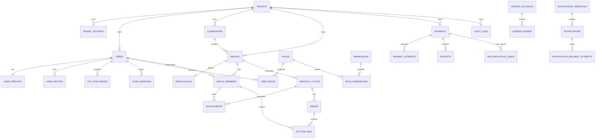

# PostgreSQL Database Architecture

This document defines the production-grade PostgreSQL database architecture for BachatSetu. It is intentionally documentation-only. It does not contain Java code, Flutter code, SQL migration scripts, or implementation DDL.

BachatSetu is India's Community Savings Platform. The first module is Bhishi, also known as ROSCA or Committee. The database must support future modules such as women's self help groups, apartment maintenance, society collection, festival collection, temple donations, wedding collection, travel savings, NGO collections, and community funds without a foundational redesign.

## 1. Database Design Philosophy

The database design prioritizes financial correctness, tenant isolation, auditability, operational scale, and evolutionary product growth.

Design principles:

- Use PostgreSQL as the system of record.
- Normalize core transactional data to protect correctness.
- Avoid premature microservice-style database splitting.
- Keep module boundaries clear through schema ownership and naming.
- Treat payments, receipts, installments, draws, bids, and audit records as high-integrity data.
- Keep financial history append-friendly and correction-friendly.
- Prefer explicit foreign keys for core relationships.
- Use soft delete for business records where history matters.
- Use hard delete only for short-lived technical records when retention rules allow it.
- Design for 10 million users, but implement the simplest structure that can scale predictably.

Key decision:

BachatSetu should begin with one PostgreSQL database, multiple logical schemas, and shared tenant-scoped tables. This keeps operations manageable while preserving future separation options.

## 2. Naming Conventions

### General

- Tables: plural snake_case.
- Columns: snake_case.
- Primary keys: `id`.
- Foreign keys: `{referenced_table_singular}_id`.
- Timestamps: `{event}_at`.
- Dates without time: `{event}_date`.
- Booleans: `is_`, `has_`, or `can_` prefix.
- Amounts in INR: `{name}_amount_paise`.
- Status columns: `status`.
- External references: `{provider}_reference` or `external_reference`.

### Indexes And Constraints

- Indexes: `idx_{table}_{columns}`
- Unique constraints: `uk_{table}_{columns}`
- Foreign keys: `fk_{source_table}_{target_table}`
- Check constraints: `ck_{table}_{rule}`

Explanation:

Predictable names make production debugging, migration review, and query-plan analysis faster.

## 3. Schema Strategy

Use logical PostgreSQL schemas by bounded context.

| Schema | Purpose |
| --- | --- |
| platform | Tenants, settings, global configuration |
| identity | Users, roles, permissions, devices, OTP |
| community | Groups, group members, monthly cycles, installments, draws, auction bids |
| finance | Payments, receipts, ledger-oriented records, reconciliations |
| notification | Notifications, templates, delivery attempts |
| audit | Audit logs and activity logs |

Explanation:

Schemas provide separation without operational overhead. They make ownership clearer and allow future extraction of high-load contexts.

## 4. Core Modules

Initial modules:

- Authentication
- Users
- Roles
- Permissions
- User Devices
- OTP
- Groups
- Group Members
- Monthly Cycles
- Installments
- Payments
- Receipts
- Draws
- Auction Bids
- Notifications
- Audit Logs
- Settings
- Activity Logs

Foundational future-ready modules:

- Tenants
- Communities
- Payment reconciliation
- Ledger accounts and ledger entries
- Notification templates and delivery attempts

Explanation:

Even if the MVP starts with simpler flows, the database should reserve clean ownership for tenant, finance, notification, and audit data from the beginning.

## 5. Complete Entity List

Platform:

- tenants
- tenant_settings
- system_settings

Identity:

- users
- user_profiles
- roles
- permissions
- user_roles
- role_permissions
- user_devices
- otp_challenges
- login_sessions

Community:

- communities
- groups
- group_rules
- group_members
- monthly_cycles
- installments
- draws
- auction_bids

Finance:

- payments
- payment_attempts
- receipts
- ledger_accounts
- ledger_entries
- reconciliation_cases

Notification:

- notification_templates
- notifications
- notification_delivery_attempts

Audit:

- audit_logs
- activity_logs

## 6. Entity Relationships

Primary relationship model:

- A tenant owns users, communities, groups, settings, financial records, notifications, and audit records.
- A user may have one user profile and many devices.
- A user may receive roles through user_roles.
- A role has many permissions through role_permissions.
- A community belongs to one tenant and can contain many groups.
- A group belongs to one tenant and optionally one community.
- A group has rules, members, monthly cycles, draws, auction bids, and installments.
- A group member connects one user to one group.
- A monthly cycle belongs to one group.
- An installment belongs to one monthly cycle and one group member.
- A payment may settle one or more installments through business-level references.
- A receipt belongs to a confirmed payment.
- A draw belongs to one monthly cycle.
- An auction bid belongs to one draw and one group member.
- Ledger entries are linked to payments, receipts, payouts, adjustments, or reversals through reference fields.
- Notifications target users, members, or operational actors.
- Audit logs record sensitive actions across all modules.

## 7. ER Diagram

## 8. Table Catalog

### Platform Tables

| Table | Purpose | Primary Key | Foreign Keys | Important Columns | Audit Columns | Soft Delete Strategy | Index Recommendations |
| --- | --- | --- | --- | --- | --- | --- | --- |
| platform.tenants | SaaS tenant boundary for organizations or operating units | id | None | tenant_code, legal_name, display_name, status, plan_code, timezone, default_locale | created_at, updated_at, created_by, updated_by, version | Soft delete with is_deleted and deleted_at; never physically delete active financial tenants | Unique tenant_code; index status; index created_at |
| platform.tenant_settings | Tenant-specific feature and operational settings | id | tenant_id to tenants | setting_key, setting_value, value_type, is_encrypted | created_at, updated_at, created_by, updated_by, version | Soft delete retired settings | Unique tenant_id plus setting_key; index tenant_id |
| platform.system_settings | Platform-wide settings controlled by BachatSetu | id | None | setting_key, setting_value, value_type, environment, is_encrypted | created_at, updated_at, created_by, updated_by, version | Soft delete retired settings | Unique environment plus setting_key |

### Identity Tables

| Table | Purpose | Primary Key | Foreign Keys | Important Columns | Audit Columns | Soft Delete Strategy | Index Recommendations |
| --- | --- | --- | --- | --- | --- | --- | --- |
| identity.users | Login-capable platform users | id | tenant_id to tenants | mobile_number_hash, email_hash, status, password_hash, last_login_at, verification_status | created_at, updated_at, created_by, updated_by, version | Soft delete with anonymization option after retention review | Unique tenant_id plus mobile_number_hash; unique tenant_id plus email_hash where present; index status |
| identity.user_profiles | Human profile information for users | id | tenant_id to tenants, user_id to users | full_name, preferred_name, date_of_birth, gender, language_code, profile_photo_reference | created_at, updated_at, created_by, updated_by, version | Soft delete follows user lifecycle; PII minimization required | Unique user_id; index tenant_id plus name search strategy |
| identity.roles | Role definitions scoped by tenant or platform | id | tenant_id to tenants nullable for platform roles | role_code, role_name, role_scope, status, description | created_at, updated_at, created_by, updated_by, version | Soft delete only if not assigned | Unique tenant_id plus role_code; index role_scope |
| identity.permissions | Atomic permission definitions | id | None | permission_code, module_code, action_code, description, status | created_at, updated_at, created_by, updated_by, version | Rarely deleted; deactivate instead | Unique permission_code; index module_code |
| identity.user_roles | Assignment of roles to users | id | tenant_id to tenants, user_id to users, role_id to roles | scope_type, scope_id, status, starts_at, expires_at | created_at, updated_at, created_by, updated_by, version | Soft delete or expire; retain history | Unique active user_id plus role_id plus scope_type plus scope_id; index user_id; index tenant_id |
| identity.role_permissions | Permission grants for roles | id | role_id to roles, permission_id to permissions | status | created_at, updated_at, created_by, updated_by, version | Soft delete for grant history | Unique role_id plus permission_id; index permission_id |
| identity.user_devices | Registered mobile or web devices | id | tenant_id to tenants, user_id to users | device_fingerprint_hash, platform, app_version, push_token_hash, trusted_status, last_seen_at | created_at, updated_at, created_by, updated_by, version | Soft delete lost or revoked devices | Unique user_id plus device_fingerprint_hash; index last_seen_at |
| identity.otp_challenges | OTP verification lifecycle | id | tenant_id to tenants, user_id to users nullable | purpose, destination_hash, otp_hash, status, expires_at, verified_at, attempts_count | created_at, updated_at, created_by, updated_by, version | Hard delete or archive after short retention; never keep raw OTP | Index destination_hash plus purpose; index expires_at; index status |
| identity.login_sessions | Refresh-token and session tracking | id | tenant_id to tenants, user_id to users, device_id to user_devices nullable | session_token_hash, status, issued_at, expires_at, revoked_at, ip_hash | created_at, updated_at, created_by, updated_by, version | Expire and archive; hard delete after retention | Unique session_token_hash; index user_id plus status; index expires_at |

### Community Tables

| Table | Purpose | Primary Key | Foreign Keys | Important Columns | Audit Columns | Soft Delete Strategy | Index Recommendations |
| --- | --- | --- | --- | --- | --- | --- | --- |
| community.communities | Real-world community container across modules | id | tenant_id to tenants | community_name, community_type, status, locality, city, state_code | created_at, updated_at, created_by, updated_by, version | Soft delete when inactive and no active groups | Index tenant_id plus status; index tenant_id plus community_type |
| community.groups | Generic group table supporting Bhishi and future modules | id | tenant_id to tenants, community_id to communities nullable, organizer_user_id to users | group_code, group_name, module_type, status, start_date, end_date, currency_code | created_at, updated_at, created_by, updated_by, version | Soft delete only for draft groups; active and completed groups retained | Unique tenant_id plus group_code; index tenant_id plus module_type plus status; index organizer_user_id |
| community.group_rules | Configured operating rules for a group | id | tenant_id to tenants, group_id to groups | contribution_amount_paise, frequency, duration_cycles, minimum_members, maximum_members, payout_method, late_fee_policy, partial_payment_allowed | created_at, updated_at, created_by, updated_by, version | Version or soft delete when replaced; keep historical rules | Unique active group_id; index tenant_id plus group_id |
| community.group_members | User participation in a group | id | tenant_id to tenants, group_id to groups, user_id to users | member_number, role_in_group, status, joined_at, exited_at, payout_eligibility_status | created_at, updated_at, created_by, updated_by, version | Prefer status and exited_at over deletion | Unique active group_id plus user_id; unique group_id plus member_number; index user_id; index status |
| community.monthly_cycles | Contribution cycle for a group | id | tenant_id to tenants, group_id to groups | cycle_number, cycle_month, due_date, status, opened_at, closed_at | created_at, updated_at, created_by, updated_by, version | Retain; no delete after opening | Unique group_id plus cycle_number; index tenant_id plus status; index due_date |
| community.installments | Member contribution obligation for a cycle | id | tenant_id to tenants, group_id to groups, cycle_id to monthly_cycles, group_member_id to group_members | expected_amount_paise, paid_amount_paise, penalty_amount_paise, due_date, status, paid_at | created_at, updated_at, created_by, updated_by, version | Retain; corrections through adjustment workflow | Unique cycle_id plus group_member_id; index group_member_id plus status; index due_date plus status |
| community.draws | Draw or payout-selection event for a cycle | id | tenant_id to tenants, group_id to groups, cycle_id to monthly_cycles, selected_group_member_id to group_members nullable | draw_type, status, scheduled_at, completed_at, payout_amount_paise | created_at, updated_at, created_by, updated_by, version | Retain; cancel through status | Unique cycle_id where one draw per cycle is enforced; index group_id plus status |
| community.auction_bids | Bids submitted during auction-based Bhishi draw | id | tenant_id to tenants, group_id to groups, draw_id to draws, group_member_id to group_members | bid_amount_paise, discount_amount_paise, bid_rank, status, submitted_at | created_at, updated_at, created_by, updated_by, version | Retain; withdraw through status | Unique draw_id plus group_member_id for one active bid unless multiple rounds are supported; index draw_id plus status |

### Finance Tables

| Table | Purpose | Primary Key | Foreign Keys | Important Columns | Audit Columns | Soft Delete Strategy | Index Recommendations |
| --- | --- | --- | --- | --- | --- | --- | --- |
| finance.payments | Internal payment intent and lifecycle | id | tenant_id to tenants, payer_user_id to users, group_id to groups nullable | payment_reference, amount_paise, currency_code, payment_method, status, idempotency_key_hash, provider_name, provider_payment_reference | created_at, updated_at, created_by, updated_by, version | Retain; never delete confirmed financial records | Unique payment_reference; unique tenant_id plus idempotency_key_hash where present; index payer_user_id; index status |
| finance.payment_attempts | Provider-specific attempts for a payment | id | tenant_id to tenants, payment_id to payments | attempt_number, provider_name, provider_order_reference, provider_status, failure_code, requested_at, responded_at | created_at, updated_at, created_by, updated_by, version | Retain for reconciliation | Unique provider_name plus provider_order_reference; index payment_id; index provider_status |
| finance.receipts | User-facing confirmation of settled payment | id | tenant_id to tenants, payment_id to payments, user_id to users | receipt_number, receipt_date, amount_paise, currency_code, delivery_status | created_at, updated_at, created_by, updated_by, version | Retain; cancel through status if needed | Unique tenant_id plus receipt_number; unique payment_id; index user_id; index receipt_date |
| finance.ledger_accounts | Accounting accounts for users, groups, and platform buckets | id | tenant_id to tenants, user_id to users nullable, group_id to groups nullable | account_code, account_type, currency_code, status | created_at, updated_at, created_by, updated_by, version | Deactivate instead of delete | Unique tenant_id plus account_code; index account_type; index user_id; index group_id |
| finance.ledger_entries | Immutable accounting entries | id | tenant_id to tenants, ledger_account_id to ledger_accounts | journal_reference, entry_type, direction, amount_paise, currency_code, source_type, source_id, posted_at | created_at, created_by | No update or soft delete; corrections through reversal entries | Index tenant_id plus posted_at; index ledger_account_id plus posted_at; index source_type plus source_id; index journal_reference |
| finance.reconciliation_cases | Payment or payout mismatch investigation | id | tenant_id to tenants, payment_id to payments nullable | case_type, status, provider_name, provider_reference, internal_status, provider_status, opened_at, resolved_at, resolution_code | created_at, updated_at, created_by, updated_by, version | Retain for audit; close through status | Index status plus opened_at; index provider_reference; index payment_id |

### Notification Tables

| Table | Purpose | Primary Key | Foreign Keys | Important Columns | Audit Columns | Soft Delete Strategy | Index Recommendations |
| --- | --- | --- | --- | --- | --- | --- | --- |
| notification.notification_templates | Channel-specific reusable templates | id | tenant_id to tenants nullable | template_code, channel, locale, subject_template, body_template, status | created_at, updated_at, created_by, updated_by, version | Soft delete old templates after replacement | Unique tenant_id plus template_code plus channel plus locale; index status |
| notification.notifications | Notification intent for reminders, receipts, alerts | id | tenant_id to tenants, template_id to notification_templates nullable, user_id to users nullable | notification_type, channel, recipient_hash, status, scheduled_at, sent_at, priority | created_at, updated_at, created_by, updated_by, version | Archive after retention; do not store unnecessary message PII | Index tenant_id plus status plus scheduled_at; index user_id; index notification_type |
| notification.notification_delivery_attempts | Per-provider send attempts | id | tenant_id to tenants, notification_id to notifications | attempt_number, provider_name, provider_reference, delivery_status, failure_code, attempted_at | created_at, updated_at, created_by, updated_by, version | Archive after retention | Index notification_id; index provider_reference; index delivery_status |

### Audit Tables

| Table | Purpose | Primary Key | Foreign Keys | Important Columns | Audit Columns | Soft Delete Strategy | Index Recommendations |
| --- | --- | --- | --- | --- | --- | --- | --- |
| audit.audit_logs | Tamper-resistant record of sensitive actions | id | tenant_id to tenants nullable, actor_user_id to users nullable | actor_type, action_code, resource_type, resource_id, reason_code, request_id, ip_hash, user_agent_hash, occurred_at | created_at | No delete within retention; archive only | Index tenant_id plus occurred_at; index actor_user_id plus occurred_at; index resource_type plus resource_id; index action_code |
| audit.activity_logs | Product activity timeline for user and group visibility | id | tenant_id to tenants, user_id to users nullable, group_id to groups nullable | activity_type, summary, visibility, occurred_at | created_at | Archive by age; soft delete only for moderation | Index user_id plus occurred_at; index group_id plus occurred_at; index activity_type |

## 9. Relationship Rules

- Every tenant-owned table must include tenant_id.
- Foreign keys must not cross tenants logically.
- A group must belong to exactly one tenant.
- A group member must belong to the same tenant as the group and user.
- A monthly cycle must belong to the same tenant and group as its installments.
- A payment must belong to the same tenant as any settled installment.
- A receipt must reference a confirmed or settled payment.
- A ledger entry must reference a valid ledger account.
- Audit logs may reference deleted or inactive resources through resource_type and resource_id.

Explanation:

PostgreSQL cannot enforce every tenant consistency rule with simple foreign keys when polymorphic references are used, so application services and database constraints must work together.

## 10. Data Integrity Rules

- Financial amounts must never be negative unless a specific reversal or adjustment type allows it.
- Paid amount cannot exceed expected amount plus approved penalty unless overpayment handling exists.
- Installments cannot be marked paid unless payment or manual settlement evidence exists.
- A cycle cannot close while required installment states are unresolved unless an exception is approved.
- A draw cannot complete without an eligible selected member.
- A receipt cannot exist without a settled payment.
- Ledger entries cannot be updated after posting.
- OTP values must be stored only as hashes.
- Payment provider callbacks must be deduplicated.

## 11. Constraints

Recommended constraint categories:

- Primary key constraints for every table.
- Foreign key constraints for core non-polymorphic relationships.
- Not-null constraints for required business fields.
- Unique constraints for natural uniqueness.
- Check constraints for amount, status, enum-like values, and date ranges.
- Exclusion or partial uniqueness where active-only uniqueness is needed.

Explanation:

Constraints reduce the chance that application bugs corrupt production data.

## 12. Unique Constraints

Recommended unique rules:

- tenants: tenant_code.
- users: tenant_id plus mobile_number_hash.
- users: tenant_id plus email_hash when email exists.
- roles: tenant_id plus role_code.
- permissions: permission_code.
- user_roles: active user_id plus role_id plus scope.
- groups: tenant_id plus group_code.
- group_members: active group_id plus user_id.
- monthly_cycles: group_id plus cycle_number.
- installments: cycle_id plus group_member_id.
- payments: payment_reference.
- payments: tenant_id plus idempotency_key_hash when idempotency key exists.
- receipts: tenant_id plus receipt_number.
- ledger_accounts: tenant_id plus account_code.

## 13. Check Constraints

Recommended check rules:

- Amount fields must be greater than or equal to zero.
- Currency code must be a valid three-letter code.
- Status must be one of the approved values for the table.
- End date must be greater than or equal to start date.
- Cycle number must be greater than zero.
- OTP attempts count must be greater than or equal to zero.
- Duration cycles must be greater than zero.
- Minimum members must be greater than zero.
- Maximum members must be greater than or equal to minimum members when provided.

## 14. Cascade Rules

Default strategy:

- Avoid cascade delete on business and financial records.
- Use restrict or no-action for core financial relationships.
- Use cascade only for purely dependent configuration records that have no independent history.

Recommended behavior:

| Relationship | Delete Rule |
| --- | --- |
| tenant to users | Restrict; deactivate tenant instead |
| tenant to groups | Restrict; deactivate tenant instead |
| group to group_rules | Restrict or controlled cascade only before activation |
| group to group_members | Restrict after activation |
| cycle to installments | Restrict |
| payment to receipt | Restrict |
| payment to payment_attempts | Restrict |
| notification to delivery_attempts | Controlled cascade may be acceptable before send |
| user to user_devices | Soft delete or revoke devices |

Explanation:

Financial systems should preserve history. Cascading deletes can destroy investigation trails.

## 15. Multi Tenancy Strategy Future Ready

Initial model:

- Shared database.
- Shared schemas.
- Tenant-scoped rows through tenant_id.

Why:

- Operationally simple.
- Cost-efficient.
- Suitable for early scale.
- Works well with strict indexes and authorization.

Future options:

- Tenant-specific partitions for very large tenants.
- Tenant-specific schemas for premium or regulated tenants.
- Tenant-specific databases only for exceptional isolation requirements.

Rules:

- Every tenant-owned table must include tenant_id.
- All tenant-scoped indexes should begin with tenant_id when queries are tenant-filtered.
- Application queries must always scope by tenant where applicable.
- Cross-tenant admin queries must be explicitly privileged and audited.

## 16. Audit Strategy

Audit logs must capture sensitive operations:

- Login and logout risk events.
- Role and permission changes.
- Group activation, suspension, completion, cancellation.
- Member addition, removal, role change.
- Installment waiver or manual settlement.
- Payment reconciliation changes.
- Receipt cancellation.
- Draw completion or override.
- Support access to user or financial records.
- Setting changes.

Audit record fields should capture tenant, actor, action, resource, reason, request ID, IP hash, user agent hash, and occurred timestamp.

Explanation:

Audit is a separate source of accountability, not just application logging.

## 17. Versioning Strategy

Use optimistic versioning for mutable business records.

Tables that should include version:

- tenants
- users
- roles
- groups
- group_rules
- group_members
- monthly_cycles
- installments
- payments
- notifications
- settings

Tables that should not be updated after creation:

- ledger_entries
- audit_logs

Schema versioning:

- Use Flyway.
- Never edit applied migrations.
- Use backward-compatible migrations for rolling deployments.
- Separate schema changes from data repair operations.

## 18. Backup Strategy

Production backup requirements:

- Automated daily backups.
- Point-in-time recovery.
- Multi-AZ RDS deployment.
- Encrypted backups.
- Cross-region snapshot copy for disaster recovery once business criticality demands it.
- Quarterly restore drills.
- Pre-release backup verification for high-risk migrations.

Recovery targets should be defined before launch:

- Recovery Point Objective.
- Recovery Time Objective.
- Maximum acceptable data loss.
- Maximum acceptable downtime.

## 19. Archival Strategy

Archival candidates:

- Old notifications.
- Old notification delivery attempts.
- Expired OTP challenges.
- Expired login sessions.
- Activity logs beyond product timeline requirements.
- Closed reconciliation cases after retention period.

Records not suitable for routine deletion:

- Confirmed payments.
- Receipts.
- Ledger entries.
- Audit logs within retention.
- Group financial history.

Approach:

- Archive by time period.
- Keep searchable summaries where product requires history.
- Compress cold data where infrastructure supports it.
- Validate legal and compliance retention before deletion.

## 20. Performance Strategy

Performance goals:

- Tenant-scoped queries should use selective indexes.
- Mobile dashboards should avoid heavy joins on every request.
- Admin reports should use pagination and background exports.
- Payment and webhook paths should minimize lock contention.
- Large append-only tables should be partition-ready.

Recommended practices:

- Use connection pooling.
- Monitor slow queries.
- Use read replicas for reporting when needed.
- Use Redis for safe cache use cases, not source-of-truth data.
- Use materialized views or reporting tables only after measuring query pressure.
- Avoid unbounded list APIs.

## 21. Index Strategy

Index principles:

- Index every foreign key used for joins.
- Use tenant_id-leading composite indexes for tenant-scoped high-volume tables.
- Use partial indexes for active records where useful.
- Use time-based indexes for logs, payments, notifications, and audit.
- Avoid indexing every column.
- Review index usage quarterly.

High-priority indexes:

- users by tenant and mobile hash.
- group_members by group and active status.
- installments by due date and status.
- payments by status and provider reference.
- payment_attempts by provider reference.
- notifications by status and scheduled_at.
- audit_logs by tenant and occurred_at.
- ledger_entries by account and posted_at.

## 22. Partitioning Strategy Future

Do not partition too early. Prepare high-volume tables for future partitioning.

Future partition candidates:

- audit.audit_logs by occurred_at.
- audit.activity_logs by occurred_at.
- notification.notifications by scheduled_at.
- notification.notification_delivery_attempts by attempted_at.
- finance.ledger_entries by posted_at.
- finance.payments by created_at or tenant_id plus time.
- community.installments by tenant_id or due_date at very large scale.

Preferred partitioning:

- Time-based partitioning for append-heavy logs and ledger.
- Tenant-based partitioning only when a small number of tenants dominate volume.

Explanation:

Partitioning adds operational complexity. Use it when table size, vacuum pressure, retention, or query performance demands it.

## 23. UUID Strategy

Use UUIDs for primary keys.

Reasons:

- Safer public identifiers.
- Easier distributed creation.
- Avoids predictable sequential IDs.
- Helps future service extraction.

Guidance:

- Use UUID for `id`.
- Consider separate human-readable codes for support, such as group_code and receipt_number.
- Do not expose internal IDs unless required.
- Use provider references separately from internal IDs.

If write locality becomes an issue at scale, evaluate time-ordered UUID variants or ULID-style identifiers.

## 24. Timestamp Strategy

Rules:

- Store timestamps in UTC.
- Use timezone-aware timestamp semantics.
- Store user-facing business dates separately.
- Use tenant timezone for display and scheduling interpretation.
- Store created_at for every table.
- Store updated_at for mutable tables.
- Store occurred_at for events and logs.
- Store posted_at for ledger entries.

Explanation:

India-first does not mean India-only. UTC storage prevents future timezone bugs.

## 25. Money Handling Strategy

Rules:

- Store INR amounts in paise.
- Use integer numeric types, not floating point.
- Store currency_code even if MVP only supports INR.
- Keep expected, paid, penalty, discount, and payout amounts explicit.
- Do not derive financial truth from receipts or notifications.
- Use ledger entries for authoritative accounting history.

Amount columns:

- contribution_amount_paise
- expected_amount_paise
- paid_amount_paise
- penalty_amount_paise
- bid_amount_paise
- discount_amount_paise
- payout_amount_paise
- amount_paise

Explanation:

Integer paise storage avoids rounding problems and supports future financial reconciliation.

## 26. Enumerations

Use controlled text status values at the application and database validation layer.

Prefer lookup tables only when business users need dynamic configuration. Prefer controlled values for stable technical statuses.

Core enum families:

- tenant_status
- user_status
- verification_status
- role_scope
- device_platform
- otp_purpose
- group_module_type
- group_status
- group_member_status
- cycle_status
- installment_status
- draw_type
- draw_status
- bid_status
- payment_status
- payment_method
- receipt_status
- reconciliation_status
- notification_channel
- notification_status
- audit_actor_type

Explanation:

PostgreSQL native enum types can be rigid during product evolution. Controlled text with check constraints is often easier for SaaS products that change quickly.

## 27. Status Values

| Domain | Status Values |
| --- | --- |
| Tenant | draft, active, suspended, closed |
| User | invited, active, locked, suspended, deleted |
| Device | active, trusted, revoked, expired |
| OTP | created, sent, verified, expired, failed, blocked |
| Group | draft, pending_activation, active, suspended, completed, cancelled |
| Group Member | invited, active, paused, exited, removed |
| Monthly Cycle | scheduled, open, collection_due, payout_pending, closed, cancelled |
| Installment | pending, due, partially_paid, paid, overdue, waived, disputed, cancelled |
| Draw | scheduled, open, completed, cancelled, disputed |
| Auction Bid | submitted, leading, outbid, withdrawn, accepted, rejected |
| Payment | initiated, pending_provider, verified, failed, cancelled, refunded, disputed |
| Receipt | generated, delivered, cancelled |
| Reconciliation Case | open, investigating, resolved, closed, escalated |
| Notification | queued, sent, delivered, failed, cancelled |

## 28. Common Base Entity

Most mutable business tables should share a common base shape:

| Column | Purpose |
| --- | --- |
| id | UUID primary key |
| tenant_id | Tenant ownership |
| created_at | Creation timestamp in UTC |
| updated_at | Last update timestamp in UTC |
| created_by | Actor that created record |
| updated_by | Actor that last updated record |
| version | Optimistic locking version |
| is_deleted | Soft delete flag where applicable |
| deleted_at | Soft delete timestamp |
| deleted_by | Actor that performed soft delete |

Exceptions:

- audit_logs should be append-only and not soft-deleted during retention.
- ledger_entries should be append-only and not updated.
- short-lived OTP records may be purged after retention.

## 29. Database Security Best Practices

Security requirements:

- Enforce TLS for database connections.
- Use AWS RDS encryption at rest.
- Use least-privilege database users.
- Separate application, migration, read-only, and reporting users.
- Keep credentials in AWS Secrets Manager or SSM Parameter Store.
- Rotate credentials.
- Do not log sensitive SQL bind values.
- Hash searchable sensitive fields such as mobile number and email.
- Encrypt highly sensitive fields where required.
- Restrict production database access through bastion or private networking.
- Enable database audit logging for privileged activity.
- Use row-level security only after careful operational evaluation.

Explanation:

Application-level tenant checks remain mandatory even if database-level controls are added.

## 30. Future Database Scaling Plan

### Stage 1: MVP And Early Production

- Single RDS PostgreSQL primary.
- Multi-AZ enabled for production.
- Shared schemas with tenant_id.
- Strict indexes for tenant-scoped queries.
- Redis for rate limiting, OTP throttling, and safe caching.

### Stage 2: Growth

- Add read replica for reporting and admin dashboards.
- Move heavy exports to background jobs.
- Introduce materialized views for measured reporting pressure.
- Add partitioning for audit, notification, and ledger tables when volume requires it.

### Stage 3: Large Scale

- Dedicated reporting database or warehouse.
- Partition high-volume transactional history.
- Isolate very large tenants through schema or database strategy if needed.
- Extract payment or notification workload only when operational pressure justifies it.

### Stage 4: Enterprise Scale

- Multi-region disaster recovery.
- Event-driven data pipelines.
- Long-term cold storage for archives.
- Dedicated ledger service if financial throughput and governance require it.

Scaling rule:

Measure before splitting. Optimize schema, indexes, queries, connection pooling, and background workloads before introducing distributed database complexity.

