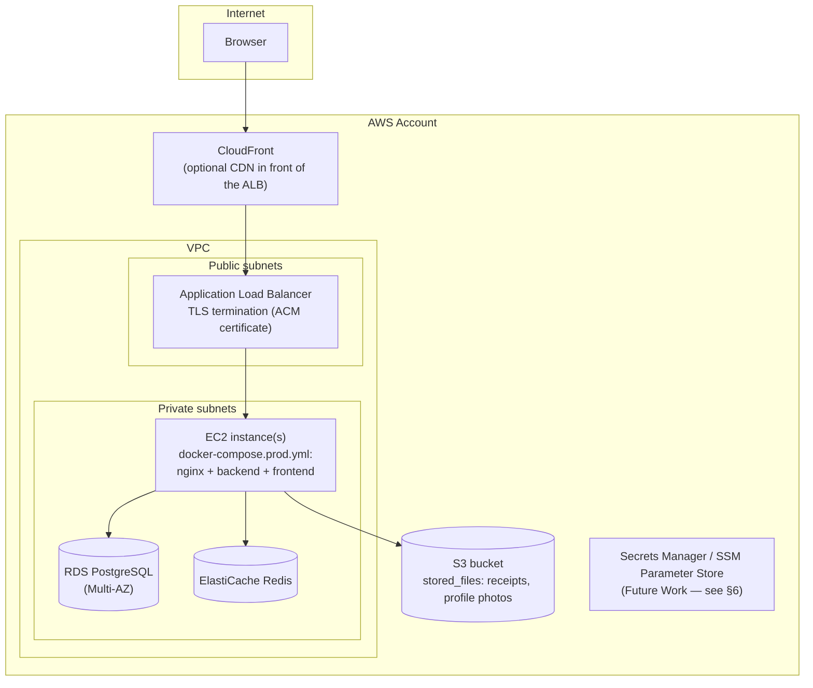

# Infrastructure Guide

> **Audience:** DevOps Engineers, Enterprise Solution Architects, Investors
> **Prerequisite reading:** [docker-guide.md](docker-guide.md)
> **Scope note:** per the PI-1 sprint brief, this chapter is infrastructure *documentation*
> only — no AWS account has been provisioned, no Terraform exists, and nothing described
> here has been deployed. It describes the target architecture the Docker images and Compose
> files in this sprint are built to run on, so the step from "documented" to "deployed" is a
> provisioning exercise, not a re-architecture.

## 1. Target architecture

This is a single-EC2-host deployment shape — `docker-compose.prod.yml` on one instance
behind an ALB — not a Kubernetes/ECS cluster. It matches what a small team can operate
without a dedicated platform engineer, and is the natural next step from the
Compose-based images in this sprint. Moving to ECS/Fargate or EKS later is additive
(the same container images work unchanged); it is not required to reach a first
production deployment.

## 2. Amazon S3

The `storage` module already supports an S3 adapter (`STORAGE_DEFAULT_PROVIDER=AWS_S3`,
`storage.aws.*` properties — see
[environment-variables-guide.md](environment-variables-guide.md)) —
this is existing application code, not new in PI-1. What PI-1 adds is the operational
guidance for provisioning the bucket itself:

- One bucket per environment (e.g. `bachatsetu-prod-storage`), private by default (block all
  public access), versioning enabled (protects against accidental overwrite/delete of
  receipts), server-side encryption enabled (SSE-S3 is sufficient; SSE-KMS if a customer-
  managed key is required for compliance).
- The `STORAGE_DEFAULT_PROVIDER=LOCAL` fallback (`STORAGE_LOCAL_PATH`, a directory inside the
  backend container) works for a single-instance deployment but **does not survive a
  container replacement** and cannot be shared across multiple backend instances. Any
  deployment with more than one backend instance, or that needs uploaded files to survive a
  redeploy, must set `STORAGE_DEFAULT_PROVIDER=AWS_S3`.
- IAM: the backend's AWS credentials need `s3:PutObject`, `s3:GetObject`, `s3:DeleteObject`
  scoped to that one bucket's ARN — nothing broader. On EC2, prefer an instance profile over
  long-lived `STORAGE_AWS_ACCESS_KEY_ID`/`STORAGE_AWS_SECRET_ACCESS_KEY` credentials where the
  AWS SDK supports it.

## 3. RDS PostgreSQL

- Engine version matching what's tested locally (PostgreSQL 16.x; 17.x is also verified
  working per `services/backend/README.md`).
- Multi-AZ for production (automatic failover) — the backend's HikariCP pool
  (`DATABASE_MAX_POOL_SIZE`, `DATABASE_MIN_IDLE`) reconnects on failover without code changes.
- Automated backups with a retention window that matches the RPO decided in
  [recovery-guide.md](recovery-guide.md) — RDS's own snapshot/point-in-time-recovery feature
  is the mechanism, not anything custom.
- The database, user, and password come from `DATABASE_URL`/`DATABASE_USERNAME`/
  `DATABASE_PASSWORD` exactly as documented in
  [environment-variables-guide.md](environment-variables-guide.md) — RDS's endpoint hostname
  is simply what `DATABASE_URL` points at; no application change is needed to move from the
  Dockerized Postgres in `docker-compose.prod.yml` to RDS.
- Security group: only the EC2 instance(s) running the backend may reach RDS on 5432 — never
  the public internet.
- Flyway migrations (`services/backend/src/main/resources/db/migration`) run automatically on
  backend startup against whatever `DATABASE_URL` points at, RDS included — there is no
  separate migration step to run by hand.

## 4. ElastiCache Redis

- Redis 7.x, matching `services/backend/docker-compose.yml`'s `redis:7-alpine`.
- `REDIS_HOST`/`REDIS_PORT`/`REDIS_PASSWORD` point at the ElastiCache endpoint exactly as they
  point at the Dockerized Redis today — no code change.
- Today, Redis backs only the generic cache infrastructure added in this sprint
  (`in.bachatsetu.backend.infrastructure.cache.CacheConfiguration` — see
  [non-functional-and-production-readiness.md](../product/non-functional-and-production-readiness.md)),
  which no business module reads or writes through yet. A single-node ElastiCache instance
  (no cluster mode, no read replicas) is sufficient until a business module actually depends
  on it for correctness rather than performance.
- Enable encryption in transit and at rest, and an auth token (`REDIS_PASSWORD`) — ElastiCache
  supports both without any application-side change beyond setting the environment variable.

## 5. Monitoring network layout

The backend exposes `/actuator/health`, `/actuator/metrics`, and `/actuator/prometheus` (see
[non-functional-and-production-readiness.md](../product/non-functional-and-production-readiness.md)).
Only `/actuator/health` and its sub-paths (`/liveness`, `/readiness`) are unauthenticated
(`bachatsetu.authentication.security.public-endpoints`) — `/actuator/metrics` and
`/actuator/prometheus` require a valid bearer token under the default configuration, and the
Nginx edge (§1.3 of [docker-guide.md](docker-guide.md)) does not proxy them to the public
internet at all.

Two ways to let an internal Prometheus server scrape metrics without exposing them publicly:

1. **Same VPC, same port (simplest):** run Prometheus inside the private subnet, issue it a
   service-account JWT scoped to nothing but the metrics endpoint, and have it authenticate
   like any other client. No infrastructure change needed.
2. **Separate management port:** set `MANAGEMENT_SERVER_PORT` to a port distinct from
   `SERVER_PORT` (e.g. `8081`). Spring Boot then serves actuator endpoints on a separate
   embedded connector, outside the application's `SecurityFilterChain` — so metrics are
   reachable unauthenticated on that port, but only from whatever can reach it, which should
   be restricted to the private subnet via a security group that allows `8081` only from the
   monitoring host, never from the ALB or the internet.

Neither a Prometheus server nor a Grafana dashboard is deployed by this sprint — that remains
Future Work (see
[roadmap-and-future-work.md](../product/roadmap-and-future-work.md)); this section documents
where they would plug in.

## 6. Secrets management

PI-1 uses plain environment variables (`.env` file next to `docker-compose.prod.yml`, or
whatever mechanism the orchestrator provides) for every secret — see
[environment-variables-guide.md](environment-variables-guide.md). This is explicitly a
starting point, not the end state: AWS Secrets Manager or SSM Parameter Store (injecting
values into the EC2 instance's environment at container start, e.g. via the instance's
user-data script or an ECS task definition's `secrets` block) is the natural next step, and
requires no application code change — the backend and frontend already read every secret
from the process environment, never from a file or a hardcoded value. Implementing that
integration is listed in
[roadmap-and-future-work.md](../product/roadmap-and-future-work.md) rather than done here,
per the sprint brief's explicit scope boundary ("no Terraform required in this sprint").

## 7. What is explicitly out of scope for this chapter

- Terraform / CloudFormation / CDK — not written this sprint, by explicit instruction.
- An actual AWS account, VPC, or any provisioned resource — none exists yet.
- Auto-scaling policy — a single EC2 instance is the starting shape; horizontal scaling is a
  later decision once real traffic data exists.
- A CI/CD pipeline that builds and deploys these images automatically — see
  [roadmap-and-future-work.md](../product/roadmap-and-future-work.md).
