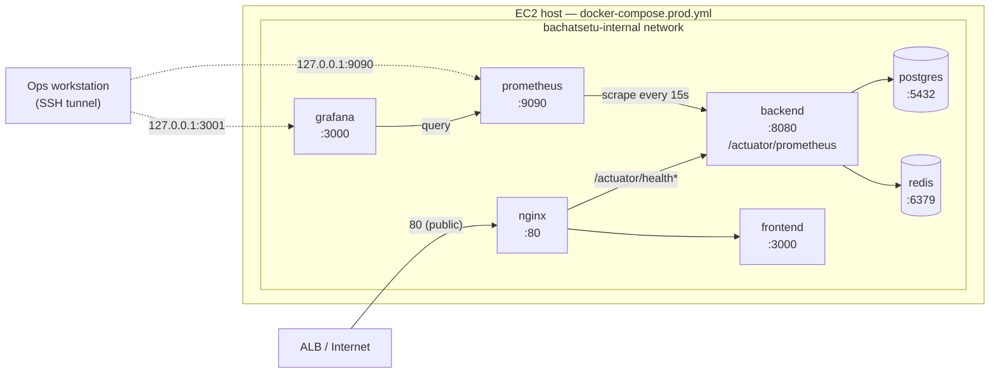

# Monitoring Guide

> **Audience:** DevOps Engineers, Developers, On-call
> **Prerequisite reading:** [docker-guide.md](docker-guide.md), [infrastructure-guide.md §5](infrastructure-guide.md#5-monitoring-network-layout)
> **Scope note:** Sprint 9.1 adds production monitoring and observability — Prometheus,
> Grafana, and the Micrometer instrumentation they scrape. It changes no business logic, no
> REST contract, no DTO, no entity, no repository, and no authentication/payment behavior — see
> §5 for exactly what changed and why each change is safe.

## 1. Architecture



- **`prometheus`** scrapes `backend:8080/actuator/prometheus` every 15 seconds
  (`deploy/monitoring/prometheus.yml`) directly over the internal Docker network — it never goes
  through nginx or the ALB.
- **`grafana`** queries Prometheus as its only datasource, auto-provisioned on startup
  (`deploy/monitoring/grafana/provisioning/datasources/datasource.yml`) — no manual "add
  datasource" click required.
- Neither service is proxied by nginx and neither publishes a port on `0.0.0.0` — both bind to
  `127.0.0.1` on the host only (`docker-compose.prod.yml`). The only way to reach either from a
  workstation is an SSH tunnel into the host (§3).
- Postgres and Redis themselves are **not** scraped — see [§7 Known limitations](#7-known-limitations).

## 2. How to start

Monitoring is part of the same `docker-compose.prod.yml` used for everything else — there is no
separate command:

```bash
cp .env.prod.example .env   # fill in every value, including GRAFANA_ADMIN_PASSWORD — see §4
docker compose -f docker-compose.prod.yml up -d --build
```

Verify both containers are healthy:

```bash
docker compose -f docker-compose.prod.yml ps prometheus grafana
```

Both declare a `HEALTHCHECK` (`prometheus`: `/-/healthy`; `grafana`: `/api/health`) with the
same `interval`/`retries`/`start_period` shape every other service in this file already uses.

## 3. How to access Grafana

Grafana is deliberately unreachable from outside the host (§1, §9 below). Reach it via an SSH
tunnel from your workstation:

```bash
ssh -N -L 3001:localhost:3001 -L 9090:localhost:9090 <user>@<production-host>
```

Then open `http://localhost:3001` in a browser on your own machine. `http://localhost:9090`
gives direct Prometheus UI access (useful for testing a PromQL expression before adding it to a
dashboard panel), the same way it would if you were logged into the host itself.

## 4. Default credentials and how to change them

- **Grafana admin user:** `${GRAFANA_ADMIN_USER}` (defaults to `admin` — see `.env.prod.example`).
- **Grafana admin password:** `${GRAFANA_ADMIN_PASSWORD}` — **required**, no default (Compose
  refuses to start without it, same `${VAR:?message}` pattern every other secret in this repo
  uses — see `docker-compose.prod.yml`). Generate one with `openssl rand -base64 24` before
  first start.
- **To change the password after first start:** either update `GRAFANA_ADMIN_PASSWORD` in `.env`
  and run `docker compose -f docker-compose.prod.yml up -d grafana` again (Grafana only applies
  `GF_SECURITY_ADMIN_PASSWORD` on a fresh, empty `grafana-prod-data` volume — if the volume
  already has data, this env var is ignored after first boot), or change it from inside the
  Grafana UI itself (Administration → Users → admin → change password), which always works
  regardless of the volume's state.
- **Prometheus has no login** — it has no built-in authentication of any kind. This is exactly
  why it is not published on any public interface (§1, §9): anyone who can reach
  `127.0.0.1:9090` on the host can read every metric this application exports. Never change its
  port binding to `0.0.0.0` without adding a reverse proxy with real authentication in front of
  it first.

## 5. What changed, and why it's safe

| Change | File(s) | Why it doesn't touch business logic |
| --- | --- | --- |
| Restrict production Actuator exposure to `health,info,prometheus` | `application-prod.yml` | Actuator/Micrometer configuration only — no controller, service, repository, or entity touched. Verified by `ActuatorProductionExposureTest`. |
| Add `/actuator/info` to the production security allowlist; remove the now-unreachable `/actuator/metrics` | `application-prod.yml` | Same file, same reasoning — `bachatsetu.authentication.security.public-endpoints` is read by `SecurityConfiguration`, itself unchanged. |
| Enable percentile histograms for `http.server.requests` (needed for the p95/p99 dashboard panels) | `application.yml` | Adds `_bucket` series to an existing, already-exported metric — does not change what a request returns, only what is recorded about it. |
| Record Lettuce (Redis client) command latency into the existing `MeterRegistry` | `RedisMetricsConfig.java` (new) | Customizes the auto-configured `ClientResources` used by the Redis connection factory; does not replace, reconfigure, or change the behavior of any Redis operation — see the class Javadoc. Covered by `RedisMetricsConfigTest`. |
| Add `prometheus`/`grafana` services, volumes, env vars | `docker-compose.prod.yml`, `.env.prod.example` | `backend`, `frontend`, `postgres`, `redis`, `nginx` service definitions are byte-for-byte unchanged (verified with `git diff` before finalizing this sprint). |
| New scrape config, Grafana provisioning, starter dashboard | `deploy/monitoring/**` (new directory) | Config-only; no application code. |

`spring-boot-starter-actuator` and `micrometer-registry-prometheus` were already dependencies
before this sprint (`services/backend/pom.xml`) — `/actuator/prometheus` was already reachable
from inside the internal network. This sprint's job was restricting what's exposed in
production, filling in the two metrics gaps (HTTP percentiles, Redis client latency), and
actually deploying something to scrape and visualize it — not adding the instrumentation
dependency itself.

## 6. Metrics reference

Everything below is already exported at `/actuator/prometheus` with zero additional
configuration, because `spring-boot-starter-actuator` + `micrometer-registry-prometheus` were
already on the classpath and Spring Boot auto-configures a Micrometer binder for each:

| Category | Example metric names | Auto-configured by |
| --- | --- | --- |
| JVM memory | `jvm_memory_used_bytes`, `jvm_memory_max_bytes` (tagged `area="heap"`/`"nonheap"`) | `JvmMetricsAutoConfiguration` |
| JVM GC | `jvm_gc_pause_seconds_sum`, `jvm_gc_pause_seconds_count` | `JvmMetricsAutoConfiguration` |
| JVM threads | `jvm_threads_live_threads` | `JvmMetricsAutoConfiguration` |
| CPU | `process_cpu_usage`, `system_cpu_usage`, `system_cpu_count` | `SystemMetricsAutoConfiguration` |
| Disk | `disk_free_bytes`, `disk_total_bytes` | `DiskSpaceMetricsAutoConfiguration` |
| HTTP requests | `http_server_requests_seconds_count`/`_sum`/`_bucket` (tagged `uri`, `method`, `status`, `outcome`) | `WebMvcMetricsAutoConfiguration` |
| HikariCP (database connections) | `hikaricp_connections_active`, `hikaricp_connections_idle`, `hikaricp_connections_max` | `DataSourcePoolMetricsAutoConfiguration` |
| Cache | `cache_gets_total`, `cache_puts_total`, `cache_evictions_total` (tagged `cache="otp"`/`"rate-limit"`/`"session"`/`"config"`) | `CacheMetricsAutoConfiguration`, against the `CacheManager` in `CacheConfiguration.java` — reads 0 until a business module actually calls `@Cacheable`, see that class's own Javadoc |
| Redis (Lettuce command latency) | `lettuce_command_completion_seconds_sum`/`_count` (tagged `command`) | `RedisMetricsConfig.java` — **new this sprint**, see §5 |
| Application-specific (pre-existing, unrelated to this sprint) | `sms.duration`, `sms.sent.success`, `sms.sent.failure`, `sms.retry`, `email.duration`, `email.sent.success`, `email.sent.failure`, `email.retry` (all tagged `provider`) | `SmsOtpSenderAdapter`, `RetryingEmailSenderAdapter` — built before this sprint; the starter dashboard does not chart these, add a panel using the same `provider` tag if you need to |

## 7. Known limitations

- **No PostgreSQL exporter.** `prometheuscommunity/postgres-exporter` is not deployed anywhere
  in this repository — `deploy/monitoring/prometheus.yml` documents the missing job in a
  comment rather than pointing at a target that doesn't exist. Adding it later means: add a
  `postgres-exporter` service to `docker-compose.prod.yml` pointed at the existing `postgres`
  service with a read-only monitoring role, uncomment the `postgres` job in
  `deploy/monitoring/prometheus.yml`, and add dashboard panels for
  `pg_stat_activity_count`/`pg_stat_database_*`. If the database ever moves to RDS
  ([infrastructure-guide.md §3](infrastructure-guide.md#3-rds-postgresql)), RDS's own CloudWatch
  metrics may be sufficient without running an exporter at all.
- **No Redis exporter.** Same situation as above for `oliver006/redis_exporter` — what this
  sprint adds instead is Redis **client**-side command latency (§6), not Redis **server**-side
  memory/eviction/hit-rate metrics. `docs/operations/production-readiness.md`'s "Redis memory
  and eviction" line item is not satisfied by this sprint; it still needs the exporter (or
  ElastiCache's own CloudWatch metrics, if that migration happens first).
- **No alerting.** Prometheus Alertmanager is not deployed, and no Grafana alert rules exist on
  the starter dashboard. `docs/operations/production-readiness.md`'s "Alerts" section remains
  entirely open.
- **No long-term metrics storage.** Prometheus's local TSDB retention is set to 15 days
  (`--storage.tsdb.retention.time=15d` in `docker-compose.prod.yml`) — there is no remote-write
  to a long-term store (Thanos, Mimir, Cortex, or a managed equivalent).
- **Business-metric dashboards are out of scope.** This sprint delivers infrastructure/runtime
  observability (JVM, HTTP, database pool, cache, Redis client) — not the
  business-specific dashboards `docs/operations/production-readiness.md` also lists (payment
  success/failure rates, webhook failures, reconciliation mismatches, authentication failure
  spikes). Those need purpose-built Micrometer counters in the relevant application services
  before a dashboard panel can chart them; none exist yet.
- **Docker was not run in the environment this sprint was implemented in** (no Docker daemon
  available — the same constraint `docker-guide.md §3` already documents for the original
  Sprint PI-1 Docker/Compose work). Every file here was written and statically validated
  (`DockerConfigurationValidationTest`, and `docker compose config` if you have Docker
  available — see §8), but an actual `docker compose up` against the `prometheus`/`grafana`
  services has not been performed. Run it as the first verification step in any environment
  with Docker available, before relying on this stack.

## 8. How to add a dashboard

1. Build or export the dashboard JSON (Grafana's UI → Dashboard settings → JSON Model, or the
   "Export" button, gives you this for any dashboard you build interactively).
2. Save it as a new file under `deploy/monitoring/grafana/dashboards/` (alongside
   `bachatsetu-overview.json`).
3. Restart Grafana, or wait up to 30 seconds — the provisioning provider
   (`deploy/monitoring/grafana/provisioning/dashboards/dashboard.yml`) polls that directory
   every `updateIntervalSeconds: 30` and picks up new/changed files automatically; no restart is
   strictly required.
4. It appears under the **BachatSetu** folder in Grafana's dashboard list.

Dashboards edited from inside the Grafana UI (`allowUiUpdates: true`) persist to the
`grafana-prod-data` volume, not back to the JSON file on disk — if you want a UI change to
survive `docker compose down -v` or to be reviewed in a pull request, export it and overwrite
the file in step 2.

## 9. Security

- Grafana and Prometheus are **not** publicly accessible by default — both bind only to
  `127.0.0.1` on the host (§1). Do not add a `0.0.0.0` port mapping, an nginx `location` block,
  or an ALB listener for either without adding real authentication in front of Prometheus first
  (it has none of its own) and reviewing who needs Grafana access.
- No secret is committed. `GRAFANA_ADMIN_PASSWORD` has no default and Compose refuses to start
  without it (`${GRAFANA_ADMIN_PASSWORD:?...}`), the same pattern every other secret in
  `docker-compose.prod.yml` already uses. `.env.prod.example` ships with every credential blank.
- `/actuator/metrics` — a generic, endpoint-by-endpoint metrics browser useful for local
  troubleshooting but unnecessary once Prometheus scrapes `/actuator/prometheus` — is disabled
  in production entirely (§5), reducing the production Actuator surface to exactly the three
  endpoints this sprint's brief specified: `health`, `info`, `prometheus`.
