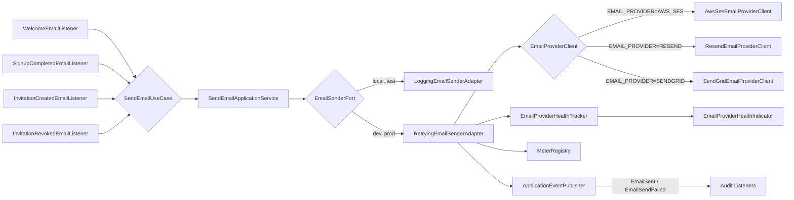

# Email Provider Integration

Version: 1.0
Sprint: PI-2.2
Status: Implemented
Last Updated: 2026-07-11

## Purpose

Sprint PI-2.2 introduces BachatSetu's first email infrastructure: a generic, provider-agnostic
`SendEmailUseCase` backed by a real, pluggable provider integration (AWS SES, Resend, or
SendGrid). Which one is active is a deployment-mode switch (`EMAIL_PROVIDER_ENABLED`,
independent of `SPRING_PROFILES_ACTIVE`) rather than a Spring-profile one — see
[environment-variables-guide.md](../deployment/environment-variables-guide.md) — defaulting to a
log-only fallback everywhere, including under `prod`, until real credentials are supplied and
the flag is explicitly enabled. Nothing in Authentication, Signup, Invitation,
Notification, or Audit was redesigned — this sprint is purely additive: a brand-new `email`
module plus a small number of event listeners that react to domain events those modules already
publish.

## Architecture



- **`SendEmailUseCase`** (`email.application.usecase`) — the one abstraction every other module
  depends on to send an email, mirroring how every module depends on Audit's
  `CreateAuditEntryUseCase` rather than a persistence type. Its only implementation,
  `SendEmailApplicationService`, renders the requested template and hands the result to
  `EmailSenderPort`.
- **`EmailSenderPort`** (`email.application.port`) — the port named in the sprint's own
  architecture diagram. Never throws: every implementation returns an `EmailSendResult`
  describing success or failure, so a provider outage never fails the business flow that
  triggered the email.
- **`RetryingEmailSenderAdapter`** (`infrastructure.email`) — the default `dev`/`prod`
  implementation. Owns retry orchestration, Micrometer metrics, health tracking, masked logging,
  and audit-facing event publication. Does **not** know which provider is active.
- **`EmailProviderClient`** (`infrastructure.email`) — a small interface
  (`EmailProviderSendResult send(EmailProviderMessage message)`) with exactly one real outbound
  call per implementation: `AwsSesEmailProviderClient` (the official AWS SDK v2 `SesClient` —
  the one provider client in this codebase that calls an SDK rather than a raw `RestClient`, since
  hand-signing AWS SigV4 requests would be neither correct nor production-ready),
  `ResendEmailProviderClient`, and `SendGridEmailProviderClient` (both plain `RestClient` calls,
  matching every SMS provider client's shape). Exactly one is registered as a Spring bean,
  selected by `bachatsetu.email.provider` (`EMAIL_PROVIDER`).
- **`LoggingEmailSenderAdapter`** (`infrastructure.email.adapter`) — the active `EmailSenderPort`
  for `local` and `test`, so neither interactive development nor the automated test suite ever
  requires live email credentials.

This mirrors Sprint PI-2.1's SMS integration (`docs/integrations/sms-provider.md`) exactly, with
one structural difference explained by the sprint's own architecture diagram: SMS's real provider
integration lives under `infrastructure.auth.sms` (owned by the Auth module, since only OTP
delivery needed it), whereas Email is a genuinely cross-cutting capability every module can use —
so it lives under its own top-level `email` module (mirroring how `audit` is also a cross-cutting
service with its own use-case interface) and `infrastructure.email` (a new, analogous ArchUnit
carve-out alongside `infrastructure.auth` and `infrastructure.group`).

## Configuration

All configuration lives under `bachatsetu.email` in `application.yml`, entirely
environment-variable-driven:

```yaml
bachatsetu:
  email:
    provider: ${EMAIL_PROVIDER:AWS_SES}
    from-address: ${EMAIL_FROM_ADDRESS:}
    reply-to: ${EMAIL_REPLY_TO:}
    retry-count: ${EMAIL_RETRY_COUNT:2}
    connect-timeout: ${EMAIL_CONNECT_TIMEOUT:3s}
    read-timeout: ${EMAIL_READ_TIMEOUT:5s}
    aws-ses:
      region: ${AWS_SES_REGION:}
      access-key: ${AWS_ACCESS_KEY:}
      secret-key: ${AWS_SECRET_KEY:}
    resend:
      api-key: ${RESEND_API_KEY:}
    send-grid:
      api-key: ${SENDGRID_API_KEY:}
```

`EmailProviderProperties` (`infrastructure.email.config`) binds this block and — in its compact
constructor, exactly like `SmsProviderProperties` — validates that whichever provider
`EMAIL_PROVIDER` selects has every one of its own required values non-blank, **and** that
`EMAIL_FROM_ADDRESS` is set regardless of provider (every provider needs a sender address). An
unselected provider's values are never checked.

### Environment variables

| Variable | Required when | Purpose |
| --- | --- | --- |
| `EMAIL_PROVIDER` | Always (`dev`/`prod`) | `AWS_SES`, `RESEND`, or `SENDGRID` — selects the active provider |
| `EMAIL_FROM_ADDRESS` | Always (`dev`/`prod`) | The sending address every provider uses |
| `EMAIL_REPLY_TO` | Optional (defaults to `EMAIL_FROM_ADDRESS`) | Reply-to address on every outbound message |
| `EMAIL_RETRY_COUNT` | Optional (default `2`) | Number of retries *after* the first attempt, for transient failures only |
| `EMAIL_CONNECT_TIMEOUT` | Optional (default `3s`) | Connect timeout for the shared `RestClient`/SES HTTP client |
| `EMAIL_READ_TIMEOUT` | Optional (default `5s`) | Response read timeout |
| `AWS_SES_REGION` | `EMAIL_PROVIDER=AWS_SES` | AWS region SES is configured in (e.g. `ap-south-1`) |
| `AWS_ACCESS_KEY` | `EMAIL_PROVIDER=AWS_SES` | IAM access key with `ses:SendEmail` permission |
| `AWS_SECRET_KEY` | `EMAIL_PROVIDER=AWS_SES` | IAM secret key |
| `RESEND_API_KEY` | `EMAIL_PROVIDER=RESEND` | Resend API key (`Authorization: Bearer` header) |
| `SENDGRID_API_KEY` | `EMAIL_PROVIDER=SENDGRID` | SendGrid API key (`Authorization: Bearer` header) |

No secret has a non-blank default anywhere in this codebase — every one of the variables above
defaults to an empty string in `application.yml`, and only produces a working configuration once
actually set in the environment.

### Switching providers

Changing `EMAIL_PROVIDER` (and supplying that provider's own variables) is the entire change.
`EmailInfrastructureConfig` registers each `EmailProviderClient` behind
`@ConditionalOnProperty(prefix = "bachatsetu.email", name = "provider", havingValue = "...")`, so
exactly one client bean exists at a time; `RetryingEmailSenderAdapter` is wired against the
`EmailProviderClient` interface, never a concrete class. No business code, REST controller, or
domain model is aware that a provider switch happened.

## Email Template System

`EmailTemplateCatalog` (`email.domain.service`) holds one `EmailTemplate` (subject, HTML body,
plain-text body, each with `{{variable}}` placeholders) per `EmailTemplateCategory`, mirroring
`NotificationTemplateCatalog`'s own static-`EnumMap` approach so this codebase keeps exactly one
templating convention — no template engine dependency was added.

`EmailTemplateRenderer` (`email.domain.service`) performs the substitution: a missing variable is
replaced with an empty string rather than left as a literal `{{placeholder}}` in the output, since
not every template uses every variable (for example `WELCOME` has no name available at
registration time).

Implemented categories:

| Category | Triggered by | Recipient |
| --- | --- | --- |
| `WELCOME` | `UserRegistered` (auth domain event) | The newly registered address, carried directly on the event |
| `SIGNUP_COMPLETED` | `UserActivated` (auth domain event, fires after OTP verification) | Resolved through the existing `auth.domain.port.UserRepository` |
| `INVITATION` | `InvitationCreated` (invitation domain event) | The organizer who created the invitation (see below) |
| `INVITATION_REVOKED` | `InvitationRevoked` (invitation domain event) | The organizer, same resolution as above |
| `PASSWORD_RESET` | *(placeholder — registered in the catalog, no publisher wired yet)* | — |
| `PAYMENT_RECEIPT` | *(placeholder)* | — |
| `MONTHLY_STATEMENT` | *(placeholder)* | — |

**A note on the Invitation recipient.** `GroupInvitation` is a code/link/QR-based shareable
invitation — by design it carries no per-recipient email address, and Sprint PI-2.2's brief
explicitly forbids redesigning the Invitation module to add one. `InvitationCreatedEmailListener`
and `InvitationRevokedEmailListener` therefore send a confirmation to the **organizer** (the
invitation's `createdBy` actor) containing the shareable code, resolved through the existing
`GroupInvitationRepository`, `SavingsGroupRepository`, and `auth.domain.port.UserRepository` — the
only new repository surface added anywhere in this sprint is one small, cross-tenant
`GroupInvitationRepository.findById(AggregateId invitationId)` overload, needed because the
domain event carries no tenant context, following the same precedent as the existing cross-tenant
`MemberRepository.findByUserId(userId)` lookup added in an earlier sprint.

## Retry Strategy

`RetryingEmailSenderAdapter` retries only when `EmailProviderException.retryable()` is `true`:

| Failure | Retryable? |
| --- | --- |
| Network interruption / connection timeout (no response at all) | Yes |
| HTTP / AWS status 502, 503, 504 | Yes |
| AWS SES throttling (429) | Yes |
| HTTP 400, 401, 403, 404 | No |
| Any other status (including a plain 500) | No |

`bachatsetu.email.retry-count` (`EMAIL_RETRY_COUNT`, default `2`) is the number of retries *after*
the first attempt. Retries are **immediate, with no backoff delay** — the same deliberate choice
Sprint PI-2.1 made for SMS, for the same reason: this codebase's `ForbiddenApiArchitectureTest`
bans `Thread.sleep` outside a real scheduling mechanism, and `retry-count` is small by design.
`EmailSenderPort.send(...)` never throws: once retries are exhausted, it returns an
`EmailSendResult` with `status=FAILED` and a `failureReason`, so a caller (an event listener)
never needs a `try`/`catch` around the retry logic itself — only around the send call as a whole,
matching every other best-effort listener in this codebase.

## Audit & Monitoring

### Audit

Two new `AuditEventType` values, `EMAIL_SENT` and `EMAIL_SEND_FAILED` (migration
`V17__email_audit_event.sql` widens the `ck_audit_entries_event_type` check constraint, the same
additive pattern every previous audit-event-type addition in this codebase has used):

- **`EmailSentAuditListener`** (`audit.interfaces.rest.event`) reacts to the new `EmailSent`
  event, published by `RetryingEmailSenderAdapter` once a provider confirms delivery. Recorded
  metadata: provider, provider message id, duration in milliseconds, recipient count, and a
  masked recipient address — never the email body or a provider secret.
- **`EmailSendFailedAuditListener`** reacts to `EmailSendFailed`, published once every retry is
  exhausted. Recorded metadata: provider, a scrubbed failure reason, duration, and the same masked
  recipient.

Both listeners follow the exact structure of `OtpSentAuditListener`/`OtpSendFailedAuditListener`:
a best-effort write that logs and swallows its own failure rather than ever letting an
audit-recording problem affect a send that already happened (or already failed).

### Metrics

`RetryingEmailSenderAdapter` records four Micrometer meters, every one tagged `provider`
(`AWS_SES`, `RESEND`, or `SENDGRID`):

| Meter | Type | Recorded |
| --- | --- | --- |
| `email.sent.success` | Counter | Once per `send(...)` call that eventually succeeds |
| `email.sent.failure` | Counter | Once per `send(...)` call that exhausts every retry |
| `email.duration` | Timer | Wall-clock time for the whole `send(...)` call, including retries |
| `email.retry` | Counter | Once per retried attempt (not per final failure) |

Already exposed at `/actuator/metrics` and `/actuator/prometheus` — no additional wiring needed.

### Delivery result (infrastructure-only)

`EmailSendResult` (status, provider, provider message id, timestamp, failure reason) is the
return value of every `SendEmailUseCase.execute(...)` call and is also what feeds the audit
metadata above. It is **not** persisted as its own database table or attached to any business
entity — Sprint PI-2.2's brief is explicit that this is infrastructure metadata only.

### Health

`EmailProviderHealthIndicator` registers as `/actuator/health/emailProvider`, backed by
`EmailProviderHealthTracker` (a small in-memory consecutive-failure counter):

- **`UNKNOWN`** — no send attempted yet since the process started.
- **`UP`** — the most recent attempt succeeded, or fewer than 3 consecutive failures.
- **`DOWN`** — 3 or more consecutive failures.

Only the provider name and a failure count are ever included as health details — never a secret.

## Logging

`RetryingEmailSenderAdapter` and `LoggingEmailSenderAdapter` never log the email body, a subject
that might contain sensitive content, or the unmasked recipient address. Every log line uses a
masked rendering (`so*****@example.com` — the first two local-part characters, then asterisks,
then the full domain), the same masking convention `SmsOtpSenderAdapter` already established for
phone numbers. API keys and AWS credentials are never logged; they appear only in a request
header/SDK credentials provider built immediately before the call and never passed to a logger.

## Testing

No unit test in this codebase makes a live call to AWS SES, Resend, or SendGrid.
`ResendEmailProviderClientTest` and `SendGridEmailProviderClientTest` stub every HTTP exchange with
Spring's `MockRestServiceServer`, including a simulated network failure (an `IOException` thrown
from the response creator). `AwsSesEmailProviderClientTest` mocks the AWS SDK's `SesClient`
directly with Mockito — no network, no AWS credentials, no real region. `RetryingEmailSenderAdapterTest`
uses an in-memory `FakeEmailProviderClient` to exercise retry counting, metrics, health tracking,
event publication, and log masking (captured via a Logback `ListAppender`). Template rendering,
the application service, both audit listeners, and all four module-integration listeners each have
their own focused unit test with no Spring context required.

## Production Setup

1. Choose a provider and obtain its credentials (an SES-verified sending domain/address and an
   IAM key with `ses:SendEmail`; a Resend API key; or a SendGrid API key).
2. Set `EMAIL_PROVIDER`, `EMAIL_FROM_ADDRESS`, and that provider's own variables
   (§[Environment variables](#environment-variables)) in the deployment environment — never in a
   committed file.
3. Deploy under the `prod` (or `dev`) Spring profile — `local` and `test` always use the log-only
   sender regardless of `EMAIL_PROVIDER`, by design.
4. Confirm `/actuator/health/emailProvider` reports `UNKNOWN` immediately after startup, then `UP`
   after the first real email send.
5. Watch `email.sent.failure` and `email.retry` in whatever scrapes `/actuator/prometheus` — a
   sustained rise in either is the leading indicator of a provider-side problem before it surfaces
   as `emailProvider: DOWN`.

## Troubleshooting

| Symptom | Likely cause | Where to look |
| --- | --- | --- |
| App fails to start under `prod` with a `BindException` mentioning `bachatsetu.email` | The selected provider's secrets, or `EMAIL_FROM_ADDRESS`, are blank | `EmailProviderProperties`'s compact constructor message names the missing environment variable |
| `email.sent.failure` climbing with no successful sends | Provider credentials are wrong, or the provider itself is down | Check `/actuator/health/emailProvider`; check `EMAIL_SEND_FAILED` audit entries' `failureReason` metadata (safe to read — no secrets) |
| `email.retry` climbing steadily but `email.sent.failure` staying flat | Transient provider errors (502/503/504/429) that eventually succeed on retry | Not necessarily an incident by itself — watch `email.duration` for latency impact |
| `emailProvider` health reports `DOWN` | 3+ consecutive failed email sends | Check the provider's own status page and account credentials/quota first |
| Switching `EMAIL_PROVIDER` doesn't seem to take effect | Config change requires a restart — `EmailInfrastructureConfig`'s beans are resolved once at startup | Restart the backend after changing `EMAIL_PROVIDER` |
| Want to test locally without sending real email | Run under the `local` profile (default) — `LoggingEmailSenderAdapter` remains active and logs a masked confirmation instead | `services/backend/README.md` |
| Invitation emails never arrive | By design, they go to the organizer (not a per-recipient invitee address) — see [Email Template System](#email-template-system) | Confirm the organizer's own account email is correct |
