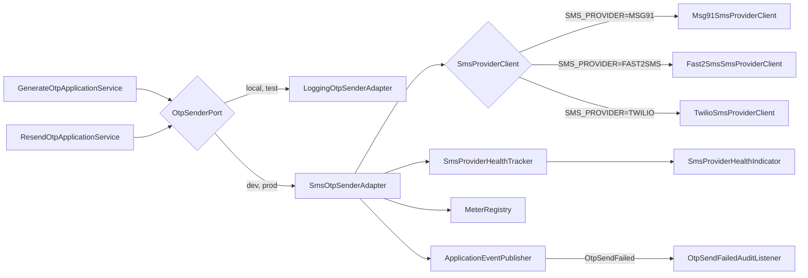

# SMS Provider Integration (OTP Delivery)

Version: 1.0
Sprint: PI-2.1
Status: Implemented
Last Updated: 2026-07-11

## Purpose

Sprint PI-2.1 replaces `LoggingOtpSenderAdapter` — the log-only OTP sender used since the
authentication module was first built — with a real, pluggable SMS provider integration for
every profile except `local` and `test`. Nothing above the infrastructure layer changed: the
same `OtpSenderPort` interface, the same `GenerateOtpUseCase`/`ResendOtpUseCase` application
services, the same REST endpoints and response contracts, the same domain rules. Only what
`OtpSenderPort.send(...)` does under the hood is new.

## Architecture



- **`OtpSenderPort`** (`auth.application.port`) — unchanged. The one abstraction every OTP
  application service depends on; neither `GenerateOtpApplicationService` nor
  `ResendOtpApplicationService` know or care which implementation is wired in.
- **`SmsOtpSenderAdapter`** (`infrastructure.auth.sms`) — the new default implementation for
  `dev`/`prod`. Owns retry orchestration, Micrometer metrics, health tracking, masked logging,
  and translating a provider failure into the existing `OtpApplicationException`. Does **not**
  know which SMS provider is active.
- **`SmsProviderClient`** (`infrastructure.auth.sms`) — a small interface
  (`SmsSendResult send(SmsMessage message)`) with exactly one real HTTP call per implementation.
  Three implementations exist: `Msg91SmsProviderClient`, `Fast2SmsSmsProviderClient`,
  `TwilioSmsProviderClient`. Exactly one is registered as a Spring bean, selected by
  `bachatsetu.sms.provider` (`SMS_PROVIDER`).
- **`LoggingOtpSenderAdapter`** (`infrastructure.auth.adapter`) — unchanged, and still the
  active `OtpSenderPort` for `local` and `test`, so neither interactive development nor the
  automated test suite ever requires live SMS credentials.

This mirrors the existing Payment Gateway module's provider-abstraction shape
(`PaymentGatewayPort` → `GatewayType`-selected adapter), with one deliberate difference: the
payment gateway providers are simulated (no live HTTP call, by that sprint's explicit design);
these SMS provider clients make real HTTP calls to each provider's actual REST API, because this
sprint's brief specifically calls for a production-ready integration. See
[Testing](#testing) for how that is reconciled with "no live SMS API calls during unit tests."

## Configuration

All configuration lives under `bachatsetu.sms` in `application.yml`, entirely environment-variable-driven:

```yaml
bachatsetu:
  sms:
    provider: ${SMS_PROVIDER:MSG91}
    retry-count: ${SMS_RETRY_COUNT:2}
    connect-timeout: ${SMS_CONNECT_TIMEOUT:3s}
    read-timeout: ${SMS_READ_TIMEOUT:5s}
    msg91:
      auth-key: ${MSG91_AUTH_KEY:}
      template-id: ${MSG91_TEMPLATE_ID:}
      sender-id: ${MSG91_SENDER_ID:}
    fast2sms:
      api-key: ${FAST2SMS_API_KEY:}
    twilio:
      account-sid: ${TWILIO_ACCOUNT_SID:}
      auth-token: ${TWILIO_AUTH_TOKEN:}
      phone-number: ${TWILIO_PHONE_NUMBER:}
```

`SmsProviderProperties` (`infrastructure.auth.config`) binds this block and — in its compact
constructor, exactly like `AuthenticationSecurityProperties` and every other fail-fast
properties record in this codebase — validates that whichever provider `SMS_PROVIDER` selects
has every one of its own required values non-blank. An unselected provider's values are never
checked, so (for example) leaving every `TWILIO_*` variable unset is fine when
`SMS_PROVIDER=MSG91`.

### Environment variables

| Variable | Required when | Purpose |
| --- | --- | --- |
| `SMS_PROVIDER` | Always (`dev`/`prod`) | `MSG91`, `FAST2SMS`, or `TWILIO` — selects the active provider |
| `SMS_RETRY_COUNT` | Optional (default `2`) | Number of retries *after* the first attempt, for transient failures only |
| `SMS_CONNECT_TIMEOUT` | Optional (default `3s`) | TCP connect timeout for the shared `RestClient` |
| `SMS_READ_TIMEOUT` | Optional (default `5s`) | Response read timeout |
| `MSG91_AUTH_KEY` | `SMS_PROVIDER=MSG91` | MSG91 API auth key (`authkey` header) |
| `MSG91_TEMPLATE_ID` | `SMS_PROVIDER=MSG91` | MSG91 OTP template id |
| `MSG91_SENDER_ID` | `SMS_PROVIDER=MSG91` | MSG91 approved sender id |
| `FAST2SMS_API_KEY` | `SMS_PROVIDER=FAST2SMS` | Fast2SMS API key (`authorization` header) |
| `TWILIO_ACCOUNT_SID` | `SMS_PROVIDER=TWILIO` | Twilio Account SID (also the HTTP Basic auth username) |
| `TWILIO_AUTH_TOKEN` | `SMS_PROVIDER=TWILIO` | Twilio Auth Token (HTTP Basic auth password) |
| `TWILIO_PHONE_NUMBER` | `SMS_PROVIDER=TWILIO` | The Twilio-provisioned sending number, in E.164 form |

No secret has a non-blank default anywhere in this codebase — every one of the variables above
defaults to an empty string in `application.yml`, and only produces a working configuration
once actually set in the environment.

### Switching providers

Changing `SMS_PROVIDER` (and supplying that provider's own variables) is the entire change.
`SmsInfrastructureConfig` registers each `SmsProviderClient` behind
`@ConditionalOnProperty(prefix = "bachatsetu.sms", name = "provider", havingValue = "...")`, so
exactly one client bean exists at a time; `SmsOtpSenderAdapter` is wired against the
`SmsProviderClient` interface, never a concrete class. No business code, REST controller, or
domain model is aware that a provider switch happened.

## Failure Handling

`SmsProviderException` (`infrastructure.auth.sms`) is the only failure type any
`SmsProviderClient` throws — a provider's own exception types (`RestClientResponseException`,
`ResourceAccessException`) never escape a client. It carries:

- `retryable` — whether `SmsOtpSenderAdapter` should retry (see [Retry Strategy](#retry-strategy)).
- `httpStatus` — the provider's HTTP status, or `-1` for a failure with no HTTP response at all
  (timeout, connection refused, DNS failure).

Once retries are exhausted, `SmsOtpSenderAdapter` never lets `SmsProviderException` (or its
message, which may echo back an HTTP status but never a raw provider response body) reach the
REST layer. It:

1. Publishes `OtpSendFailed` (a new event, not part of the pre-existing `OtpApplicationEvent`
   family — see [Audit & Monitoring](#audit--monitoring)).
2. Throws the pre-existing `OtpApplicationException` with a **new** reason,
   `OtpFailureReason.SMS_DELIVERY_FAILED`, and a generic, safe message: *"Unable to deliver the
   OTP by SMS at this time. Please try again shortly."*

`GlobalExceptionHandler`'s existing exhaustive switch over `OtpFailureReason` gained exactly one
new case for this reason, mapping to `503 Service Unavailable` with problem type
`urn:bachatsetu:problem:otp-delivery-failed` — every pre-existing reason's mapping
(`user-not-found`, `otp-not-found`, `active-otp-exists`, `otp-resend-limit-exceeded`) is
untouched, so the existing API contract for every other failure mode is unchanged.

MSG91 and Fast2SMS both have a quirk this integration accounts for: a logically rejected
request (bad template, invalid API key, insufficient balance) is frequently answered with
**HTTP 200** and a `"type": "error"` / `"return": false` field in the body, not a 4xx status.
Both clients check that field explicitly rather than trusting the HTTP status alone, and treat
that case as non-retryable (retrying a request the provider already rejected cannot succeed).

## Retry Strategy

`SmsOtpSenderAdapter` retries only when `SmsProviderException.retryable()` is `true`:

| Failure | Retryable? |
| --- | --- |
| Network interruption / connection timeout (no HTTP response at all) | Yes |
| HTTP 502, 503, 504 | Yes |
| HTTP 400, 401, 403, 404 | No |
| Any other HTTP status (including a plain 500) | No |
| A `type: error` / `return: false` logical rejection on HTTP 200 (MSG91, Fast2SMS) | No |

`bachatsetu.sms.retry-count` (`SMS_RETRY_COUNT`, default `2`) is the number of retries *after*
the first attempt — so the default configuration makes up to 3 total attempts. Retries are
**immediate, with no backoff delay**: this codebase's own `ForbiddenApiArchitectureTest` bans
`Thread.sleep` anywhere outside a real scheduling mechanism, and `retry-count` is small by
design, so an unconditional immediate retry was the deliberate choice here rather than
implementing a backoff scheduler for what is, in practice, a handful of attempts. Each retry
increments the `sms.retry` metric (see below); the OTP application services themselves are
unaware a retry ever happened — `OtpSenderPort.send(...)` either returns normally or throws.

## Audit & Monitoring

### Audit

Two audit event types now record OTP delivery outcomes — `OTP_SENT` already existed in
`AuditEventType` (added in an earlier sprint) but had no listener actually recording it until
this sprint; `OTP_SEND_FAILED` is new (migration `V15__otp_send_failed_audit_event.sql` widens
the `ck_audit_entries_event_type` check constraint, the same additive pattern every previous
audit-event-type addition in this codebase has used).

- **`OtpSentAuditListener`** (`audit.interfaces.rest.event`) reacts to the pre-existing `OtpSent`
  application event. That event was already constructed by `GenerateOtpApplicationService`/
  `ResendOtpApplicationService`, but neither service previously published it anywhere — this
  sprint additively wires the pre-existing `OtpEventPublisherPort` into both services'
  constructors (mirroring the pattern `VerifyOtpApplicationService` already used for
  `OtpVerified`), so `OtpSent` is now actually published, not just returned in the command
  result.
- **`OtpSendFailedAuditListener`** reacts to the new `OtpSendFailed` event, published directly by
  `SmsOtpSenderAdapter` once retries are exhausted. Recorded metadata: provider name and a
  scrubbed failure reason string (never the OTP, the phone number, or a provider secret) as a
  small JSON object.

Both listeners follow the exact structure of the pre-existing `LoginAuditListener`: a tenant-less
entry (no tenant exists yet at OTP-send time), a best-effort write that logs and swallows its own
failure rather than ever letting an audit-recording problem break OTP delivery.

### Metrics

`SmsOtpSenderAdapter` records four Micrometer meters, every one tagged `provider` (`MSG91`,
`FAST2SMS`, or `TWILIO`):

| Meter | Type | Recorded |
| --- | --- | --- |
| `sms.sent.success` | Counter | Once per `send(...)` call that eventually succeeds |
| `sms.sent.failure` | Counter | Once per `send(...)` call that exhausts every retry |
| `sms.duration` | Timer | Wall-clock time for the whole `send(...)` call, including retries |
| `sms.retry` | Counter | Once per retried attempt (not per final failure) |

These are ordinary Micrometer meters — already exposed at `/actuator/metrics` and
`/actuator/prometheus` (Sprint PI-1's monitoring work), with no additional wiring needed.

### Delivery result (infrastructure-only)

`SmsSendResult` (provider name, provider message id, timestamp) is captured from every successful
provider response and logged (with the destination number masked) — it is **not** persisted
anywhere and is not part of the OTP domain model. Sprint PI-2.1's brief is explicit that this is
infrastructure metadata only, not a business-logic change to `OtpVerification`.

### Health

`SmsProviderHealthIndicator` registers as `/actuator/health/smsProvider`, backed by
`SmsProviderHealthTracker` (a small in-memory consecutive-failure counter `SmsOtpSenderAdapter`
updates after every attempt):

- **`UNKNOWN`** — no send attempted yet since the process started.
- **`UP`** — the most recent attempt succeeded, or fewer than 3 consecutive failures.
- **`DOWN`** — 3 or more consecutive failures.

Only the provider name and a failure count are ever included as health details — never a secret.
Like every other custom `HealthIndicator`, this is **not** part of the `liveness`/`readiness`
actuator groups (Spring Boot only includes the built-in probes there by default), so an SMS
provider outage does not, by itself, take the application out of a Kubernetes/ECS rotation — see
`docs/deployment/infrastructure-guide.md` (Sprint PI-1) for how that health group boundary works.

## Logging

`SmsOtpSenderAdapter` never logs the OTP code (`OtpCode.toString()` is redacted by design; the
adapter never even calls it) or the raw destination number. Every log line uses a masked
rendering: `+91******3210` (country code and last 4 digits visible, everything else replaced
with `*`) — the identical masking `LoggingOtpSenderAdapter` already used. API keys and tokens are
never logged; they appear only in a request header/body built immediately before the HTTP call
and never passed to a logger.

## Testing

No unit test in this codebase makes a live call to MSG91, Fast2SMS, or Twilio. Every HTTP
exchange in `Msg91SmsProviderClientTest`, `Fast2SmsSmsProviderClientTest`, and
`TwilioSmsProviderClientTest` is stubbed with Spring's `MockRestServiceServer`, including a
simulated network failure (an `IOException` thrown from the response creator, which
`RestClient` surfaces as `ResourceAccessException`) to exercise the retryable-network-failure
path without a real socket. `SmsOtpSenderAdapterTest` uses an in-memory `FakeSmsProviderClient`
(never touches HTTP at all) to exercise retry counting, metrics, health tracking, event
publication, and log masking (captured via a Logback `ListAppender`, not real log output
scraping). `SmsProviderPropertiesTest` and `SmsInfrastructureConfigTest` cover fail-fast
configuration validation and per-provider bean selection using Spring's
`ApplicationContextRunner`, matching the existing `AuthenticationInfrastructureConfigTest`
pattern.

## Production Setup

1. Choose a provider and obtain its credentials (MSG91 auth key + an approved OTP template;
   Fast2SMS API key; or a Twilio Account SID/Auth Token/purchased number).
2. Set `SMS_PROVIDER` and that provider's variables (§[Environment variables](#environment-variables))
   in the deployment environment — never in a committed file. See
   `docs/deployment/environment-variables-guide.md` (Sprint PI-1) for how secrets reach a
   `docker-compose.prod.yml` deployment.
3. Deploy under the `prod` (or `dev`) Spring profile — `local` and `test` always use the
   log-only sender regardless of `SMS_PROVIDER`, by design.
4. Confirm `/actuator/health/smsProvider` reports `UNKNOWN` immediately after startup (no send
   attempted yet), then `UP` after the first real OTP request.
5. Watch `sms.sent.failure` and `sms.retry` in whatever scrapes `/actuator/prometheus` — a
   sustained rise in either is the leading indicator of a provider-side problem before it
   surfaces as `smsProvider: DOWN`.

## Troubleshooting

| Symptom | Likely cause | Where to look |
| --- | --- | --- |
| App fails to start under `prod` with a `BindException` mentioning `bachatsetu.sms` | The selected provider's secrets are blank | `SmsProviderProperties`'s compact constructor message names the missing environment variable |
| Every OTP request returns `503` with problem type `otp-delivery-failed` | Provider credentials are wrong, or the provider itself is down | Check `/actuator/health/smsProvider`; check the `OTP_SEND_FAILED` audit entries' `failureReason` metadata (safe to read — no secrets) |
| `sms.retry` climbing steadily but `sms.sent.failure` staying flat | Transient provider errors (502/503/504) that eventually succeed on retry | Not necessarily an incident by itself — watch `sms.duration` for user-facing latency impact |
| `smsProvider` health reports `DOWN` | 3+ consecutive failed OTP sends | Check the provider's own status page and account balance/credentials first |
| Switching `SMS_PROVIDER` doesn't seem to take effect | Config change requires a restart — `SmsInfrastructureConfig`'s beans are resolved once at startup | Restart the backend after changing `SMS_PROVIDER` |
| Want to test locally without sending real SMS | Run under the `local` profile (default) — `LoggingOtpSenderAdapter` remains active and logs a masked confirmation instead | `services/backend/README.md` |
