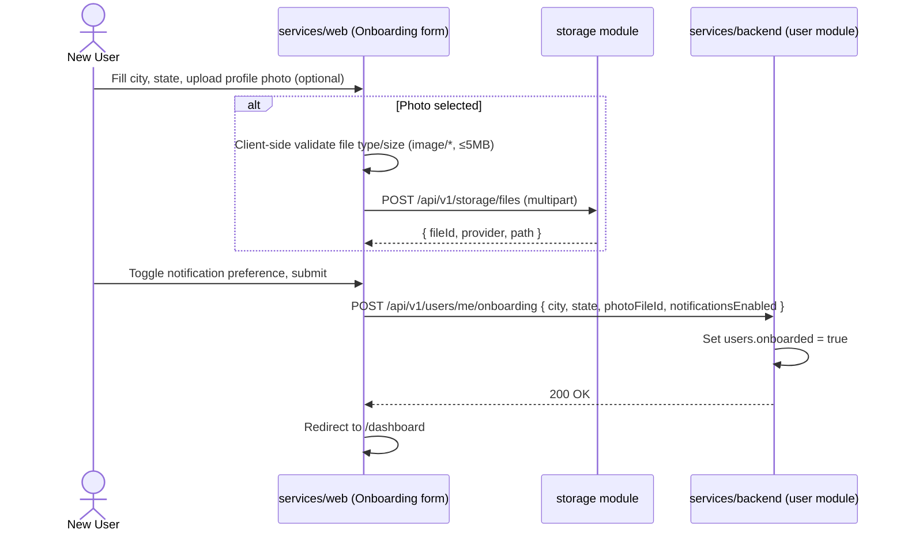
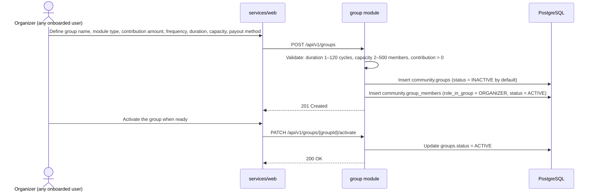
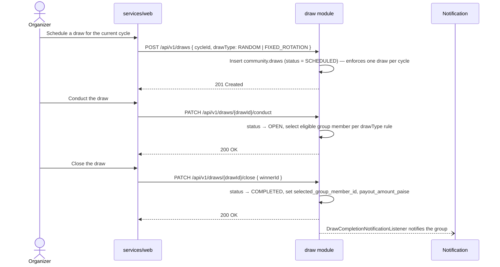
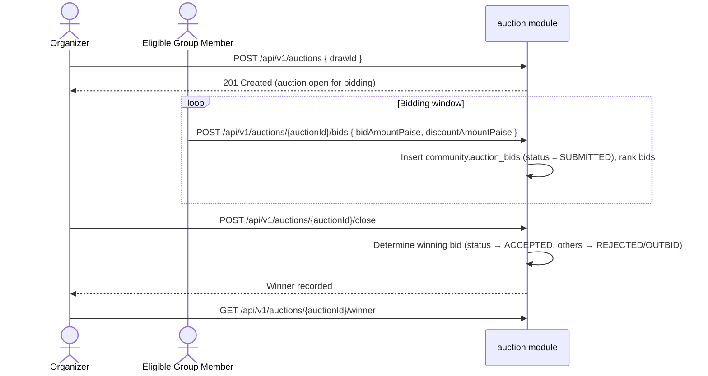
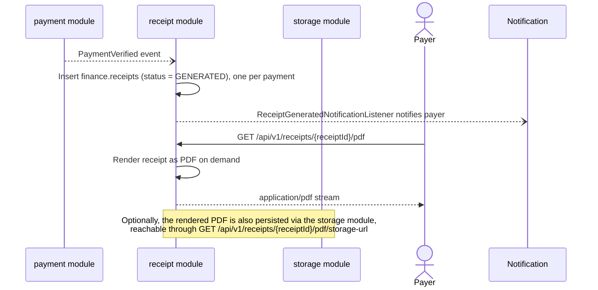
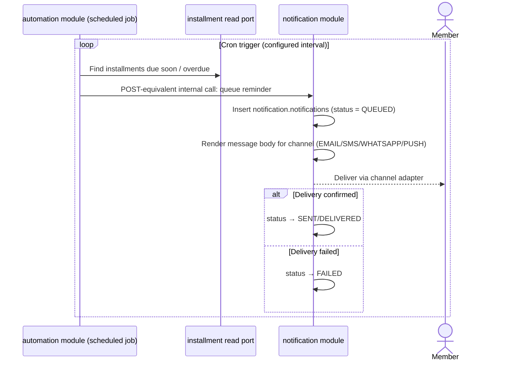
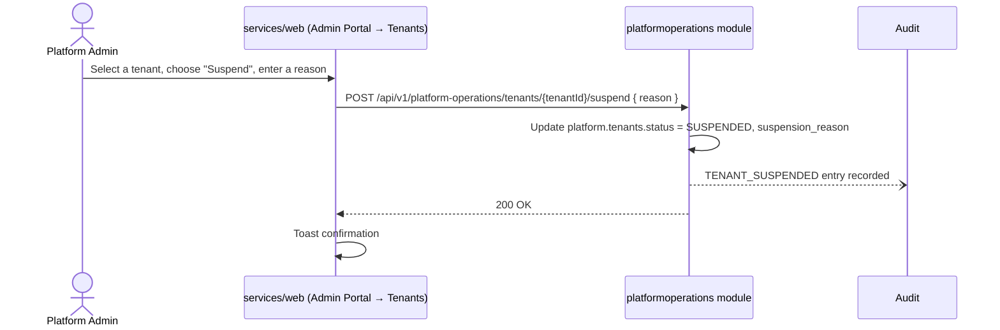
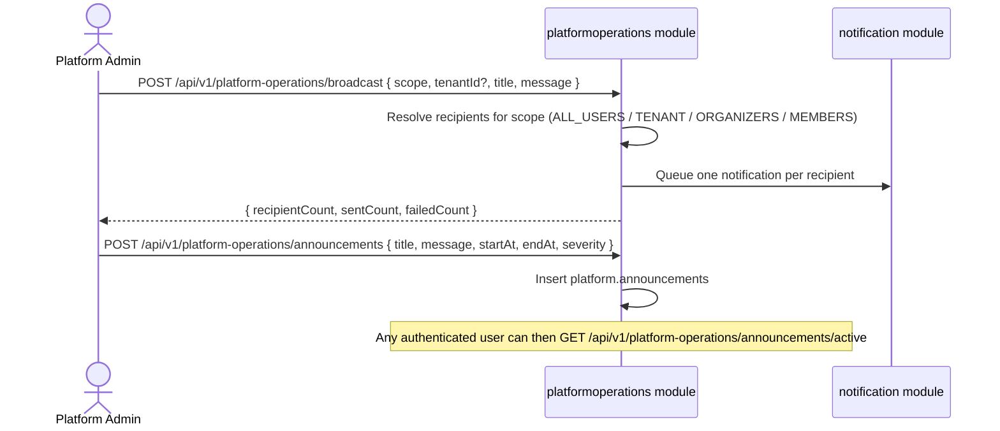

# Business Processes

> **Audience:** Product Managers, QA Engineers, Developers, Designers
> **Prerequisite reading:** [Backend Module and API Reference](backend-module-and-api-reference.md), [Data Model and Database Schema](data-model-and-database-schema.md)

This chapter walks through every end-to-end process actually implemented in BachatSetu, as a sequence of real API calls between the frontend (`services/web`), the backend (`services/backend`), and external providers. Each process links to the [State Machines](state-machines.md) chapter for the entity lifecycle it drives.

## Signup and OTP Verification

```mermaid
sequenceDiagram
    actor U as Visitor
    participant W as services/web (Signup form)
    participant B as services/backend (auth module)
    participant DB as PostgreSQL

    U->>W: Enter name, mobile number, preferred language
    W->>B: POST /api/v1/auth/signup
    B->>DB: Insert identity.users (auth_status = PENDING_VERIFICATION)
    B->>DB: Insert identity.otp_verifications (otp_hash, purpose = REGISTRATION)
    B-->>W: 201 Created { userId, mobileNumber, otpExpiresAt }
    Note over B: OTP delivery is logged, not sent, under the local/test profiles; dev/prod send a real<br/>SMS via a configured provider (MSG91, Fast2SMS, or Twilio) — see docs/integrations/sms-provider.md
    U->>W: Enter 6-digit OTP
    W->>B: POST /api/v1/auth/signup/verify
    B->>DB: Verify otp_hash match, increment verification_attempts on failure
    B->>DB: Update users.auth_status = ACTIVE
    B->>DB: Insert identity.refresh_tokens (status = ACTIVE)
    B-->>W: 200 OK { accessToken, refreshToken, ... }
    W->>W: Persist session (localStorage), redirect to onboarding
```

If the OTP is wrong or expired, `verification_attempts` increments (capped at 5, per the `ck_otp_verification_attempts` constraint in [Data Model §3](data-model-and-database-schema.md#3-schema-identity)) and the frontend shows the countdown/resend UI (`POST /api/v1/auth/otp/resend`, capped at 3 resends per `ck_otp_resend_count`).

## Profile Onboarding



Onboarding is a one-time gate: the frontend uses `users.onboarded` to decide whether to route a freshly-authenticated user to the onboarding form or straight to the dashboard.

## Group Creation



See [State Machines — Group](state-machines.md#group) for the full `ACTIVE ⇄ INACTIVE ⇄ SUSPENDED → CLOSED` lifecycle. Unlike the aspirational flow in [`business-domain-design.md` §14](business-domain-design.md#event-flow) ("Bhishi Group Activation Flow"), the real system does **not** auto-create the first `MonthlyCycle` or generate `Installment` obligations on activation — cycle and installment creation are separate, not shown as wired into group activation in the reviewed controllers; treat automatic cycle/installment generation on activation as **未confirmed** and verify against `services/backend/docs/application/savings-group-application.md` before relying on it operationally.

## Invitation and Join

```mermaid
sequenceDiagram
    actor O as Organizer
    actor M as Prospective Member
    participant W as services/web
    participant I as invitation module

    O->>W: Open "Invite members"
    W->>I: POST /api/v1/groups/{groupId}/invite
    I->>I: Generate invitation_code, secure_token; enforce one ACTIVE invitation per group
    I-->>W: 201 { invitationCode, secureToken, joinLink, expiresAt }
    W->>W: Render QR code (from joinLink), copyable code, shareable link

    O-->>M: Share QR / code / link (out of band)

    alt Joins via link or QR
        M->>W: Open joinLink
        W->>I: GET /api/v1/join/{token}
        I-->>W: Invitation + group preview (public, no auth required)
    else Joins via code
        M->>W: Enter invitation code manually
    end
    M->>W: Confirm join (signs in / signs up first if needed)
    W->>I: POST /api/v1/groups/join { code or token }
    I->>I: Validate invitation status = ACTIVE, not expired
    I->>I: Insert community.group_members (role_in_group = MEMBER)
    I->>I: Update group_invitations.status = USED, accepted_at, accepted_by
    I-->>W: 200 OK
```

Invitations expire on a fixed server-side validity window (documented per-deployment in `bachatsetu.invitation.validity`, surfaced to organizers in the Invite Members screen as "Invitations expire 7 days after generation" in the current configuration) and are not currently configurable per group or per organizer.

## Contribution Payment (with Gateway)

```mermaid
sequenceDiagram
    actor Mb as Member
    participant W as services/web
    participant P as payment module
    participant PG as paymentgateway module
    participant Gw as External Gateway<br/>(Razorpay / Stripe / Cashfree)

    Mb->>W: Choose an installment to pay
    W->>P: POST /api/v1/payments { amount, installment reference, idempotency fingerprint }
    P->>P: Hash idempotency key; reject duplicate with same tenant+hash
    P-->>W: 201 { paymentId, status: INITIATED }
    W->>PG: POST /api/v1/payments/{paymentId}/gateway-orders
    PG->>Gw: Create order (provider-specific API)
    Gw-->>PG: { providerOrderId, paymentLink }
    PG->>PG: Insert finance.payment_gateway_orders
    PG-->>W: { paymentLink }
    W->>Mb: Redirect to gateway checkout
    Mb->>Gw: Complete payment (UPI / card / etc.) on provider's own UI

    par Provider webhook (authoritative)
        Gw->>PG: POST /api/v1/payments/webhooks/{provider}
        PG->>PG: Verify signature; deduplicate by provider event ID
        PG->>P: Update payments.status = VERIFIED
        P->>P: Notify listeners (PaymentVerifiedNotificationListener)
    and Client-side sync (best effort)
        W->>PG: POST /api/v1/payments/{paymentId}/gateway-orders/sync
        PG->>Gw: Query current order status
        PG-->>W: Current status
    end

    Note over P: Receipt module listens for PaymentVerified and generates a Receipt automatically
```

Per [Security and Compliance](security-and-compliance.md), client-side payment completion is **never** treated as final — only a verified webhook (or an explicit reconciliation sync) transitions a `Payment` to `VERIFIED`. See [State Machines — Payment](state-machines.md#payment) for every status a payment can reach, including `REFUNDED` (via `POST /api/v1/payments/{paymentId}/refunds`) and `DISPUTED`.

## Draw (Random or Fixed-Rotation Payout Selection)



The frontend's organizer draw screen requires the winner to be entered manually (a UUID field) because **no member-selection-list endpoint exists** to power a picker — this is a documented, honest gap, not a missing feature the UI hides.

## Auction (Bid-Based Payout Selection)



See [State Machines — Auction Bid](state-machines.md#auction-bid) for the full `SUBMITTED → LEADING/OUTBID → WITHDRAWN/ACCEPTED/REJECTED` transition set.

## Receipt Generation and Download



## Notification Delivery (Reminders)



`automation` has no REST controller of its own (see [Backend Module and API Reference](backend-module-and-api-reference.md)) — it is purely a scheduled internal caller of the `notification`, `payment`, and `group` modules' read ports.

## Support Ticket Lifecycle

```mermaid
sequenceDiagram
    actor U as User
    actor Op as Support Operator
    participant S as support module

    U->>S: POST /api/v1/support/tickets { category, priority, subject, description }
    S->>S: Insert support.support_tickets (status = OPEN)
    Op->>S: POST /api/v1/support/tickets/{ticketId}/assign
    S->>S: status → ASSIGNED, assigned_to = operator
    Op->>S: (works the ticket; status may move to IN_PROGRESS)
    Op->>S: POST /api/v1/support/tickets/{ticketId}/resolve { resolution }
    S->>S: status → RESOLVED, resolved_at set, resolution required
    Op->>S: POST /api/v1/support/tickets/{ticketId}/close
    S->>S: status → CLOSED
```

Every transition in this flow writes an `AuditEntry` (`SUPPORT_TICKET_CREATED`, `SUPPORT_TICKET_ASSIGNED`, `SUPPORT_TICKET_RESOLVED`, `SUPPORT_TICKET_CLOSED` — see [Data Model §7](data-model-and-database-schema.md#7-schema-audit)).

## Platform Operations: Tenant Suspension



The same pattern (confirm → call → toast) applies to `activate` and `archive`, and to the User Management screen's enable/disable actions — every state-changing admin action in the frontend shows an explicit success or failure toast (hardened in the FE-6 production-readiness sprint; see [Non-Functional Requirements and Production Readiness](non-functional-and-production-readiness.md)).

## Platform Operations: Broadcast and Announcements



## Next Chapter

[State Machines](state-machines.md) documents the full set of lifecycle states referenced throughout this chapter, as Mermaid state diagrams with every legal transition.
