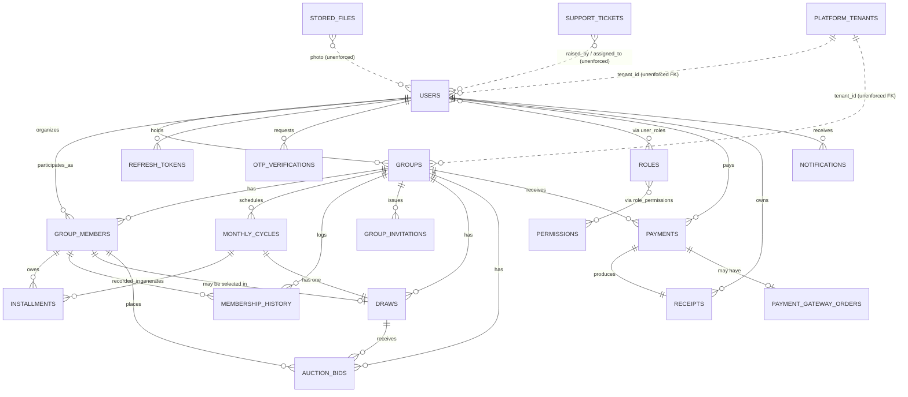
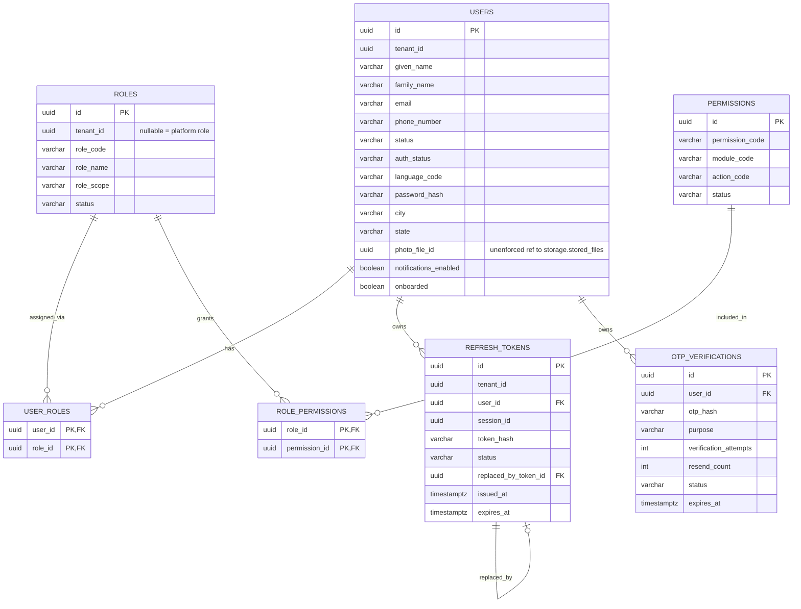
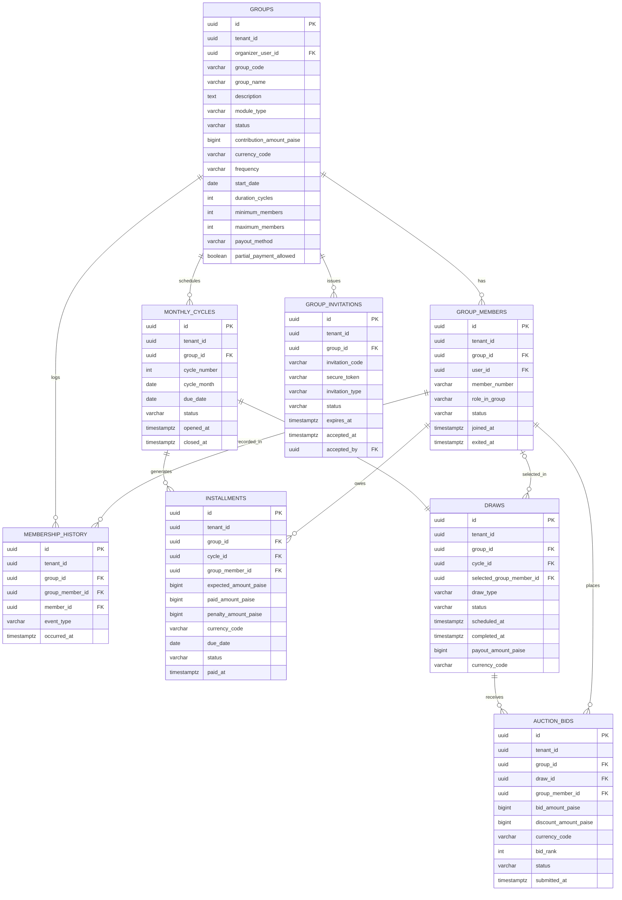
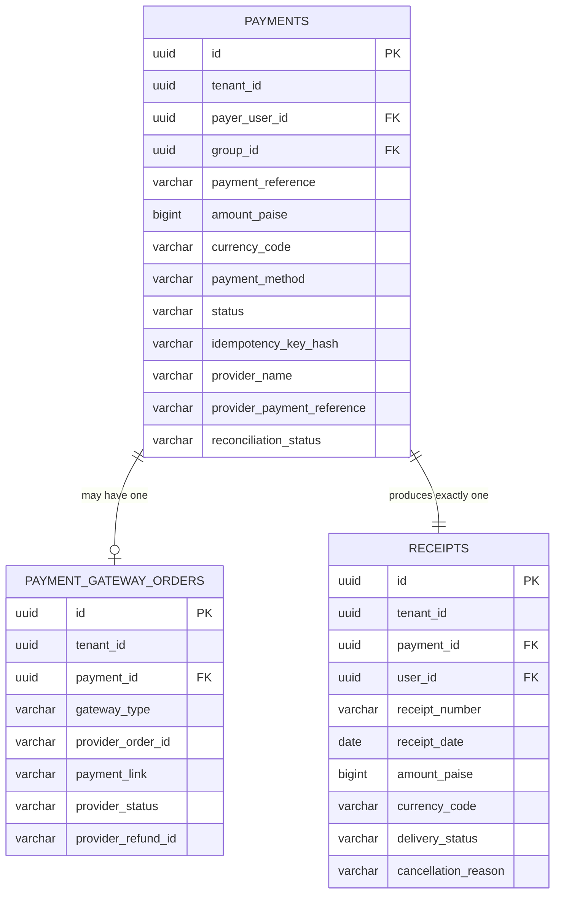
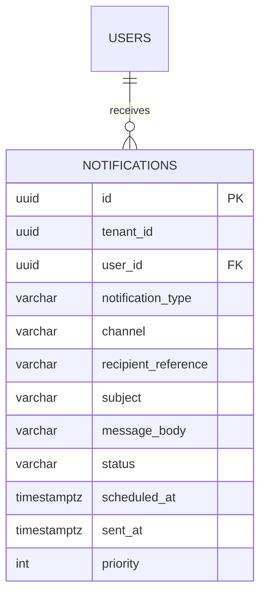
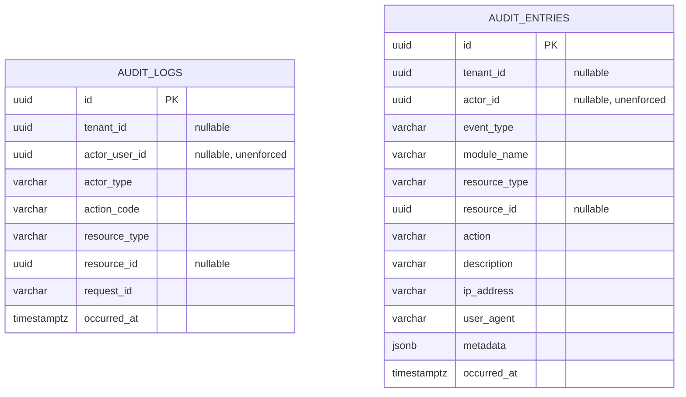
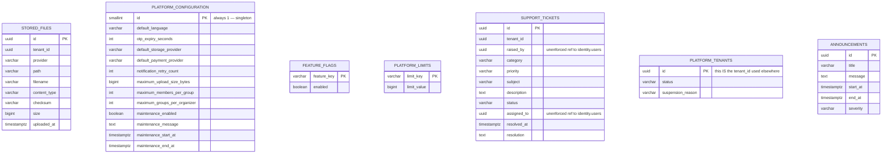

# Data Model and Database Schema

> **Audience:** Developers, DevOps Engineers, QA Engineers, Data/Analytics stakeholders
> **Prerequisite reading:** [System Architecture and Modules](system-architecture-and-modules.md)

This chapter documents the database schema exactly as defined by the 18 applied Flyway migrations in `services/backend/src/main/resources/db/migration/` (`V1__initial_schema.sql` through `V18__login_failed_token_refresh_audit_event.sql`), plus the opt-in seed data location described in `services/backend/README.md`. `V15`–`V18` are additive: `V15` adds the `OTP_SEND_FAILED` audit event, `V16` backfills `created_by`/`updated_by` audit metadata on role/permission tables, `V17` adds `EMAIL_SENT`/`EMAIL_SEND_FAILED` audit events, and `V18` adds `LOGIN_FAILED`/`TOKEN_REFRESH` audit events (see §5's `audit_entries.event_type` list). It supersedes the aspirational schema in [`postgresql-database-architecture.md`](../database/postgresql-database-architecture.md) — see [Vision and Implementation Status §7](vision-and-implementation-status.md#7-database-schema-reconciliation) for the itemized differences.

## 1. Database and Multi-Tenancy Configuration

- **Engine:** PostgreSQL, database name `bachatsetu`.
- **Migration tool:** Flyway (`spring.flyway.clean-disabled: true` everywhere — `flyway:clean` cannot run against this project's own configuration).
- **Schema authority:** Flyway is authoritative; Hibernate runs with `ddl-auto: validate` only — it never generates schema.
- **Tenancy model:** Single shared database, split into **named PostgreSQL schemas** by bounded context (not one schema per tenant). Tenancy within each schema is a shared-table, discriminator-column strategy: most business tables carry a `tenant_id UUID` column. `identity.permissions` and every `config.*` table are tenant-agnostic (platform-global). `identity.roles.tenant_id` is nullable — `NULL` means a platform-scoped role.
- **Schemas, in order of introduction:** `identity`, `community`, `finance`, `notification`, `audit` (migration `V1`) → `storage` (`V8`) → `config` (`V11`) → `support`, `platform` (`V14`).

## 2. Cross-Schema Entity Relationship Diagram

This diagram shows the primary relationships across all nine schemas. Base audit/soft-delete columns (`created_at`, `created_by`, `updated_at`, `updated_by`, `version`, `is_deleted`, `deleted_at`, `deleted_by`) are omitted from every entity box below for readability — see [§9](#9-the-standard-base-entity-shape).

**Note on dashed relationships:** `..` denotes a relationship enforced only by application logic, with **no database-level foreign key** — either because the reference is polymorphic (audit entries), because it was added after the referencing table (tenant scoping), or because the column was never given an FK constraint despite pointing at another table (`stored_files`, `support_tickets`). This is called out explicitly wherever it applies.

## 3. Schema: `identity`

Authentication, authorization, and session management.

| Table | Purpose | Key constraints |
| --- | --- | --- |
| `users` | Every login-capable person | `UNIQUE(tenant_id, email)`, `UNIQUE(tenant_id, phone_number)`; at least one of email/phone required; phone must match `^\+[1-9][0-9]{7,14}$` |
| `roles` | Role definitions | `role_scope` observed values (seeded): `PLATFORM`, `TENANT`, `GROUP`; platform-scoped role codes (`tenant_id IS NULL`) are globally unique via a partial index |
| `permissions` | Atomic, module-scoped permissions | Globally unique `permission_code`; no `tenant_id` — permissions are platform-global |
| `user_roles`, `role_permissions` | Many-to-many join tables | Composite primary keys |
| `refresh_tokens` | Session/JWT refresh-token lifecycle | One active token per `(user_id, session_id)` (partial unique index); self-referential `replaced_by_token_id` supports rotation and **reuse detection** (`status` includes `ROTATED`, `REUSED`) |
| `otp_verifications` | OTP challenge lifecycle for signup/login/password-reset/mobile-change | Only the bcrypt **hash** of the OTP is stored (plaintext `otp_code` column was dropped in migration `V4`); at most one `PENDING` OTP per `(user_id, purpose)` |

Seeded roles (migration `V2`): `PLATFORM_ADMIN`, `SUPPORT_OPERATOR` (both `PLATFORM` scope), `TENANT_ADMIN` (`TENANT` scope), `GROUP_ORGANIZER`, `GROUP_MEMBER` (both `GROUP` scope) — matching the role list in [`business-domain-design.md` §4](business-domain-design.md#4-user-roles), though only `PLATFORM_ADMIN` currently has a dedicated frontend surface (the Admin Portal); see [Security and Compliance](security-and-compliance.md).

## 4. Schema: `community`

The Bhishi group lifecycle: groups, membership, cycles, installments, invitations, draws, and auction bids.

| Table | Purpose | Key constraints |
| --- | --- | --- |
| `groups` | The aggregate root for a savings group (any `module_type`, though only `BHISHI` has a product experience — see [Vision and Implementation Status](vision-and-implementation-status.md)) | Rule and contribution-schedule fields live directly on this table, not a separate rules aggregate; `UNIQUE(tenant_id, group_code)` is a partial index excluding soft-deleted rows |
| `group_members` | A user's participation in one group | `UNIQUE(group_id, user_id)`, `UNIQUE(group_id, member_number)` |
| `monthly_cycles` | One scheduled contribution period | `UNIQUE(group_id, cycle_number)` |
| `installments` | What one member owes for one cycle | `UNIQUE(cycle_id, group_member_id)` — exactly one installment per member per cycle |
| `draws` | The payout-selection event for a cycle | `UNIQUE(cycle_id)` — **exactly one draw per cycle** |
| `auction_bids` | Bids placed during an auction-type draw | `UNIQUE(draw_id, group_member_id)` — one active bid per member per draw |
| `group_invitations` | QR/code/link invitation issued by an organizer | `UNIQUE(tenant_id, invitation_code)`, `UNIQUE(secure_token)`; **at most one `ACTIVE` invitation per group** at a time (partial unique index) |
| `membership_history` | Append-only join/removal event log per member | `UNIQUE(group_member_id, event_type)` — this is a simplified before/after pair, not a full timeline (see column note below) |

**Note on `membership_history`:** the unique constraint is `(group_member_id, event_type)`, which permits at most one `JOINED` row and one `REMOVED` row per membership — this is a lightweight join/exit marker, not a general-purpose audit timeline (that role is filled by `audit.audit_entries` instead).

## 5. Schema: `finance`

Payments, gateway integration, and receipts.

| Table | Purpose | Key constraints |
| --- | --- | --- |
| `payments` | A payer's payment intent/attempt, independent of gateway | `UNIQUE(payment_reference)`; `UNIQUE(tenant_id, idempotency_key_hash)` — idempotency is enforced here, not via an `Idempotency-Key` HTTP header (see [Vision and Implementation Status §6](vision-and-implementation-status.md#6-api-contract-reconciliation)) |
| `payment_gateway_orders` | The gateway-specific order created for a payment | `UNIQUE(payment_id)` — one gateway order per payment; `gateway_type IN ('RAZORPAY','STRIPE','CASHFREE')` |
| `receipts` | The confirmation document for a settled payment | `UNIQUE(payment_id)` — one receipt per payment; `UNIQUE(tenant_id, receipt_number)` |

There is no `finance.ledger_accounts`, `finance.ledger_entries`, `finance.payment_attempts`, or `finance.reconciliation_cases` table — see [Vision and Implementation Status §5](vision-and-implementation-status.md#5-what-a-ledger-would-add).

## 6. Schema: `notification`

A single flat table — no separate template or per-attempt delivery-log tables (message bodies are rendered in application code at send time, not stored as reusable template rows). `channel IN ('EMAIL','SMS','WHATSAPP','PUSH')`; `notification_type` is a fixed enum (`VERIFICATION`, `PAYMENT_RECEIPT`, `CONTRIBUTION_REMINDER`, `GROUP_UPDATE`, `DRAW_RESULT`, `SECURITY_ALERT`).

## 7. Schema: `audit`

Two tables coexist: `audit_logs` (from the initial migration `V1`) and `audit_entries` (introduced in migration `V9`, with a JSONB `metadata` column and a much larger, still-evolving `event_type` enum). **Only `audit_entries` is written to by current application code** — `audit_logs` is a superseded, dormant table kept for schema-history continuity. Neither table has a database-level foreign key on its actor/resource columns; both are intentionally unconstrained so an audit row survives deletion of the thing it refers to. See [Security and Compliance](security-and-compliance.md) for what triggers a write to this table.

**Current `audit_entries.event_type` enum (46 values, as of migration `V18`):** `LOGIN`, `LOGIN_FAILED`, `LOGOUT`, `TOKEN_REFRESH`, `OTP_SENT`, `OTP_SEND_FAILED`, `OTP_VERIFIED`, `EMAIL_SENT`, `EMAIL_SEND_FAILED`, `GROUP_CREATED`, `GROUP_UPDATED`, `GROUP_CLOSED`, `MEMBER_ADDED`, `MEMBER_REMOVED`, `PAYMENT_CREATED`, `PAYMENT_VERIFIED`, `PAYMENT_REFUNDED`, `DRAW_CREATED`, `DRAW_COMPLETED`, `RECEIPT_GENERATED`, `PDF_DOWNLOADED`, `NOTIFICATION_SENT`, `FILE_UPLOADED`, `FILE_DELETED`, `GATEWAY_REFUND_INITIATED`, `GATEWAY_WEBHOOK_PROCESSED`, `ADMIN_ANALYTICS_VIEWED`, `PLATFORM_CONFIGURATION_UPDATED`, `FEATURE_FLAG_UPDATED`, `SYSTEM_LIMIT_UPDATED`, `USER_REGISTERED`, `PROFILE_COMPLETED`, `INVITATION_CREATED`, `INVITATION_REVOKED`, `GROUP_JOINED`, `QR_JOINED`, `LINK_JOINED`, `TENANT_SUSPENDED`, `TENANT_ACTIVATED`, `TENANT_ARCHIVED`, `SUPPORT_TICKET_CREATED`, `SUPPORT_TICKET_ASSIGNED`, `SUPPORT_TICKET_RESOLVED`, `SUPPORT_TICKET_CLOSED`, `ANNOUNCEMENT_PUBLISHED`, `BROADCAST_NOTIFICATION_SENT`, `SYSTEM_EVENT`.

## 8. Schemas: `storage`, `config`, `support`, `platform`

| Table | Schema | Purpose | Key constraints |
| --- | --- | --- | --- |
| `stored_files` | `storage` | Every uploaded/generated file (profile photos, receipt PDFs) | `provider IN ('LOCAL','AWS_S3','AZURE_BLOB','GOOGLE_CLOUD_STORAGE')`; **no FK** from `identity.users.photo_file_id` to this table — the relationship is logical only |
| `platform_configuration` | `config` | The single global configuration row | `CHECK (id = 1)` enforces exactly one row ever exists |
| `feature_flags` | `config` | Nine platform-wide feature toggles | `feature_key IN ('AUTHENTICATION','PAYMENTS','NOTIFICATIONS','STORAGE','RECEIPTS','AUCTION','ANALYTICS','AUDIT','SIGNUP')`, all seeded `enabled = true` |
| `platform_limits` | `config` | Five configurable platform-wide ceilings | `limit_key IN ('MAX_GROUPS','MAX_MEMBERS','MAX_UPLOADS','MAX_RECEIPTS','MAX_NOTIFICATIONS')` |
| `support_tickets` | `support` | Tenant-scoped support requests | **No FK constraints at all** — `raised_by` and `assigned_to` reference `identity.users.id` only by convention, not by database constraint |
| `tenants` | `platform` | The tenant registry itself | `status IN ('ACTIVE','SUSPENDED','ARCHIVED')`; this table's own `id` **is** the `tenant_id` value used everywhere else in the schema |
| `announcements` | `platform` | Platform-wide broadcast announcements | No `tenant_id` — intentionally global, not per-tenant |

## 9. The Standard "Base Entity" Shape

Nearly every table above carries the same eight columns, omitted from the diagrams for readability:

| Column | Type | Purpose |
| --- | --- | --- |
| `created_at` | `TIMESTAMPTZ NOT NULL` | Row creation time |
| `created_by` | `UUID` | Actor that created the row |
| `updated_at` | `TIMESTAMPTZ NOT NULL` | Last modification time |
| `updated_by` | `UUID` | Actor that last modified the row |
| `version` | `BIGINT NOT NULL DEFAULT 0` | Optimistic-locking version |
| `is_deleted` | `BOOLEAN NOT NULL DEFAULT FALSE` | Soft-delete flag |
| `deleted_at` | `TIMESTAMPTZ` | Soft-delete timestamp, paired with `is_deleted` |
| `deleted_by` | `UUID` | Actor that performed the soft delete |

Every table also carries a matching pair of check constraints (`ck_<table>_audit_time` requiring `updated_at >= created_at`, and `ck_<table>_soft_delete` requiring the three soft-delete columns to be consistently null or consistently set). Exceptions: `audit.audit_entries` and `finance.ledger_entries`-equivalent append-only tables have no `updated_at`/soft-delete columns by design — an audit entry is never edited or deleted.

## 10. Money and Currency Convention

Every monetary column across `community` and `finance` schemas is an integer count of **paise** (`BIGINT ..._paise`), paired with a `currency_code VARCHAR(3)` column validated against `^[A-Z]{3}$`. This matches [`postgresql-database-architecture.md` §25](../database/postgresql-database-architecture.md#25-money-handling-strategy) exactly — this part of the original spec was followed faithfully.

## 11. Seed Data

An opt-in Flyway location (`services/backend/src/main/resources/db/seed/V900__local_development_seed_data.sql`, active only under the `seed` Spring profile) inserts a small, self-consistent sample dataset — one organizer, two members, a group, group memberships, a monthly cycle, a payment, a receipt, and a completed draw — all under a fixed local placeholder tenant. It never runs under `dev` or `prod`.

## Next Chapter

[Backend Module and API Reference](backend-module-and-api-reference.md) documents every REST endpoint that reads and writes the tables above.
