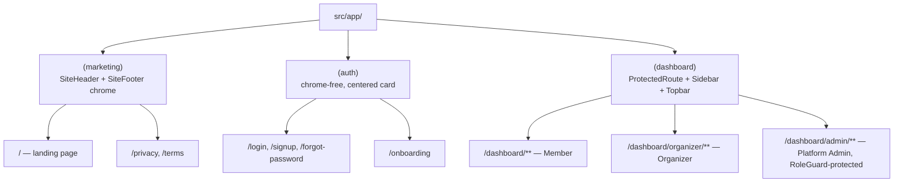

# Frontend Experience

> **Audience:** UI/UX Designers, Developers, QA Engineers, Product Managers
> **Prerequisite reading:** [Backend Module and API Reference](backend-module-and-api-reference.md), [State Machines](state-machines.md)

`services/web` is a single Next.js 16 (App Router) application that serves the public marketing site, every authenticated persona's dashboard, and the platform admin portal — there is no separate mobile app or standalone admin app (see [Vision and Implementation Status §4](vision-and-implementation-status.md#4-system-architecture-reconciliation)). This chapter catalogs every real screen, organized by the four personas the product actually supports.

## 1. Personas

| Persona | Who they are in the data model | Where they land |
| --- | --- | --- |
| **Visitor** | Not authenticated | Marketing site (`/`), `/login`, `/signup`, `/privacy`, `/terms` |
| **Member** | Any authenticated, onboarded `User` with at least one `GroupMember` row | `/dashboard/*` |
| **Organizer** | A Member whose `GroupMember.roleInGroup = ORGANIZER` in one or more groups | `/dashboard/organizer/*`, in addition to everything a Member sees |
| **Platform Administrator** | A User whose JWT carries the `PLATFORM_ADMIN` role | `/dashboard/admin/*`, in addition to everything a Member sees |

There is no dedicated UI today for the **Tenant Admin**, **Support Operator**, **Finance Operator**, or **Auditor** roles envisioned in [`business-domain-design.md` §4](business-domain-design.md#4-user-roles) — see [Roadmap and Future Work](roadmap-and-future-work.md).

## 2. Route Groups

A Next.js **route group** — the parenthesized segments `(marketing)`, `(auth)`, `(dashboard)` — organizes routes without adding a URL segment; each group's `layout.tsx` supplies shared chrome and, for `(dashboard)`, the `ProtectedRoute` authentication gate. Every route follows the same three-file convention: a server `page.tsx` (sets metadata), a client `*-content.tsx` (the actual interactive UI), and a `loading.tsx` (skeleton shown while data loads).

## 3. Screen Catalog — Visitor (Marketing)

| Route | Purpose |
| --- | --- |
| `/` | Landing page: hero, features, how-it-works, benefits, testimonials, pricing, FAQ sections |
| `/login` | Mobile-number + OTP sign-in |
| `/signup` | Name, mobile number, language, terms acceptance → OTP verification |
| `/forgot-password` | Placeholder — no password-based auth exists to reset (the platform is OTP-only) |
| `/privacy`, `/terms` | Early-access placeholder legal copy, explicitly flagged as not yet legally reviewed |

## 4. Screen Catalog — Member

| Route | Purpose |
| --- | --- |
| `/onboarding` | One-time profile completion (city, state, photo, notification preference) |
| `/dashboard` | Home: current group summary, recent notifications, upcoming draw |
| `/dashboard/groups` | List of groups the member belongs to |
| `/dashboard/groups/[groupId]` | Group detail: overview, membership, contribution progress |
| `/dashboard/groups/join` | Join a group via invitation code, QR, or link |
| `/dashboard/payments` | The member's own payment history |
| `/dashboard/receipts` | The member's own receipts, with PDF download |
| `/dashboard/notifications` | The member's own notification feed |
| `/dashboard/profile` | View/edit profile |
| `/dashboard/settings` | Theme, language, notification preference (device-local; no backend endpoint to persist these beyond onboarding — disclosed in-UI), logout |

## 5. Screen Catalog — Organizer

| Route | Purpose |
| --- | --- |
| `/dashboard/organizer` | Organizer home: every group owned, member counts, pending invitations, upcoming draws, contribution progress per group |
| `/dashboard/organizer/groups` | Searchable list of owned groups |
| `/dashboard/organizer/groups/[groupId]` | Group detail with tabs: Overview, Members (placeholder — no group-scoped member-list endpoint exists), Payments, Draws, Documents (placeholder), Settings |
| `/dashboard/organizer/groups/[groupId]/invite` | Generate/revoke the group's invitation (QR code, copyable code, shareable link) |
| `/dashboard/organizer/payments` | Aggregate contribution-progress view across every owned group |
| `/dashboard/organizer/draws` | Manage the next scheduled draw per group (conduct, close with manually-entered winner) |
| `/dashboard/organizer/notifications` | Reuses the Member notification feed (an organizer is also a member of their own group) |
| `/dashboard/organizer/settings` | Reuses Member settings, plus two read-only disclosure cards explaining that group rules and invitation validity cannot be edited after creation |

## 6. Screen Catalog — Platform Administrator

| Route | Purpose |
| --- | --- |
| `/dashboard/admin` | Platform Dashboard: totals (users, groups, members, payments, receipts, notifications, active tenants, storage usage), today's activity, quick actions |
| `/dashboard/admin/analytics` | Tabbed analytics: Overview, Payments, Groups, Users, Notifications, Storage — summary cards, real charts (30-day trends, monthly new-group/registration bars), and category distributions |
| `/dashboard/admin/users` | Cross-tenant user search (email, phone, status, date range), paginated, with enable/disable actions behind a confirmation dialog |
| `/dashboard/admin/groups` | Cross-tenant group search (status, date range), paginated; page-scoped client-side text filter since no server-side search parameter exists |
| `/dashboard/admin/tenants` | Tenant list with per-tenant statistics and suspend/activate/archive lifecycle actions |
| `/dashboard/admin/configuration` | Tabbed: General settings, Maintenance Mode, Feature Flags, System Limits — every control writes through to the real `admin.configuration` endpoints |
| `/dashboard/admin/monitoring` | System health (database/storage/notification component status, uptime, memory, disk), storage usage, notification health, and an audit-entries feed explicitly disclosed as tenant-scoped, not platform-wide |
| `/dashboard/admin/support` | Broadcast notification form (scope: all users / one tenant / organizers / members) and platform announcement publishing/listing |

Access to every `/dashboard/admin/*` route is gated client-side by a `RoleGuard` component checking the JWT's decoded `roles` claim, in addition to every underlying endpoint independently enforcing `PLATFORM_ADMIN` server-side — see [Security and Compliance](security-and-compliance.md).

## 7. The "Honest Empty State" Pattern

A consistent, deliberate UX convention runs through every screen above: **wherever the backend does not yet expose enough data to power a feature, the UI shows a real, labeled explanation instead of fabricated data.** This is not a bug — it is the explicit engineering directive followed across every frontend sprint (FE-1 through FE-6). Examples:

- The organizer's group Members tab shows "Member list isn't available yet — viewing every member's status and join date requires a group-scoped member list endpoint that doesn't exist on the backend yet."
- The Draw conduct/close screen requires a manually-typed winner ID because no member-picker endpoint exists.
- The Monitoring screen's audit feed is labeled "Tenant-scoped, not platform-wide" rather than silently showing incomplete data as if it were complete.
- Stat tiles that have no backing data show a "Coming soon" badge rather than a zero or blank.

## 8. Data-Fetching Pattern

Every screen follows the same layered pattern: `src/types/*.ts` (mirrors a backend DTO field-for-field) → `src/services/*.ts` (a thin axios wrapper per endpoint) → `src/hooks/*.ts` (a TanStack React Query hook per resource, with mutations invalidating the relevant query keys on success) → the feature component. Every data-fetching component implements the same four states: loading (skeleton), error (retry button), empty (explained placeholder), and success.

## 9. Production Readiness

A dedicated sprint (FE-6) hardened the frontend for launch: React Query Devtools and the `recharts` analytics bundle are lazy-loaded out of the production bundle; every mutation has explicit success/error toast feedback; a skip-to-content link and labeled navigation landmarks were added; SEO metadata, a sitemap, robots.txt, and a web app manifest with an offline-fallback service worker were added; and the `/dashboard/admin/*` role-gating described in §6 was added specifically to close a real security gap found during that sprint. Full detail in [Non-Functional Requirements and Production Readiness](non-functional-and-production-readiness.md).

## Next Chapter

[Security and Compliance](security-and-compliance.md) documents how authentication, authorization, and audit actually work end to end — backend and frontend together.
