# State Machines

> **Audience:** Developers, QA Engineers
> **Prerequisite reading:** [Data Model and Database Schema](data-model-and-database-schema.md), [Business Processes](business-processes.md)

Every enum below is transcribed directly from the `CHECK` constraint on the corresponding column in the applied Flyway migrations (see [Data Model and Database Schema](data-model-and-database-schema.md) for the exact migration each constraint comes from). Where a transition is driven by a specific REST endpoint documented in [Backend Module and API Reference](backend-module-and-api-reference.md), the endpoint is named on the arrow. Where the triggering endpoint is not confirmed from the reviewed controller surface, the transition is shown without an endpoint label — treat it as a documented possible state, not a guaranteed automatic transition, and confirm against the relevant `services/backend/docs/application/*.md` before relying on it for a QA test plan.

## User Authentication Status

`identity.users` carries **two** status columns, added in different migrations. `status` (migration `V1`) is the coarser, original field; `auth_status` (migration `V3`) is the one the actual signup/OTP/login flow reads and writes today, and the one exposed to the frontend as `PlatformUserStatus` (see [Frontend Experience](frontend-experience.md)).

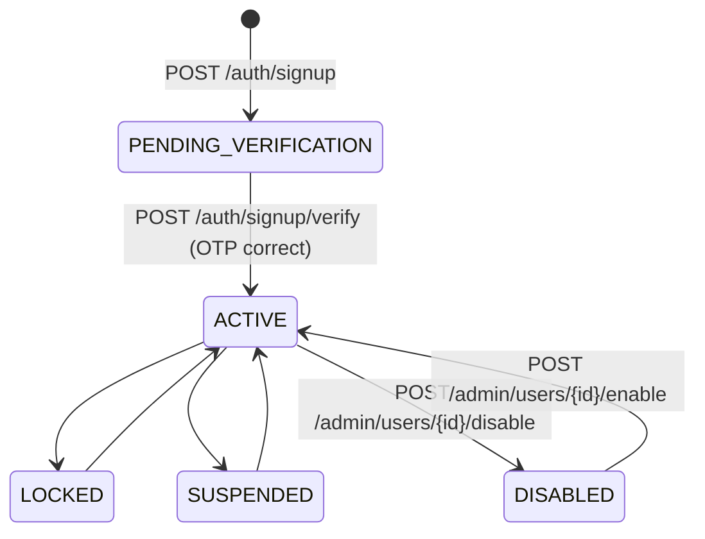
```mermaid
stateDiagram-v2
    [*] --> PENDING_VERIFICATION: POST /auth/signup
    PENDING_VERIFICATION --> ACTIVE: POST /auth/signup/verify (OTP correct)
    ACTIVE --> LOCKED
    LOCKED --> ACTIVE
    ACTIVE --> SUSPENDED
    SUSPENDED --> ACTIVE
    ACTIVE --> DISABLED: POST /admin/users/{id}/disable
    DISABLED --> ACTIVE: POST /admin/users/{id}/enable
```

The legacy `status` column's values (`INVITED`, `ACTIVE`, `LOCKED`, `SUSPENDED`, `DELETED`) still exist in the schema but are not the field driving current signup/enable/disable behavior.

## Refresh Token (Session)

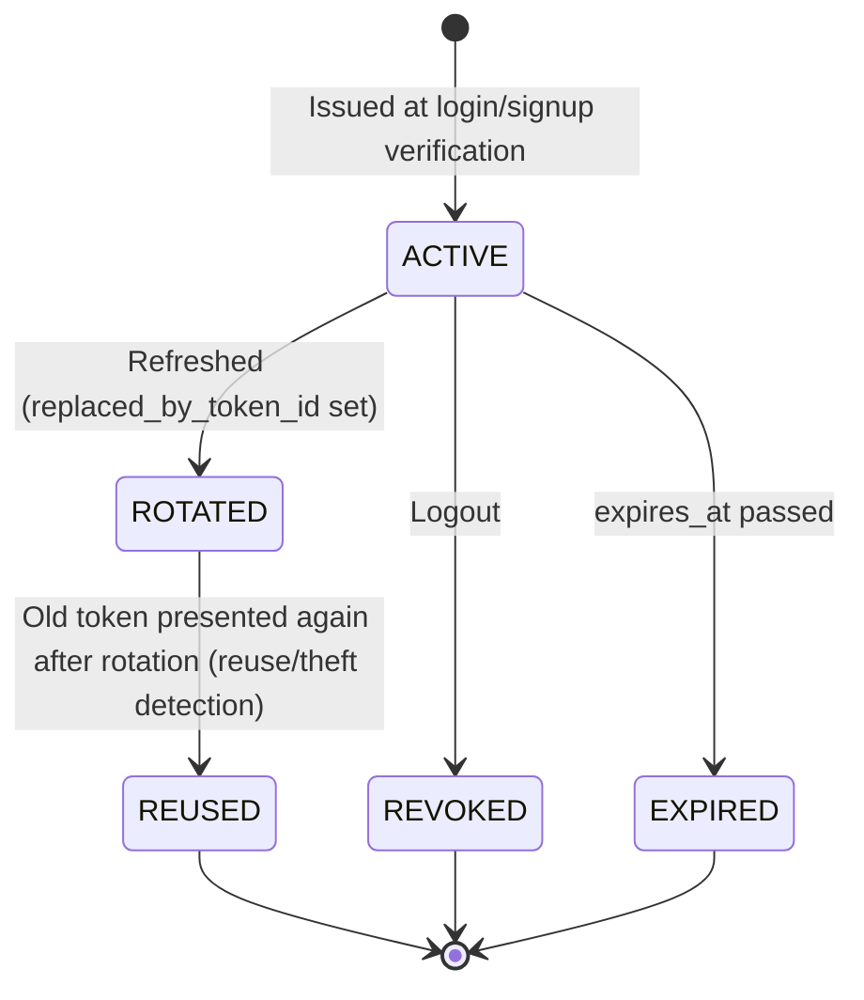
```mermaid
stateDiagram-v2
    [*] --> ACTIVE: Issued at login/signup verification
    ACTIVE --> ROTATED: Refreshed (replaced_by_token_id set)
    ACTIVE --> REVOKED: Logout
    ACTIVE --> EXPIRED: expires_at passed
    ROTATED --> REUSED: Old token presented again after rotation (reuse/theft detection)
    REUSED --> [*]
    REVOKED --> [*]
    EXPIRED --> [*]
```

`REUSED` is a security control, not a normal path: presenting an already-rotated refresh token is treated as a possible token-theft signal.

## OTP Verification

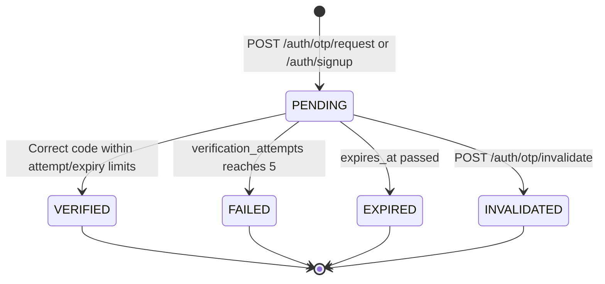
```mermaid
stateDiagram-v2
    [*] --> PENDING: POST /auth/otp/request or /auth/signup
    PENDING --> VERIFIED: Correct code within attempt/expiry limits
    PENDING --> FAILED: verification_attempts reaches 5
    PENDING --> EXPIRED: expires_at passed
    PENDING --> INVALIDATED: POST /auth/otp/invalidate
    VERIFIED --> [*]
    FAILED --> [*]
    EXPIRED --> [*]
    INVALIDATED --> [*]
```

At most one `PENDING` OTP exists per `(user_id, purpose)` at a time (enforced by a partial unique index — see [Data Model §3](data-model-and-database-schema.md#3-schema-identity)).

## Group

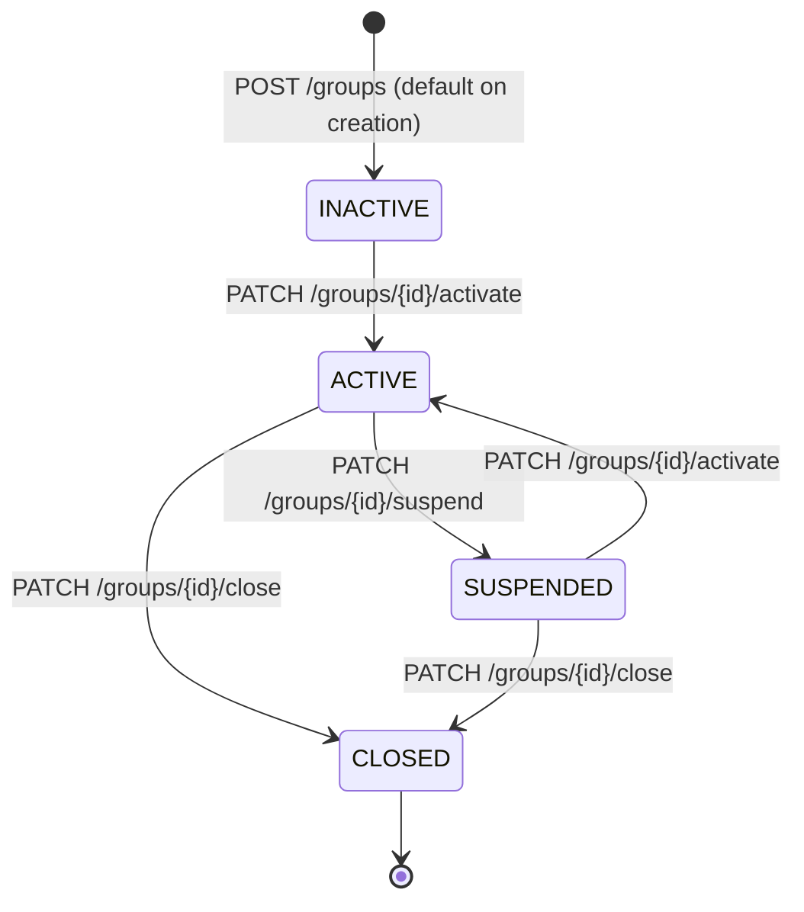
```mermaid
stateDiagram-v2
    [*] --> INACTIVE: POST /groups (default on creation)
    INACTIVE --> ACTIVE: PATCH /groups/{id}/activate
    ACTIVE --> SUSPENDED: PATCH /groups/{id}/suspend
    SUSPENDED --> ACTIVE: PATCH /groups/{id}/activate
    ACTIVE --> CLOSED: PATCH /groups/{id}/close
    SUSPENDED --> CLOSED: PATCH /groups/{id}/close
    CLOSED --> [*]
```

This is a **collapsed** state set relative to the original design's six-value `DRAFT/PENDING_ACTIVATION/ACTIVE/SUSPENDED/COMPLETED/CANCELLED` enum — migration `V6` remapped `DRAFT`/`PENDING_ACTIVATION` → `INACTIVE` and `COMPLETED`/`CANCELLED` → `CLOSED`. See [Vision and Implementation Status §7](vision-and-implementation-status.md#7-database-schema-reconciliation).

## Group Member

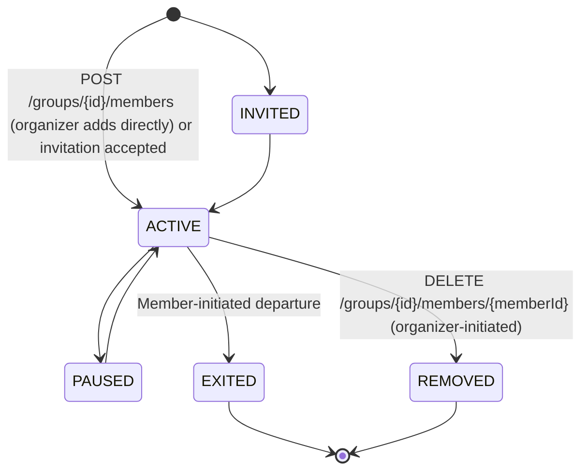
```mermaid
stateDiagram-v2
    [*] --> INVITED
    [*] --> ACTIVE: POST /groups/{id}/members (organizer adds directly) or invitation accepted
    INVITED --> ACTIVE
    ACTIVE --> PAUSED
    PAUSED --> ACTIVE
    ACTIVE --> EXITED: Member-initiated departure
    ACTIVE --> REMOVED: DELETE /groups/{id}/members/{memberId} (organizer-initiated)
    EXITED --> [*]
    REMOVED --> [*]
```

## Group Invitation

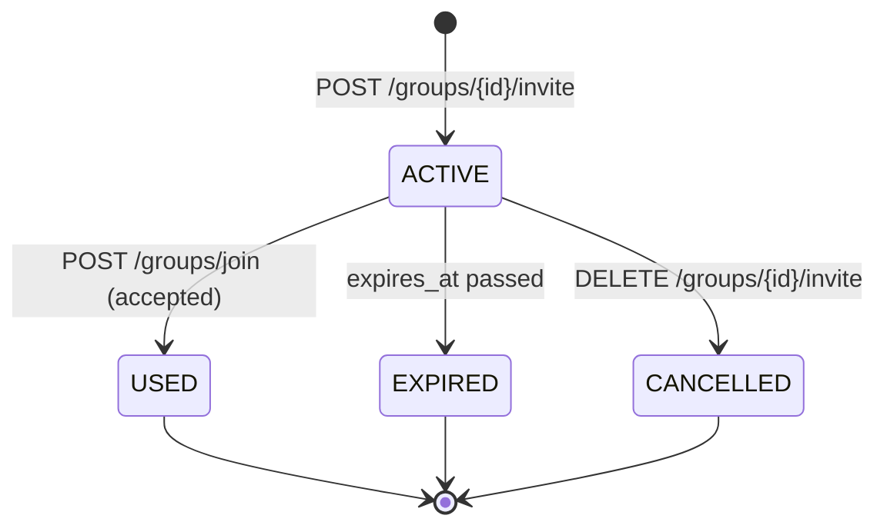
```mermaid
stateDiagram-v2
    [*] --> ACTIVE: POST /groups/{id}/invite
    ACTIVE --> USED: POST /groups/join (accepted)
    ACTIVE --> EXPIRED: expires_at passed
    ACTIVE --> CANCELLED: DELETE /groups/{id}/invite
    USED --> [*]
    EXPIRED --> [*]
    CANCELLED --> [*]
```

At most one `ACTIVE` invitation exists per group at a time (partial unique index — see [Data Model §4](data-model-and-database-schema.md#4-schema-community)).

## Monthly Cycle

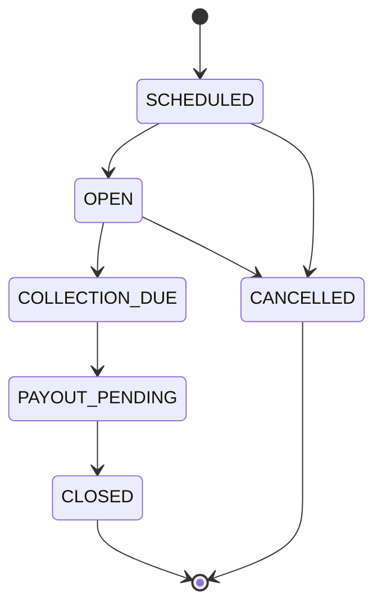
```mermaid
stateDiagram-v2
    [*] --> SCHEDULED
    SCHEDULED --> OPEN
    OPEN --> COLLECTION_DUE
    COLLECTION_DUE --> PAYOUT_PENDING
    PAYOUT_PENDING --> CLOSED
    SCHEDULED --> CANCELLED
    OPEN --> CANCELLED
    CLOSED --> [*]
    CANCELLED --> [*]
```

## Installment

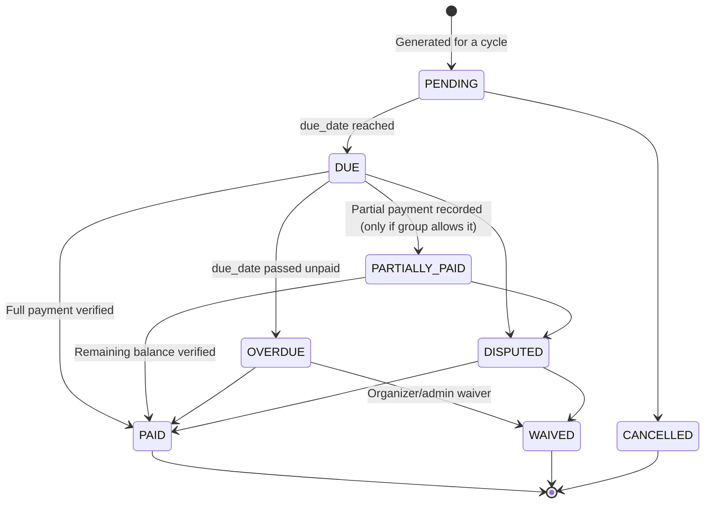
```mermaid
stateDiagram-v2
    [*] --> PENDING: Generated for a cycle
    PENDING --> DUE: due_date reached
    DUE --> PARTIALLY_PAID: Partial payment recorded (only if group allows it)
    DUE --> PAID: Full payment verified
    PARTIALLY_PAID --> PAID: Remaining balance verified
    DUE --> OVERDUE: due_date passed unpaid
    OVERDUE --> PAID
    OVERDUE --> WAIVED: Organizer/admin waiver
    PENDING --> CANCELLED
    DUE --> DISPUTED
    PARTIALLY_PAID --> DISPUTED
    DISPUTED --> PAID
    DISPUTED --> WAIVED
    PAID --> [*]
    WAIVED --> [*]
    CANCELLED --> [*]
```

## Payment

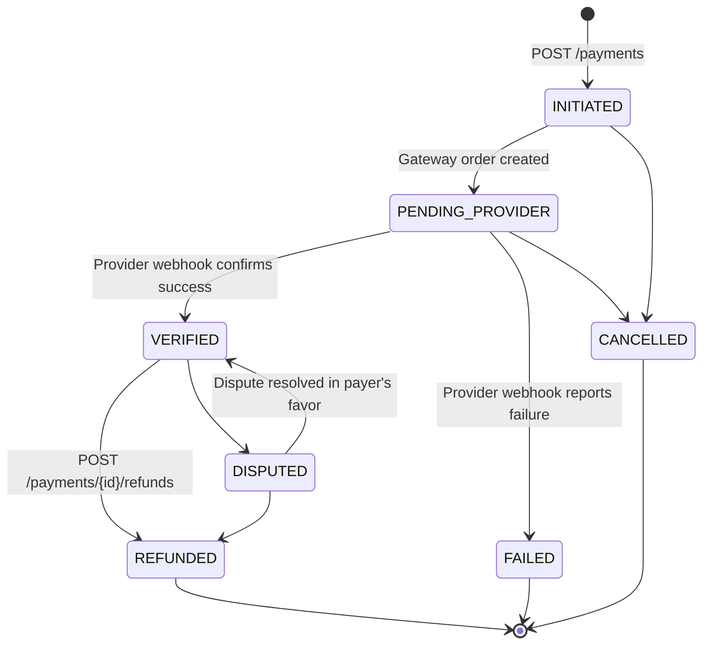
```mermaid
stateDiagram-v2
    [*] --> INITIATED: POST /payments
    INITIATED --> PENDING_PROVIDER: Gateway order created
    PENDING_PROVIDER --> VERIFIED: Provider webhook confirms success
    PENDING_PROVIDER --> FAILED: Provider webhook reports failure
    INITIATED --> CANCELLED
    PENDING_PROVIDER --> CANCELLED
    VERIFIED --> REFUNDED: POST /payments/{id}/refunds
    VERIFIED --> DISPUTED
    DISPUTED --> VERIFIED: Dispute resolved in payer's favor
    DISPUTED --> REFUNDED
    FAILED --> [*]
    CANCELLED --> [*]
    REFUNDED --> [*]
```

A payment additionally carries an **independent** `reconciliationStatus` (`NOT_REQUIRED → PENDING → MATCHED | MISMATCHED → RESOLVED`), tracking whether the internal status and the provider's status agree — see [Data Model §5](data-model-and-database-schema.md#5-schema-finance) and [Vision and Implementation Status §1](vision-and-implementation-status.md#1-ubiquitous-language-reconciliation) for why this is a single column rather than the originally-specified `Reconciliation Case` workflow.

## Receipt (Delivery Status)

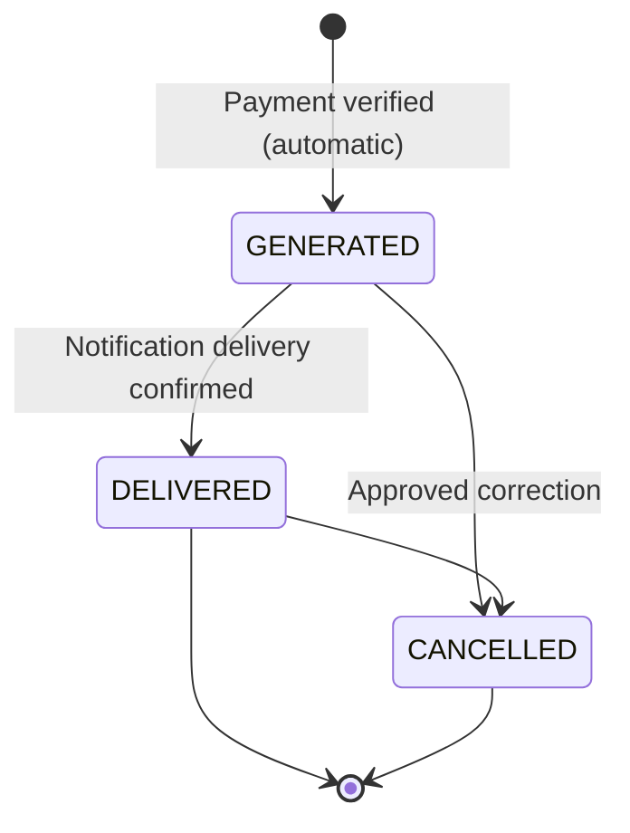
```mermaid
stateDiagram-v2
    [*] --> GENERATED: Payment verified (automatic)
    GENERATED --> DELIVERED: Notification delivery confirmed
    GENERATED --> CANCELLED: Approved correction
    DELIVERED --> CANCELLED
    DELIVERED --> [*]
    CANCELLED --> [*]
```

A `Receipt` requires `cancellation_reason` to be set whenever `delivery_status = CANCELLED` (database check constraint).

## Draw

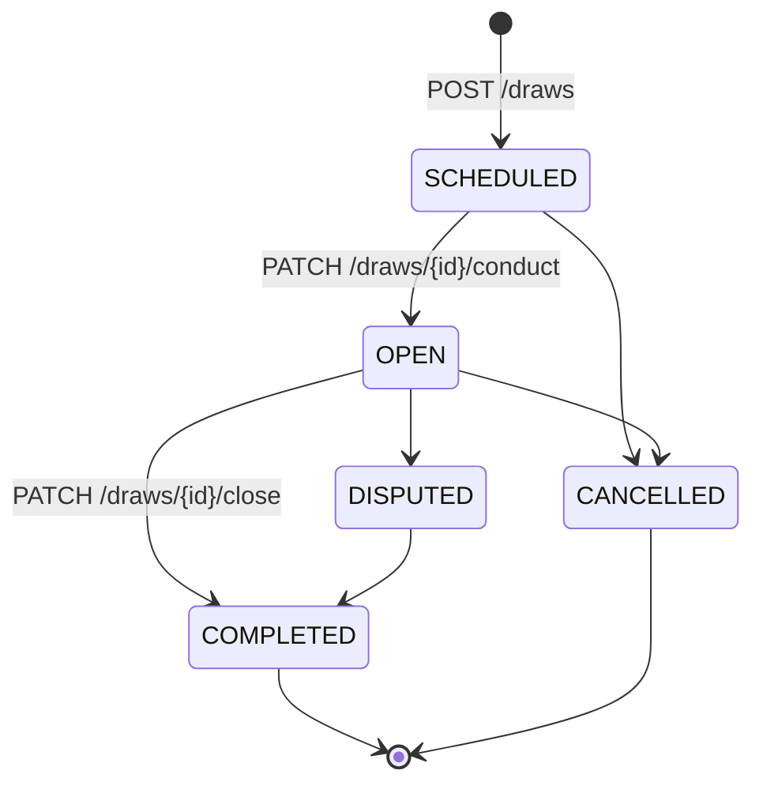
```mermaid
stateDiagram-v2
    [*] --> SCHEDULED: POST /draws
    SCHEDULED --> OPEN: PATCH /draws/{id}/conduct
    OPEN --> COMPLETED: PATCH /draws/{id}/close
    SCHEDULED --> CANCELLED
    OPEN --> CANCELLED
    OPEN --> DISPUTED
    DISPUTED --> COMPLETED
    COMPLETED --> [*]
    CANCELLED --> [*]
```

Exactly one `Draw` exists per `MonthlyCycle` (database-enforced unique constraint).

## Auction Bid

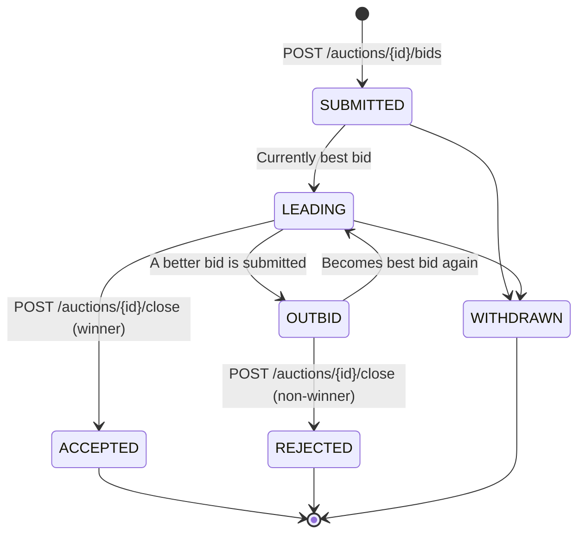
```mermaid
stateDiagram-v2
    [*] --> SUBMITTED: POST /auctions/{id}/bids
    SUBMITTED --> LEADING: Currently best bid
    LEADING --> OUTBID: A better bid is submitted
    OUTBID --> LEADING: Becomes best bid again
    SUBMITTED --> WITHDRAWN
    LEADING --> WITHDRAWN
    LEADING --> ACCEPTED: POST /auctions/{id}/close (winner)
    OUTBID --> REJECTED: POST /auctions/{id}/close (non-winner)
    ACCEPTED --> [*]
    REJECTED --> [*]
    WITHDRAWN --> [*]
```

## Notification

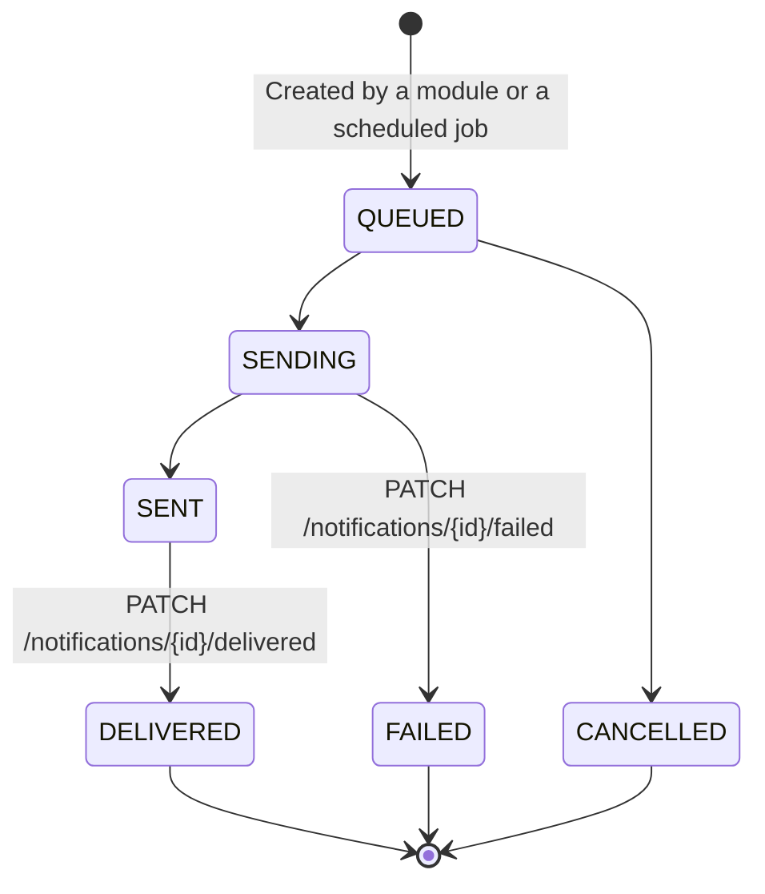
```mermaid
stateDiagram-v2
    [*] --> QUEUED: Created by a module or a scheduled job
    QUEUED --> SENDING
    SENDING --> SENT
    SENT --> DELIVERED: PATCH /notifications/{id}/delivered
    SENDING --> FAILED: PATCH /notifications/{id}/failed
    QUEUED --> CANCELLED
    DELIVERED --> [*]
    FAILED --> [*]
    CANCELLED --> [*]
```

## Support Ticket

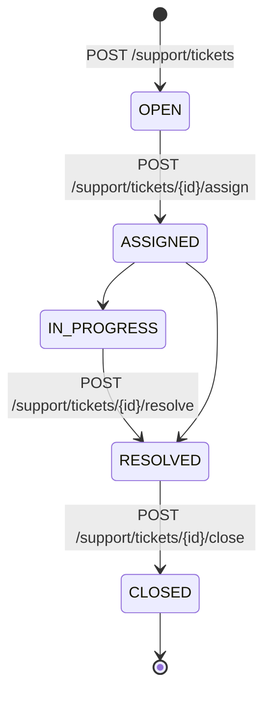
```mermaid
stateDiagram-v2
    [*] --> OPEN: POST /support/tickets
    OPEN --> ASSIGNED: POST /support/tickets/{id}/assign
    ASSIGNED --> IN_PROGRESS
    IN_PROGRESS --> RESOLVED: POST /support/tickets/{id}/resolve
    ASSIGNED --> RESOLVED
    RESOLVED --> CLOSED: POST /support/tickets/{id}/close
    CLOSED --> [*]
```

`resolved_at` and `resolution` are required together whenever `status IN (RESOLVED, CLOSED)`, and forbidden otherwise (database check constraint).

## Tenant

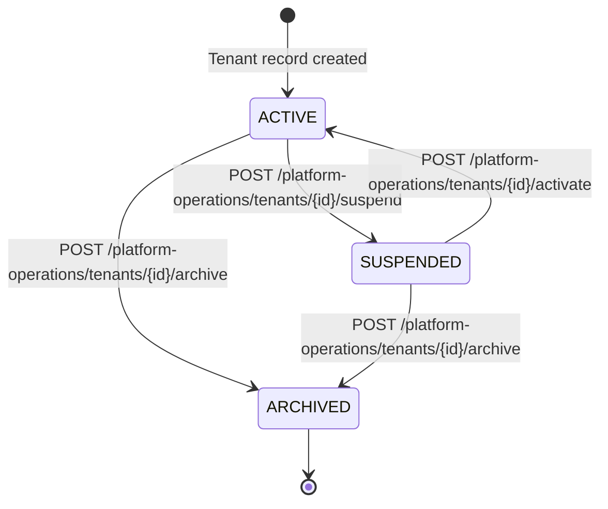
```mermaid
stateDiagram-v2
    [*] --> ACTIVE: Tenant record created
    ACTIVE --> SUSPENDED: POST /platform-operations/tenants/{id}/suspend
    SUSPENDED --> ACTIVE: POST /platform-operations/tenants/{id}/activate
    ACTIVE --> ARCHIVED: POST /platform-operations/tenants/{id}/archive
    SUSPENDED --> ARCHIVED: POST /platform-operations/tenants/{id}/archive
    ARCHIVED --> [*]
```

`ARCHIVED` is terminal — the reviewed endpoints have no un-archive path.

## Next Chapter

[Frontend Experience](frontend-experience.md) shows how these states surface as badges, banners, and disabled actions across the actual web application screens.
