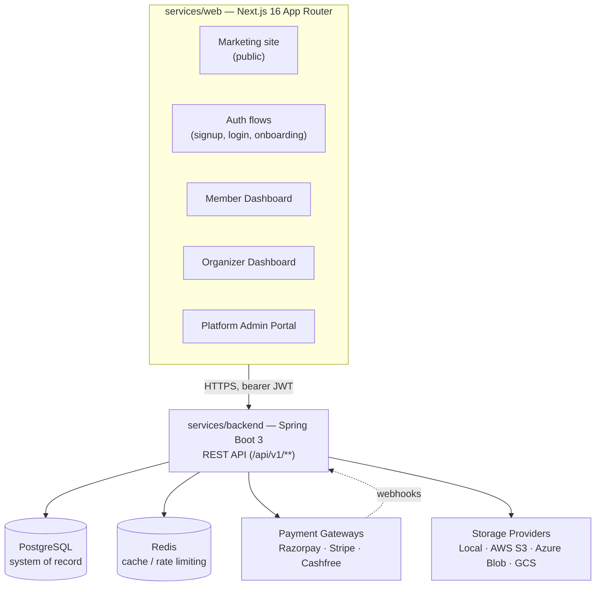
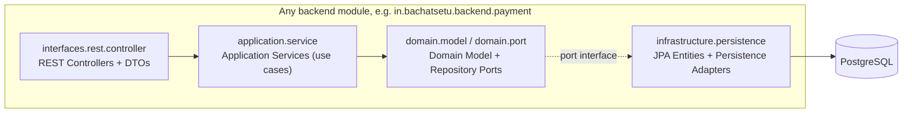

# System Architecture and Modules

> **Audience:** Developers, DevOps Engineers, Enterprise Architects
> **Prerequisite reading:** [Platform Overview](platform-overview.md), [Vision and Implementation Status](vision-and-implementation-status.md)

This chapter documents the architecture as implemented in `services/backend` and `services/web`, following the modular-monolith direction set out in [`system-architecture.md`](../architecture/system-architecture.md). Where implementation diverges from that original spec, this chapter states the implemented reality and links to [Vision and Implementation Status](vision-and-implementation-status.md) rather than repeating the reconciliation.

## 1. Architectural Style

BachatSetu's backend is a **single Spring Boot application** (a modular monolith, not microservices), internally organized into independent bounded-context modules under `in.bachatsetu.backend`. Each module follows **Domain-Driven Design** and **Hexagonal (Ports and Adapters) Architecture** independently — the monolith is modular in the sense that module boundaries are enforced by package structure and (per `services/backend/docs/quality/build-quality.md`) verified automatically by ArchUnit tests, not by network boundaries.

The frontend is a **single Next.js application** (`services/web`) — not a separate mobile app plus a separate admin portal as the original architecture spec envisioned (see [Vision and Implementation Status §4](vision-and-implementation-status.md#4-system-architecture-reconciliation)). It serves the public marketing site, member/organizer dashboards, and the full platform admin portal from one deployable, with route-level and role-level access control distinguishing them.

## 2. High-Level System Diagram

There is no API Gateway, load balancer tier, or service mesh in the implemented system — `services/web` calls `services/backend` directly over HTTPS. The AWS target architecture described in [`system-architecture.md` §"AWS Target Architecture"](../architecture/system-architecture.md#aws-target-architecture) (Route 53, CloudFront, ALB, ECS/EKS, RDS, ElastiCache, Secrets Manager, WAF, KMS) has not been provisioned — no deployment has occurred yet. This is tracked in [Roadmap and Future Work](roadmap-and-future-work.md).

## 3. Backend Layered Architecture

Every backend module follows the same four-layer structure, matching [`system-architecture.md`'s prescribed pattern](../architecture/system-architecture.md#backend-architecture) exactly:

| Layer | Package convention | Responsibility |
| --- | --- | --- |
| Interfaces (REST) | `<module>.interfaces.rest.controller`, `.dto`, `.mapper`, `.exception` | HTTP concerns only: request/response mapping, `@PreAuthorize` role checks, RFC 7807 problem-detail error translation |
| Application | `<module>.application.service`, `.usecase`, `.command`, `.query` | Orchestrates one use case per service class; owns transaction boundaries |
| Domain | `<module>.domain.model`, `.port` | Aggregates, value objects, domain invariants, and repository **port interfaces** (no persistence detail) |
| Infrastructure | `<module>.infrastructure.persistence.adapter`, `.entity` (or shared `in.bachatsetu.backend.infrastructure.persistence`) | JPA entity mapping and repository port **implementations** |

Rules enforced across every module (verified by ArchUnit — see `services/backend/docs/quality/build-quality.md`):

- Controllers depend only on application services, never directly on domain repositories or JPA entities.
- Domain packages have no dependency on Spring, JPA, or any persistence framework.
- A module does not reach into another module's persistence layer directly — cross-module reads go through the other module's public application-service or port interface.
- Configuration classes are gated with `@ConditionalOnProperty` (e.g. `bachatsetu.admin.enabled`, `bachatsetu.audit.rest.enabled`), not `@ConditionalOnBean` against sibling configuration classes — the latter has no guaranteed evaluation order for regular `@Configuration` classes (documented as a real bug class avoided, in `services/backend/README.md`'s Troubleshooting section).

## 4. Backend Module Inventory

Every top-level package under `in.bachatsetu.backend` and the bounded context it owns:

| Module | Bounded Context | Owns |
| --- | --- | --- |
| `auth` | Identity and Access | Signup, OTP request/verify/resend/invalidate, JWT issuance, refresh-token rotation |
| `user` | Identity and Access | Profile onboarding (`GET/POST /api/v1/users/me/onboarding`) |
| `group` | Bhishi | `Group` aggregate: creation, lifecycle (activate/suspend/close), rules |
| `member` | Bhishi | `GroupMember` aggregate: adding/removing members, roles within a group |
| `invitation` | Bhishi | `GroupInvitation` aggregate: QR/code/link invitation issuance and the public join flow |
| `payment` | Payment | `Payment` aggregate: creation, status transitions, reconciliation status |
| `paymentgateway` | Payment | Gateway-order creation/sync, refunds, and webhook ingestion for Razorpay/Stripe/Cashfree |
| `draw` | Bhishi | `Draw` aggregate: scheduling, opening, completing (selecting a payout winner), closing |
| `auction` | Bhishi | `AuctionBid` aggregate: bid submission and ranking within a draw |
| `receipt` | Payment | `Receipt` aggregate: generation on verified payment, PDF rendering, storage-backed download URL |
| `notification` | Notification | `Notification` aggregate, channel abstraction (email/SMS/WhatsApp/push), template rendering |
| `automation` | Notification | Scheduled jobs: due-installment reminders, no REST surface of its own |
| `storage` | *(new — not in original design)* | `StoredFile` aggregate behind a provider-agnostic port (local disk, S3, Azure Blob, GCS) |
| `audit` | Audit and Compliance | `AuditEntry` aggregate: tenant-scoped audit trail creation and search |
| `admin` | Reporting / Tenant | Platform statistics, cross-tenant user/group/tenant search, user enable/disable; sub-packages `admin.analytics` (payment/group/user/notification/storage analytics) and `admin.configuration` (platform configuration singleton, feature flags, system limits) |
| `platformoperations` | Tenant and Community | Platform-wide overview, tenant suspend/activate/archive, system health, broadcast notifications, announcements |
| `support` | *(new — not in original design)* | `SupportTicket` aggregate: creation, assignment, resolution, closure |
| `dashboard` | *(cross-cutting query module)* | Composed read-only summaries for the member and organizer home screens |

See [Vision and Implementation Status §2](vision-and-implementation-status.md#2-bounded-context-reconciliation) for why `storage`, `support`, and `dashboard` have no equivalent in the original nine bounded contexts, and why the original **Ledger** and **Reporting** contexts are only partially or not at all realized.

## 5. Cross-Module Integration Pattern

Modules integrate through two mechanisms, both visible in the codebase:

1. **Synchronous application-service calls** — e.g. the `receipt` module's application service calls into `payment`'s port to confirm a payment is `VERIFIED` before generating a receipt.
2. **Event listeners for notifications and audit** — domain state changes in one module trigger notification and audit side effects via dedicated listener classes (e.g. `PaymentVerifiedNotificationListener`, `ReceiptGeneratedNotificationListener`, `DrawCompletionNotificationListener`, `SavingsGroupNotificationListener`, `MemberNotificationListener`). Every sensitive action across every module — login, payment verification, receipt generation and download, draw completion, notification send, storage upload/delete, gateway refund and webhook processing, tenant lifecycle changes, support ticket lifecycle, announcement publication — writes an `AuditEntry` through the shared `audit` module rather than each module maintaining its own audit log.

This listener-based integration is in-process (Spring application events), not a message broker or external event bus — there is no Kafka, RabbitMQ, or SQS in the stack today.

## 6. Multi-Tenancy Implementation

The implemented strategy matches the spec's stated default ([`system-architecture.md` §"Multi-Tenancy"](../architecture/system-architecture.md#multi-tenancy)): **shared database, shared schema, tenant-scoped rows** via a `tenant_id` column on nearly every table (51 occurrences across the schema — see [Data Model and Database Schema](data-model-and-database-schema.md)). `platform.tenants` (added in migration `V14`) is the tenant registry, but no other table has a database-level foreign key to it — tenant consistency is enforced entirely in the application layer, not by PostgreSQL constraints. See [Security and Compliance](security-and-compliance.md) for how tenant scoping is enforced on every request.

Locally, a fixed placeholder tenant is wired only under the `local` Spring profile to unblock development without a full tenant-resolution strategy (`LocalTenantScopeProviderConfig`) — it does not activate under `dev` or `prod`.

## 7. Tech Stack

| Layer | Technology | Notes |
| --- | --- | --- |
| Backend language/runtime | Java 21 | |
| Backend framework | Spring Boot 3 | Spring Security, Spring Data JPA |
| Database | PostgreSQL 16.x/17.x | System of record; see [Data Model and Database Schema](data-model-and-database-schema.md) |
| Cache | Redis 7.x | Used for cache/rate-limiting per the architecture spec; not the source of truth for money or identity |
| Migrations | Flyway | 14 versioned migrations applied (`V1`–`V14`) |
| Build | Maven | `mvn clean verify` runs the full test suite plus Checkstyle, PMD, SpotBugs, ArchUnit, and JaCoCo coverage gates |
| API documentation | springdoc-openapi (Swagger UI) | Live at `/swagger-ui/index.html` when the app is running |
| Frontend framework | Next.js 16 (App Router, Turbopack) | Server + client component split per route |
| Frontend UI library | React 19 | |
| Frontend language | TypeScript (strict) | |
| Styling | TailwindCSS v4 + shadcn/ui (`base-nova` preset) | Backed by `@base-ui/react`, not Radix |
| Server-state management | TanStack React Query v5 | |
| Forms | react-hook-form + zod | |
| Charts | recharts (lazy-loaded) | Admin analytics only |

## 8. Configuration and Feature Gating

Every module's REST layer is individually toggleable via a `@ConditionalOnProperty`-gated configuration class, using property prefixes such as `bachatsetu.admin.enabled`, `bachatsetu.admin.analytics.enabled`, `bachatsetu.admin.platform-config.enabled`, `bachatsetu.audit.rest.enabled`, and `bachatsetu.platform-operations.rest.enabled` (all default to `true`). This lets an operator disable a module's HTTP surface without removing it from the deployed artifact. Separately, `config.feature_flags` (a database table, not a Spring property) exposes nine platform-wide feature toggles to platform administrators at runtime through the Admin Portal's Configuration screen: `AUTHENTICATION`, `PAYMENTS`, `NOTIFICATIONS`, `STORAGE`, `RECEIPTS`, `AUCTION`, `ANALYTICS`, `AUDIT`, `SIGNUP` — see [Backend Module and API Reference §Platform Configuration](backend-module-and-api-reference.md#platform-configuration).

## Next Chapter

[Data Model and Database Schema](data-model-and-database-schema.md) documents every table these modules persist to, with entity-relationship diagrams per schema.
