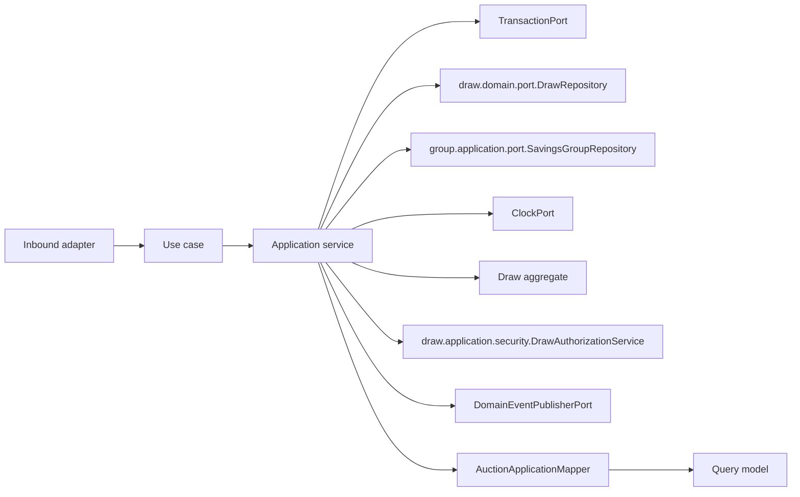

# Auction Application Layer

Version: 1.0
Sprint: 11.8
Status: Implemented
Last Updated: 2026-07-08

## Purpose

The Auction application layer exposes framework-neutral, business-vocabulary-aligned use cases for
conducting a savings group's monthly auction. It does not introduce a new aggregate: "Auction" is the
pre-existing `Draw` aggregate (`draw.domain.model.Draw`) operating in `DrawType.AUCTION` mode, which already
shipped complete bid-submission, bid-ranking, and winner-acceptance behavior (`submitBid`, `complete`,
`AuctionBid`, `BidAmount`, `BidStatus`) ahead of this sprint. Recreating a parallel aggregate would violate
the sprint's explicit "reuse existing... do not recreate existing functionality" instruction, so
`auction.application.*` is a thin facade: it depends on `draw.domain.*` directly, adds only the
cross-aggregate rules Draw cannot enforce on its own (member eligibility, bid-range validation against the
group's contribution amount), and derives one new read-only domain view (`AuctionWinner`, see
[Architecture Decisions](#why-auctionwinner-lives-in-drawdomainmodel)).

This layer has no Spring, Jakarta Persistence, REST, or infrastructure dependencies.

## Architecture

Dependency direction is inward: `auction.application.*` depends on the Draw domain, the Group
application/domain layers, shared domain contracts, and Java — never on `auction.interfaces.*` or any
concrete Spring/JPA type.

## Use Cases

| Use case | Command/input | Result |
| --- | --- | --- |
| `CreateAuctionUseCase` | `CreateAuctionCommand` | `AuctionResult` |
| `PlaceBidUseCase` | `PlaceBidCommand` | `draw.application.query.AuctionBidResult` |
| `CloseAuctionUseCase` | `CloseAuctionCommand` | `AuctionResult` |
| `GetAuctionUseCase` | Tenant ID and auction ID | `AuctionResult` |
| `ListAuctionsUseCase` | Tenant ID and `DrawPageRequest` | `DrawPage<AuctionSummary>` |
| `GetWinnerUseCase` | Tenant ID and auction ID | `AuctionWinnerResult` |

Each use case has one concrete application service, constructor-injected, orchestration only.

## Why Auction Has No "Conduct" Step

Draw's own REST surface separates scheduling (`create`) from opening (`conduct`) so a draw can sit
`SCHEDULED` before it starts accepting activity. The Auction sprint brief lists no equivalent endpoint —
only create, place a bid, and close — and "eligible members submit bids" implies bidding must be possible
immediately after creation. `CreateAuctionApplicationService` therefore calls `Draw.schedule(...)` and
`Draw.open(...)` back-to-back in the same transaction, so a freshly created auction is already `OPEN` and
can accept `PlaceBidUseCase` calls without a separate step. `Draw.schedule(...)` is called directly rather
than through `draw.domain.factory.DrawFactory` — see
[Bypassing DrawFactory](#bypassing-drawfactory-to-avoid-a-clock-race) below.

## Bypassing DrawFactory To Avoid A Clock Race

`DrawFactory.schedule(...)` reads its own `Instant` from an internally injected `Clock` to stamp
`createdAt`, independently of whatever `Instant` the caller used for `scheduledAt`. `Draw.schedule(...)`
rejects `scheduledAt.isBefore(createdAt)` — a guard that exists to stop a draw being scheduled for a
plausible-sounding past date but is not intended to reject same-instant scheduling. Because Auction schedules
for immediate opening (`scheduledAt` == "now"), and `DrawFactory`'s own clock read happens a few
nanoseconds after the caller's, the two independently-captured "now" values occasionally invert, making
`CreateAuctionApplicationService` fail non-deterministically. This is the identical bug class already
diagnosed and fixed for `CreateNotificationApplicationService` in Sprint 11.7. The fix is the same:
`CreateAuctionApplicationService` bypasses `DrawFactory` and calls `Draw.schedule(id, tenantId, groupId,
cycleId, number, DrawType.AUCTION, now, actorId, now)` directly, reusing one `Instant now` for both
`scheduledAt` and `createdAt`, then immediately calls `auction.open(actorId, now)`.

## Cross-Aggregate Validation Owned By Auction, Not Draw

`Draw.submitBid` already enforces every rule that depends only on the `Draw` aggregate itself: the auction
must be open, a member may not hold more than one active bid, and the highest discount always leads. Two
rules from the sprint brief depend on `SavingsGroup`, an aggregate `Draw` has no reference to, so they are
enforced in `PlaceBidApplicationService` before `Draw.submitBid` is called:

- **Member eligibility** — the bidder must be an active member (`GroupMember.isActive()`) of the
  `SavingsGroup` that owns the auction's `groupId`. Throws `MemberNotEligibleException` (422) otherwise.
- **Bid range** — the bid's discount amount must not exceed the group's `contributionAmount()`. Throws
  `InvalidBidAmountException` (422) otherwise.

Duplicate-bid and closed-auction rejections surface unchanged from `Draw` as `DuplicateBidException` and
`InvalidDrawStateException` respectively (mapped generically as `DomainException` by
`AuctionExceptionHandler`, matching Draw's own exception mapping).

## Why AuctionWinner Lives In draw.domain.model

`ArchitectureTest.TOP_LEVEL_MODULES_MUST_BE_FREE_OF_CYCLES` treats every top-level package
(`in.bachatsetu.backend.(*)..`) as one node and forbids a cycle between any two of them. `auction.application`
must depend on `draw.domain` (to call `Draw.submitBid`/`complete`/`winner`), so if the new derived-value type
representing "the accepted winning bid" (`AuctionWinner`) lived in a new `auction.domain.model` package,
`draw.domain` would need to import it from `Draw.winner()`'s return type — creating `draw → auction` and
`auction → draw` simultaneously, an illegal cycle. Placing `AuctionWinner` inside the pre-existing
`draw.domain.model` package instead means only one edge exists (`auction → draw`), matching the direction
every other Auction class already depends in. `Draw.winner()` was added as a new accessor method (not stored
state): it derives its answer from the aggregate's own `bids`/`status`/`type`/`winnerMemberId` fields,
returning `Optional.empty()` for any non-auction, incomplete, or (defensively) winner-less draw.

## Commands

`CreateAuctionCommand` carries the tenant, group, cycle, auction number, and actor — no `scheduledAt` field,
since the service always uses the transaction's own clock reading (see above); accepting-but-ignoring a
caller-supplied value would be the kind of placeholder the sprint forbids. `PlaceBidCommand` carries the
tenant, auction id, bidding member id, discount amount, and actor. `CloseAuctionCommand` carries the tenant,
auction id, winner id, and actor, mirroring `CloseDrawCommand`. All constructors perform null validation
only.

## Query Models

- `AuctionResult` is the complete application view of an auction, including every recorded bid
  (`draw.application.query.AuctionBidResult`, reused directly rather than duplicated, since it already
  matches Auction's own shape exactly).
- `AuctionSummary` is the compact list projection used by `ListAuctionsUseCase`.
- `AuctionWinnerResult` is the dedicated view returned by `GetWinnerUseCase`, derived from `Draw.winner()`.

`AuctionApplicationMapper` converts the aggregate and its child entities to these models.

## Ports

`auction.application.port` defines its own `ClockPort`, `TransactionPort`, and `DomainEventPublisherPort` —
structurally identical `@FunctionalInterface`s to every other module's equivalents, kept separate per this
codebase's established one-port-set-per-module convention rather than sharing Draw's port instances.

Auction has no repository port of its own: every use case depends directly on the pre-existing
`draw.domain.port.DrawRepository`, extended additively with one new method,
`findPageByType(AggregateId tenantId, DrawType type, DrawPageRequest pageRequest)`
(see [auction-persistence.md](../persistence/auction-persistence.md)). `ListAuctionsApplicationService` calls
this new method — not the pre-existing `findPage` — so that pagination totals reflect only auction-type
draws rather than being corrected in memory after the fact.

`draw.domain.port.DrawPage`/`DrawPageRequest`/`DrawSortField`/`SortDirection` are reused directly rather than
duplicated as `AuctionPage`/`AuctionPageRequest`: Auction has no repository of its own that would otherwise
need its own pagination vocabulary, and `findPageByType` already speaks these types natively.

## Authorization

`create` and `close` are restricted to the owner (organizer) of the auction's `SavingsGroup`, reusing
`draw.application.security.DrawAuthorizationService.requireOwner(...)` directly (not duplicated) — the exact
same authorization service Draw itself uses, since Auction's ownership model is identical (an auction has no
owner concept of its own; ownership belongs to its `SavingsGroup`). A caller who is not the group's owner
receives `DrawAccessDeniedException`, Draw's own exception type, not a duplicated Auction-specific one.
`AuctionAccessDeniedException` exists solely for the "target group does not exist" branch inside
`AuctionApplicationSupport.requireOwningGroup`, where authorization cannot even be attempted.

`placeBid`, `get`, `list`, and `getWinner` are tenant-scoped only, with no ownership restriction beyond the
member-eligibility check `placeBid` already performs.

## Integration With Notifications

Closing an auction (`Draw.complete(...)`) registers the pre-existing `DrawCompleted` domain event.
`CloseAuctionApplicationService` publishes it through `DomainEventPublisherPort` exactly as every other
event-registering transition does — it never calls into `notification.application.*` directly. A separate
Spring component, `auction.interfaces.rest.event.DrawCompletionNotificationListener`, reacts to
`DrawCompleted` with `@TransactionalEventListener(phase = TransactionPhase.AFTER_COMMIT)` and calls
`notification.application.usecase.CreateNotificationUseCase` to notify the winner. This is the first use of
Spring's event-listener mechanism anywhere in this codebase. `AFTER_COMMIT` ensures a notification is only
attempted once the auction's closing transaction has durably committed — never for a closure that is later
rolled back. A failure while notifying is logged and swallowed, never rethrown, since notification is
best-effort and the draw closure (already committed) must never appear to fail because of it. `DrawCompleted`
fires for every completed draw, not only auction-type ones, since notifying any draw's winner is desirable
regardless of selection method; this required no change to any existing Draw behavior.

Because this listener lives under `auction.interfaces.*` (not `auction.infrastructure.*`), it is unaffected
by `GENERAL_INFRASTRUCTURE_MUST_NOT_DEPEND_ON_APPLICATION_OR_INTERFACES`, which restricts only
`..infrastructure..` packages — an `interfaces` package may freely depend on other modules' domain and
application layers.

## Transactions

Every application service owns its transaction boundary via `TransactionPort.execute(...)`. Command
execution order:

- **Create**: load and authorize the owning group, schedule and immediately open the `Draw`, save, publish
  events (`DrawScheduled`), map and return.
- **Place bid**: load the auction, load the owning group, validate eligibility and bid range, call
  `Draw.submitBid`, save, publish events (`AuctionBidSubmitted`), map and return the bid.
- **Close**: load the auction, load and authorize the owning group, call `Draw.complete`, save, publish
  events (`DrawCompleted`), map and return.
- **Get/list/getWinner**: read-only, tenant-and-type-scoped lookups with no event publication.

## Testing

The application suite covers:

- All six service implementations: success paths, owner-rejection (`DrawAccessDeniedException`),
  group-not-found (`AuctionAccessDeniedException`), auction-not-found, and non-auction-type exclusion for
  every read use case.
- Eligibility rejection (`MemberNotEligibleException`), bid-range rejection (`InvalidBidAmountException`),
  duplicate-bid rejection, and bid-after-close rejection — all surfacing unchanged from `Draw`.
- Tenant isolation for get/list/getWinner.
- `AuctionApplicationMapper`, including the not-found-winner rejection path.
- Commands, ports, exceptions, and null validation for every service and command.

## Future Integration

Scheduled/background auction closing, richer tie-break policy configuration beyond "first bid at the
highest discount leads," and payout/receipt integration for the winning member remain separate, later
sprints. This sprint deliberately stops at the point where an auction's lifecycle can be driven manually,
securely, through the REST API, with the winner notified automatically once closed.
