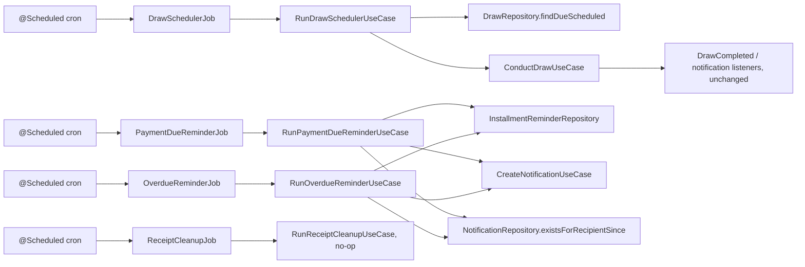

# Automation & Background Jobs

Version: 1.0
Sprint: 12.1
Status: Implemented
Last Updated: 2026-07-08

## Purpose

Sprint 12.1 introduces the first scheduled background processing in this codebase: four Spring `@Scheduled`
jobs that periodically orchestrate work across the already-complete Draw, Payment, Receipt, and Notification
modules. The new `automation` module contains no business rules of its own — it only decides *when* to call
pre-existing use cases (`ConductDrawUseCase`, `CreateNotificationUseCase`) and, for the two reminder jobs,
which pre-existing data (outstanding installments) qualifies for a reminder. Every actual business
invariant — the SCHEDULED→OPEN transition, group-owner authorization, notification queuing and dispatch —
still lives exactly where earlier sprints put it.

This sprint introduces no new aggregate. `automation.domain` contains one immutable read-projection record
(`DueInstallment`) and its repository port — not an aggregate with identity-based lifecycle or behavior.

## Architecture

Package layout follows the sprint's own suggestion: `automation.domain.{model,port}`,
`automation.application.{port,query,usecase,service}`, `automation.interfaces.scheduler.{,adapter,config}`.
No REST surface exists for this module — schedulers are the only inbound trigger.

## Jobs

| Job | Use case | Cron property | Default |
| --- | --- | --- | --- |
| Monthly Draw Scheduler | `RunDrawSchedulerUseCase` | `bachatsetu.automation.draw.cron` | every 15 minutes |
| Payment Due Reminder | `RunPaymentDueReminderUseCase` | `bachatsetu.automation.payment-reminder.cron` | daily at 09:00 |
| Overdue Reminder | `RunOverdueReminderUseCase` | `bachatsetu.automation.overdue-reminder.cron` | daily at 09:30 |
| Receipt Cleanup | `RunReceiptCleanupUseCase` | `bachatsetu.automation.cleanup.cron` | daily at 03:00 |

### Monthly Draw Scheduler

Reuses `DrawRepository.findDueScheduled(Instant cutoff)` (new, additive, cross-tenant — every other query on
this port is tenant-scoped) to find every `DrawStatus.SCHEDULED` draw whose `scheduledAt` is at or before
now, then calls the pre-existing `ConductDrawUseCase` for each one — never `Draw.open(...)` directly, and
never a raw repository save. `ConductDrawUseCase` requires an `actorId` and enforces that it owns the draw's
group; a scheduled job has no human actor, so it acts on the group's own organizer's behalf (the one
identity the use case always accepts for this operation) rather than weakening or bypassing that
authorization check. Once a draw is conducted it becomes `OPEN` and drops out of the `SCHEDULED` filter, so
re-running this job (on the next cron tick, or manually) never reprocesses the same draw — the query itself
is what makes the job idempotent and safe to run repeatedly. A failure conducting one draw is logged and
does not stop the remaining draws in the same run from being attempted.

This job only *conducts* (opens) a draw — it never closes/completes one, since a winner still needs to be
selected (by lottery logic or an auction closing), which the sprint brief does not ask this scheduler to do.

### Payment Due Reminder / Overdue Reminder

Both reuse the pre-existing `community.installments` table (`InstallmentJpaEntity`/`InstallmentStatus`),
which predated this sprint but had no domain, application, or repository-port layer of its own — the same
situation Receipt (11.4) and Notification (11.7) were in before their own foundation sprints. A new,
additive `automation.domain.port.InstallmentReminderRepository` (backed by
`InstallmentReminderRepositoryAdapter`, using two new derived Spring Data queries on the pre-existing
`InstallmentSpringDataRepository`) exposes exactly two read-only, cross-tenant queries:

- `findDueBetween(from, to)` — outstanding installments due within a window.
- `findOverdueBefore(cutoff)` — outstanding installments whose due date has already passed.

Both exclude installments already `PAID`, `WAIVED`, `CANCELLED`, or `DISPUTED`. Neither query, nor anything
else in this sprint, transitions an installment's own `status` field (`PENDING`→`DUE`→`OVERDUE`) — that
would be new lifecycle/business logic this sprint does not introduce; "due" and "overdue" are determined
purely by comparing `dueDate` against today, which is sufficient for deciding whether to remind someone.

**Payment Due Reminder** reuses the pre-existing `NotificationCategory.CONTRIBUTION_REMINDER` category and
its fixed template ("... your contribution of `{{amount}}` to `{{groupName}}` is due soon.") — an exact fit,
so no new category or template was introduced. The look-ahead window defaults to 3 days
(`bachatsetu.automation.payment-reminder.days-ahead`).

**Overdue Reminder** has no pre-existing category with matching wording, so it reuses the pass-through
`NotificationCategory.PAYMENT` category introduced in Sprint 11.9, supplying the exact "Payment Overdue"
wording as `title`/`body` placeholders rather than introducing a seventh category.

Both jobs resolve a display name via the pre-existing `user.domain.port.UserRepository`, falling back to the
literal string `"Member"` when no `UserProfile` exists for the recipient (mirroring the "don't fabricate
data" convention every Sprint 11.9 listener already followed).

### Receipt Cleanup

A deliberate no-op. `ReceiptPdfGenerator#generate` renders a receipt PDF entirely in memory (returning a
`byte[]` straight to its caller) and never writes to disk — there is no temporary PDF cache directory,
orphan file, or any other on-disk artifact anywhere in the current Receipt implementation for this job to
clean up. `ReceiptCleanupApplicationService` and its job exist so the job, its cron trigger, and its wiring
are present, observable, and testable ahead of a future on-disk or object-storage cache being introduced —
at which point the cleanup logic would be implemented behind this exact same `RunReceiptCleanupUseCase`
boundary, requiring no change to the scheduler or its configuration.

## Same-Day Reminder De-Duplication

`NotificationRepository` gained one additive method, `existsForRecipientSince(tenantId, recipientUserId,
category, since)`, backed by a new derived Spring Data query
(`existsByTenantIdAndUser_IdAndCategoryAndCreatedAtGreaterThanEqualAndDeletedFalse`) — reusing the
*existing* Notification persistence as the record of "already reminded" rather than adding new state (for
example, a `lastReminderSentAt` column) to `installments`. Both reminder jobs check this, per installment,
against the start of the current UTC day before creating a notification, and skip (counted separately as
`skippedCount` in `JobRunResult`, not `failedCount`) when one already exists.

This granularity is per (tenant, recipient, category, day) — not per individual installment. A member with
two overdue installments in two different groups on the same day receives only one `PAYMENT`-category
reminder that day, not two, since both would share the same category and recipient. This is a known,
accepted limitation (see below), not an oversight: implementing exact per-installment tracking would require
either a new persisted field on `installments` (schema change) or a new correlation identifier on
`Notification` (aggregate change), both of which this additive-only sprint avoids.

An overdue installment that remains unpaid is expected to generate one new reminder per day for as long as
it stays overdue — the de-duplication only prevents more than one reminder *on the same day*, not repeat
reminders across days, which is the intended "overdue reminder" behavior.

## Ports

`automation.application.port.ClockPort` is the only port this module defines — a `@FunctionalInterface`
identical in shape to every other module's `ClockPort`, letting every test control "now" without a
scheduler ever waiting on a real cron tick. No `TransactionPort` or `DomainEventPublisherPort` was
introduced: every use case here either performs read-only queries or calls an already-transactional,
already-event-publishing use case from another module (`ConductDrawUseCase`, `CreateNotificationUseCase`),
so automation itself never needs to own a transaction boundary or publish a domain event of its own — adding
either port would be exactly the "unnecessary abstraction" this sprint's instructions warn against.

## Failure Handling

Failure handling is layered:

1. **Per-item**, inside each application service (`DrawSchedulerApplicationService`,
   `ReminderApplicationSupport`): a `RuntimeException` processing one draw or one installment is caught and
   turned into a plain `String` message collected in `JobRunResult.failureMessages()` (from which
   `failedCount()` is derived), and the loop continues with the next item. This is what "no duplicate
   execution" and "continues after one failure" mean in practice — one bad item never stops the rest of the
   batch. The application layer never logs directly: `LayerDependencyArchitectureTest`'s
   `APPLICATION_MUST_DEPEND_ONLY_ON_DOMAIN_AND_APPLICATION` rule forbids an `..application..` class from
   depending on `org.slf4j..`, so failures are reported as data, not logged, at this layer.
2. **Per-run**, inside each `@Scheduled` job class (`DrawSchedulerJob` and its three siblings): the job logs
   every message in `result.failureMessages()` at `ERROR`, then logs an aggregate summary line, then (wrapped
   around the whole `execute()` call) a defensive top-level `try`/`catch (RuntimeException)` logs instead of
   letting an entirely unexpected failure (for example, a mis-wired dependency throwing before the per-item
   loop even starts) escape the scheduled method. Spring's `@Scheduled` support does not automatically
   reschedule a task whose method threw, so this catch is what guarantees the *next* cron tick still fires.

There is no retry queue, backoff, or dead-letter mechanism — out of scope per this sprint's explicit
"NO retry queues" instruction. A failed item is simply not retried until the job's next scheduled run
naturally reconsiders it (which happens automatically for the draw scheduler and the reminder jobs, since
their queries are re-evaluated fresh every run).

## Notification Lifecycle Reuse

Nothing about `Notification`'s own lifecycle changed. `RunPaymentDueReminderUseCase`/
`RunOverdueReminderUseCase` call `CreateNotificationUseCase` exactly as any other caller would — the
resulting notification is queued, delivered, and trackable through the existing REST API precisely like a
notification created any other way. Conducting a draw completes the existing
`ConductDrawUseCase → Draw.open()` flow unchanged; a later `CloseDrawUseCase`/`CloseAuctionUseCase` call
(still a manual REST action, not scheduled by this sprint) still triggers `DrawCompleted` →
`DrawCompletionNotificationListener` → winner/organizer notifications exactly as Sprint 11.8/11.9 built them.

## Testing

- `DrawSchedulerApplicationServiceTest` — conducts every due draw on the organizer's behalf, an empty
  result when nothing is due, one failing draw does not stop the rest, and null-argument validation.
- `PaymentDueReminderApplicationServiceTest`, `OverdueReminderApplicationServiceTest` — sends the correct
  category/placeholders, falls back to a default display name, skips an already-reminded-today recipient,
  an empty result when nothing qualifies, one failing send does not stop the rest, and
  null/negative-argument validation.
- `ReceiptCleanupApplicationServiceTest` — confirms the deliberate no-op and that repeated runs are safe.
- `JobRunResultTest` — the `empty()` factory and negative-count rejection.
- `DrawSchedulerJobTest`, `PaymentDueReminderJobTest`, `OverdueReminderJobTest`, `ReceiptCleanupJobTest` —
  each job is invoked directly (no cron wait), asserting the use case is called exactly once and that an
  unexpected `RuntimeException` from the use case never propagates out of `run()`.
- `SystemAutomationClockAdapterTest`, `AutomationInfrastructureConfigTest`, `AutomationApplicationConfigTest`
  — clock delegation and bean wiring, including the disabled-persistence-repositories case.
- `InstallmentReminderRepositoryAdapterTest` — due-between/overdue-before mapping, outstanding-amount
  computation, and clamping at zero when a partial payment exceeds the expected amount (defensive; should
  not occur in practice).
- `DrawRepositoryAdapterTest`, `NotificationRepositoryAdapterTest` (both extended) — the new
  `findDueScheduled`/`existsForRecipientSince` methods.

No Testcontainers integration test was added for automation itself in this sprint: every new repository
method is a thin, already-covered-by-unit-test derived query or adapter mapping over tables whose own
persistence round-trip integration tests already exist (Draw, Notification) or predate any application
layer (`installments`, exercised here only through mocked Spring Data calls).

## Known Limitations

- **Same-day de-duplication is per (tenant, recipient, category), not per installment.** See above.
- **No distributed lock / single-node only.** If this application is ever run on more than one node, every
  node's scheduler fires independently — explicitly out of scope per this sprint ("NO distributed locks",
  "NO multi-node scheduler").
- **No retry queue.** A failed item is only reconsidered on the job's next natural scheduled run.
- **The Monthly Draw Scheduler only conducts (opens) a draw, never closes it.** Selecting and recording a
  winner remains a separate, manual `CloseDrawUseCase`/`CloseAuctionUseCase` REST call.
- **Receipt Cleanup is a no-op** until a real PDF cache exists (see above).
- **Cron granularity, not real-time.** A draw scheduled for a time between two cron ticks is conducted at
  the next tick, not the instant it becomes due — acceptable for a monthly-cadence draw, and consistent with
  every other job's daily/periodic cadence.
