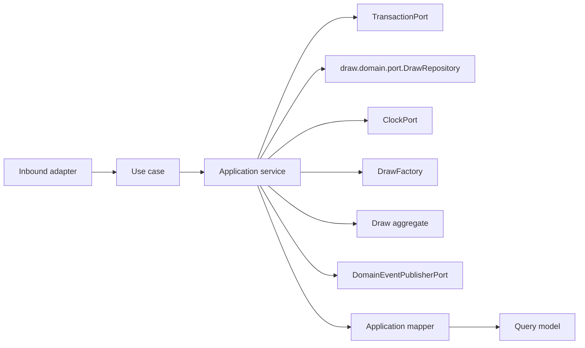

# Draw Application Layer

Version: 1.0
Sprint: 11.2
Status: Implemented
Last Updated: 2026-07-07

## Purpose

The Draw application layer exposes framework-neutral use cases around the `Draw` aggregate defined in the
pre-existing Draw domain model (`draw.domain.*`, shipped ahead of this sprint). It coordinates the domain
repository port, time, transactions, aggregate calls, mapping, and event publication. Business invariants
remain inside `Draw` and `AuctionBid`.

This layer has no Spring, Jakarta Persistence, REST, infrastructure, or security dependencies.

## Architecture

Dependency direction is inward: the application package depends only on the Draw domain, shared domain
contracts, and Java.

## Use Cases

| Use case | Command/input | Result |
| --- | --- | --- |
| `CreateDrawUseCase` | `CreateDrawCommand` | `DrawResult` |
| `GetDrawUseCase` | Tenant ID and draw ID | `DrawResult` |
| `ListDrawsUseCase` | Tenant ID and `DrawPageRequest` | `DrawPage<DrawSummary>` |
| `ConductDrawUseCase` | `ConductDrawCommand` | `DrawResult` |
| `CloseDrawUseCase` | `CloseDrawCommand` | `DrawResult` |

Each use case has one concrete application service. Services use constructor injection and contain
orchestration only. No RBAC or ownership validation exists yet; every use case is reachable by any
authenticated tenant user, matching the sprint's explicit scope (Sprint 11.3 owns authorization).

## Scheduling A Draw Reuses The Existing DrawFactory

Following the precedent Payment set in Sprint 11.1 (reusing `PaymentFactory` directly rather than
reproducing Group/Member's "bypass the factory, generate through a dedicated port" pattern),
`CreateDrawApplicationService` calls the pre-existing `draw.domain.factory.DrawFactory` directly.
`DrawFactory` wraps only a `java.time.Clock` — a plain JDK type the `..application..` ArchUnit rule already
permits — and delegates straight to `Draw.schedule(...)`; it has no independent code-generation logic
comparable to `GroupCodeGenerator`/`MemberNumberGenerator` that would justify a parallel port.
`DrawInfrastructureConfig` builds one `Clock` bean and uses it for both the `DrawFactory` bean and the
`ClockPort` adapter, so there is exactly one clock instance in the composition.

Unlike `GroupCodeGenerator`/`MemberNumberGenerator`, the caller supplies the draw number itself
(`CreateDrawRequest.drawNumber`) — see [Known Limitations](../persistence/draw-persistence.md#known-limitations)
for why this value must match the referenced cycle's own cycle number.

## Why "Conduct" And "Close" Map To open() And complete()

The sprint brief requires using only domain methods that already exist and forbids inventing new domain
behaviour. `Draw` exposes exactly three lifecycle transitions: `open(actorId, openedAt)`,
`submitBid(memberId, amount, actorId, submittedAt)`, and `complete(winnerId, actorId, completedAt)` — there
are no methods literally named `conduct` or `close`. The two lifecycle endpoints requested by this sprint
(`PATCH /{drawId}/conduct` and `PATCH /{drawId}/close`) map onto the two remaining transitions in their
natural order:

- **Conduct → `open()`.** Moves a `SCHEDULED` draw to `OPEN` once its scheduled time has arrived
  (`ConductDrawApplicationService`). This is the domain's own name for "the draw is now being conducted."
- **Close → `complete()`.** Moves an `OPEN` draw to `COMPLETED` with a winning member
  (`CloseDrawApplicationService`). This is the domain's own name for "the draw has been closed with a
  result."

`submitBid` has no corresponding REST endpoint in this sprint's explicit API scope (only the five listed
endpoints are implemented), so it is not wired into any use case; auction bids remain visible read-only
through `DrawResult.bids()`/`DrawResponse.bids()` for draws that already have them, matching the domain
state as persisted.

## Commands

Commands are immutable records containing domain value objects and operation context.
`CreateDrawCommand` carries the tenant, group, cycle, draw number, type, scheduled time, and actor.
`ConductDrawCommand` and `CloseDrawCommand` carry the tenant, draw id, actor, and — for close — the winning
member id. Constructors perform null validation only.

## Query Models

- `DrawResult` is the complete application view, including every recorded auction bid.
- `AuctionBidResult` is the nested per-bid projection used inside it.
- `DrawSummary` is the compact list projection used by `ListDrawsUseCase`.

`DrawApplicationMapper` converts the aggregate and its child entities to these models. Query models expose
scalar Java values and immutable collections, never domain aggregates or persistence entities.

## Ports

### draw.domain.port.DrawRepository

Draw use cases depend directly on the pre-existing domain repository port, following the same resolution
Member (Sprint 10.1/10.2) and Payment (Sprint 11.1) adopted rather than introducing a parallel
`draw.application.port.DrawRepository`: `GENERAL_INFRASTRUCTURE_MUST_NOT_DEPEND_ON_APPLICATION_OR_INTERFACES`
(see `LayerDependencyArchitectureTest`) has no carve-out for a `draw` adapter depending on
`draw.application`, and the sprint brief forbids modifying ArchUnit. The port gained two additive methods
this sprint: `findById(AggregateId tenantId, AggregateId drawId)` for tenant-scoped lookup, and
`findPage(AggregateId tenantId, DrawPageRequest pageRequest)` for pagination. Every pre-existing method
(`findById(drawId)`, `findByGroupAndNumber`, `findByCycleId`, `save`) is untouched.

### Additional Ports

| Port | Responsibility |
| --- | --- |
| `DomainEventPublisherPort` | Publishes committed aggregate events. |
| `ClockPort` | Supplies deterministic application time. |
| `TransactionPort` | Executes one complete use case transaction. |

These three ports are structurally identical to their Savings Group, Member, and Payment counterparts
(`@FunctionalInterface`), and — for the same ArchUnit reason described above — their adapters are composed
under `draw.interfaces.rest.config`/`draw.interfaces.rest.adapter` rather than a new
`infrastructure.draw` package, exactly mirroring Member's Sprint 10.1 resolution.

## Pagination

`ListDrawsUseCase` lists tenant-scoped draws, paginated and sorted at the persistence boundary, following
the same shape Member (10.2) and Payment (11.1) established: a page/size/totalElements carrier with derived
`totalPages()`/`hasNext()`/`hasPrevious()`, a page request record validating `page >= 0` and
`1 <= size <= 100`, and a sort-field enum (`CREATED_AT` or `SCHEDULED_AT`) with a direction enum
(`ASC`/`DESC`). No status or type filter exists, matching the sprint brief's literal scope (page, size,
sort, direction only).

For the same reason described above, `DrawPage`/`DrawPageRequest`/`DrawSortField`/`SortDirection` live in
`draw.domain.port` rather than `draw.application.port`, and
`DrawApiMapper.listDraws(useCase, currentUser, page, size, sort, direction)` fully consolidates page
construction, use-case invocation, and response mapping so the controller never touches a domain-port type
directly (`*Controller`-named classes may not depend on `..domain..`).

## Transactions

Every application service owns its transaction boundary by invoking `TransactionPort.execute(...)`. No
framework annotation is present. Command execution order for `CreateDrawUseCase` is:

1. Begin transaction abstraction.
2. Call `DrawFactory.schedule(...)`.
3. Save the aggregate.
4. Pull and publish domain events (`DrawScheduled`).
5. Map and return the result.

For `ConductDrawUseCase`/`CloseDrawUseCase`: load the tenant-scoped draw, call the matching domain
transition method, save, pull and publish any domain events, map and return. Conducting a draw
(`Draw.open()`) does not register a domain event — only `submitBid`/`complete`/`schedule` do — so
`ConductDrawApplicationService` still calls `eventPublisher.publish(...)` unconditionally (via the shared
`DrawApplicationSupport.saveAndPublish`), but with an empty list in that case. Events are not pulled when
persistence fails, preserving pending aggregate events for the failed unit of work, matching the existing
convention.

## Application Validation

Application validation is intentionally limited to:

- Required command arguments.
- Tenant-scoped aggregate existence.

All lifecycle-transition validation (scheduled-time ordering, open/completed state guards, auction
winning-bid ownership) lives in `Draw`/`AuctionBid` and is not duplicated here.

## Testing

The application suite covers:

- All five service implementations and use-case contracts.
- Repository success and missing-aggregate paths.
- Transaction execution and save-before-publish ordering.
- Aggregate event publication (`DrawScheduled`, `DrawCompleted`) and the no-event case for `open()`.
- Domain-level rejection of invalid transitions (opening before the scheduled time, closing a draw that is
  not open).
- Paginated, sorted tenant-scoped listing.
- Mapper and immutable query-model behavior, including bid mapping.
- Commands, ports, exceptions, and null validation.

## Future Integration

Business authorization (restricting who may create, conduct, or close a draw) is explicitly out of scope —
Sprint 11.3 owns it, mirroring how Group deferred to 9.6, Member deferred to 10.3, and Payment deferred to
11.3 as well. Lottery/auction algorithm improvements, winner payout, receipt generation, notifications, and
scheduled/background draw execution are separate, later sprints; this sprint deliberately stops at the
point where a draw's lifecycle can be driven manually through the REST API.
