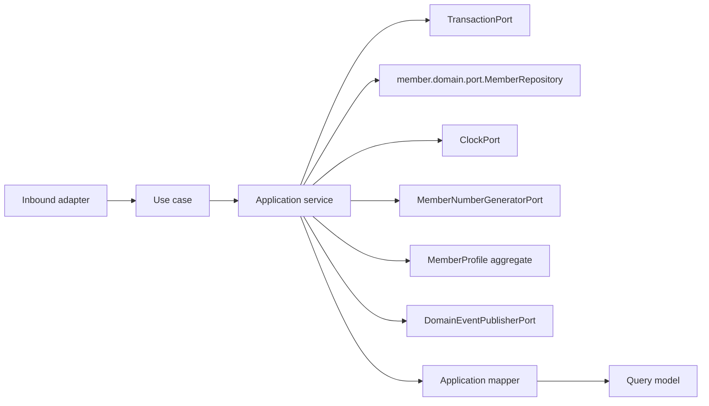

# Member Application Layer

Version: 1.2
Sprint: 10.1, management APIs and pagination amended by Sprint 10.2, authorization amended by Sprint 10.3
Status: Implemented
Last Updated: 2026-07-07

## Purpose

The Member application layer exposes framework-neutral use cases around the `MemberProfile` aggregate
defined in the Member domain model. It coordinates the domain repository port, time, transactions, member
number generation, aggregate calls, mapping, and event publication. Business invariants remain inside
`MemberProfile` and `GroupParticipation`.

This layer has no Spring, Jakarta Persistence, REST, infrastructure, or security dependencies.

## Architecture

Dependency direction is inward: the application package depends only on the Member domain, shared domain
contracts, and Java.

## Use Cases

| Use case | Command/input | Result |
| --- | --- | --- |
| `CreateMemberProfileUseCase` | `CreateMemberProfileCommand` | `MemberProfileResult` |
| `JoinGroupParticipationUseCase` | `JoinGroupParticipationCommand` | `MemberProfileResult` |
| `GetMemberProfileUseCase` | Tenant ID, member ID, and actor ID (Sprint 10.3) | `MemberProfileResult` |
| `ListMemberProfilesUseCase` | Tenant ID and `MemberPageRequest` | `MemberPage<MemberProfileSummary>` |
| `UpdateMemberProfileUseCase` | `UpdateMemberProfileCommand` | `MemberProfileResult` |

Each use case has one concrete application service. Services use constructor injection and contain
orchestration only.

## Why Creation Always Carries A Group

Sprint 10.1 discovered that the Member persistence model built in the earlier community-context sprints
has no dedicated `members` table: a `MemberProfile` is durably represented only as one or more rows in
`community.group_members`, and `MemberRepositoryAdapter.save` rejects a profile with zero participations
(there being no other row to write). Rather than redesigning that already-shipped persistence model,
`CreateMemberProfileCommand` requires a `groupId` and `role` alongside the joining user. The application
service calls `MemberProfile.create(...)` and then `member.joinGroup(...)` in the same unit of work, before
`repository.save(...)` is ever invoked, so the aggregate always has at least one participation by the time
it reaches the repository. `JoinGroupParticipationUseCase` covers the separate case of an already-persisted
member joining an additional group.

## Updating Lifecycle Status (Sprint 10.2)

Sprint 10.2 required a `PATCH /api/v1/members/{memberId}` endpoint for "editable profile fields." Inspecting
`MemberProfile` showed it has exactly one mutable field beyond its child collections — `status` — and no
method ever changed it (`create()` hardcodes `INVITED`). `tenantId`, `userId`, and `memberNumber` are
immutable by design and were already excluded from the brief. `MemberProfile.changeStatus(MemberStatus,
AggregateId, Instant)` is therefore the only new domain method: an additive, narrowly-guarded transition
(same-status and out-of-terminal-state transitions are rejected, mirroring the terminal-state check already
present in `joinGroup`) that emits a new `MemberStatusChanged` event, structurally identical to how
`SavingsGroup.transitionTo` guards its own lifecycle. `UpdateMemberProfileUseCase` is the only use case that
calls it; `Update` in this context means "change lifecycle status," since no other profile field exists to
edit.

## Listing Member Profiles (Sprint 10.2)

`ListMemberProfilesUseCase` lists tenant-scoped member profiles, paginated and sorted at the persistence
boundary, following the same shape as Savings Group's Sprint 9.7 pagination: a page/size/totalElements
carrier with derived `totalPages()`/`hasNext()`/`hasPrevious()`, a page request record validating
`page >= 0` and `1 <= size <= 100`, and a sort-field enum (`MEMBER_NUMBER` or `CREATED_AT`) with a direction
enum (`ASC`/`DESC`). Unlike Savings Group, Member does not support a status filter for Sprint 10.2 — the
brief only asked for page, size, sort, and direction.

**Why `MemberPage`/`MemberPageRequest`/`MemberSortField`/`SortDirection` live in `member.domain.port`
instead of `member.application.port`.** Savings Group placed its equivalents in `group.application.port`
because `SavingsGroupRepository` — the port that returns a paginated result — is itself an application-layer
port. Member has no equivalent application-layer repository port (see "member.domain.port.MemberRepository"
below); its repository port is the pre-existing `member.domain.port.MemberRepository`. A domain port's
return type cannot live in `..application..` (`APPLICATION_MUST_DEPEND_ONLY_ON_DOMAIN_AND_APPLICATION` runs
the other direction, and nothing permits `..domain..` to depend on `..application..`). Since these four types
are plain, framework-free Java (records and enums, no Spring/JPA), keeping them beside the repository port
they parametrize — in `member.domain.port` — satisfies every existing ArchUnit rule without a new carve-out.
`ListMemberProfilesUseCase` and the REST mapper are both allowed to reference them (`..application..` and
`..interfaces..` may depend on `..domain..`); only `*Controller`-named classes may not, which is why
`MemberApiMapper.listMembers(useCase, currentUser, page, size, sort, direction)` fully consolidates page
construction, use-case invocation, and response mapping — the controller method never touches `MemberPage`
or `MemberPageRequest` directly.

## Commands

Commands are immutable records containing domain value objects and operation context. Mutation commands
carry the tenant identifier, aggregate identifiers where applicable, and the actor identifier. Constructors
perform null validation only.

## Query Models

- `MemberProfileResult` is the complete application view, including every group participation and consent.
- `GroupParticipationResult` and `MemberConsentResult` are the nested projections used inside it.
- `MemberProfileSummary` (Sprint 10.2) is the compact list projection: member ID, user ID, member number,
  status, and a total participation count.

`MemberApplicationMapper` converts the aggregate and its child entities to these models. Query models expose
scalar Java values and immutable collections, never domain aggregates or persistence entities.

## Ports

### member.domain.port.MemberRepository

Member use cases depend directly on the pre-existing domain repository port rather than introducing a
parallel `member.application.port.MemberRepository`. `SavingsGroupRepository` (Sprint 9.x) instead added a
new, tenant-scoped application port alongside the legacy domain port; Member does not repeat that pattern
here because the existing `MemberRepositoryAdapter` already implements only the domain port, and
`GENERAL_INFRASTRUCTURE_MUST_NOT_DEPEND_ON_APPLICATION_OR_INTERFACES` (see
`LayerDependencyArchitectureTest`) has no carve-out for a `member` adapter depending on `member.application`.
Reusing the domain port keeps the existing adapter's dependencies unchanged and avoids touching ArchUnit
rules. The port gained one additive method, `findById(AggregateId tenantId, AggregateId memberId)`, so
callers can perform a tenant-scoped lookup; the pre-existing `findById(AggregateId memberId)` overload is
untouched and still used by other callers.

### Additional Ports

| Port | Responsibility |
| --- | --- |
| `MemberNumberGeneratorPort` | Produces a candidate member number for a new aggregate identifier. |
| `DomainEventPublisherPort` | Publishes committed aggregate events. |
| `ClockPort` | Supplies deterministic application time. |
| `TransactionPort` | Executes one complete use case transaction. |

These four ports are structurally identical to their Savings Group counterparts (`@FunctionalInterface`),
but their adapters are composed under `member.interfaces.rest.config`/`member.interfaces.rest.adapter`
rather than a new `infrastructure.member` package — see
[Member Persistence](../persistence/member-persistence.md#adapter-placement) for why.

## Transactions

Every application service owns its transaction boundary by invoking `TransactionPort.execute(...)`. No
framework annotation is present.

Command execution order for `CreateMemberProfileUseCase` is:

1. Begin transaction abstraction.
2. Generate a member identifier and number; reject a duplicate number early.
3. Call `MemberProfile.create(...)`.
4. Call `member.joinGroup(...)` for the first participation.
5. Save the aggregate.
6. Pull and publish domain events (`MemberCreated` and `MemberJoinedGroup`).
7. Map and return the result.

Events are not pulled when persistence fails, preserving pending aggregate events for the failed unit of
work, matching the Savings Group convention.

## Application Validation

Application validation is intentionally limited to:

- Required command arguments.
- Tenant-scoped aggregate existence.
- Duplicate member number detection before creation.

Database uniqueness on `(group_id, member_number)` remains the ultimate safeguard against a concurrent
number-generation race.

## Authorization (Sprint 10.3)

`member.application.security.MemberAuthorizationService` mirrors `group.application.security
.GroupAuthorizationService` (Sprint 9.6) exactly in shape and spirit: one small, framework-free class with
one method, `requireSelf(MemberProfile member, AggregateId actorId)`, that throws
`MemberAccessDeniedException` if `!member.userId().equals(actorId)`. Like `GroupAuthorizationService`, it
never inspects `AuthenticatedUser.roles()`/`.permissions()` — Group's own Sprint 9.6 authorization is pure
aggregate-owned-ID comparison, and this sprint follows the same pattern rather than introducing a new one.

**Rules applied:**

| Operation | Rule |
| --- | --- |
| Create Member Profile | Only for yourself — `command.userId()` must equal `command.actorId()` (Sprint LR-3). |
| Get Member Profile | Only the member themselves. |
| List Member Profiles | Unchanged tenant isolation only (no self/role restriction). |
| Get Participations | Only the member themselves (inherited automatically — see below). |
| Join Additional Group | Only the member themselves (Sprint LR-3). |
| Update Member Status | Only the member themselves. |

**Sprint LR-3 correction.** A Closed Beta production-readiness audit found that `CreateMemberProfileUseCase`
and `JoinGroupParticipationUseCase` — unlike every other mutating Member operation — performed no
authorization check at all: `userId`/`role` on `CreateMemberProfileRequest` and `groupId`/`role` on
`JoinGroupParticipationRequest` are client-supplied, so any authenticated tenant user could create a member
profile (or add a participation) for **any other user**, in **any group**, with any `GroupRole` including
`ORGANIZER`. Fixed by adding `MemberAuthorizationService.requireSelf(...)` to both services — a new
`requireSelf(AggregateId targetUserId, AggregateId actorId)` overload for Create (no `MemberProfile` is
loaded yet at that point) and the existing `requireSelf(MemberProfile, AggregateId)` for Join, run
immediately after `support.requireMember(...)` loads the aggregate, matching the exact ordering already used
by Get/Update. No new authorization framework was introduced. The frontend never called either endpoint
directly (the real join-group flow goes through the Invitation module), so this fix has zero impact on any
shipped user journey.

**Why there is no "tenant administrator" branch.** The sprint brief allowed an administrator bypass "if
such concept already exists." A `TENANT_ADMIN` role name is seeded in `V2__seed_roles_permissions.sql` and
`AuthenticatedUser.roles()` is populated with a caller's real assigned role names at request time — but
nothing in the codebase's application or domain layers ever reads `roles()`/`permissions()` to make an
authorization decision; `GroupAuthorizationService` itself never checks them either. Introducing the first
role-based authorization check anywhere in the codebase would be a new authorization pattern, which the
sprint brief explicitly disallowed ("do not introduce a new authorization framework"). Per the brief's own
fallback — "if no administrator concept exists, implement self-only access" — self-only access is
implemented for both Get and Update.

**Where authorization runs.** Every check happens application-side, immediately after the aggregate is
loaded and before any mutation or response mapping, exactly mirroring `ActivateGroupApplicationService`'s
`support.requireGroup(...)` → `authorization.requireOwner(...)` → `group.activate(...)` ordering:
`GetMemberProfileApplicationService` and `UpdateMemberProfileApplicationService` both call
`repository.findById(tenantId, memberId)` (or the shared `MemberApplicationSupport.requireMember`) first,
then `authorization.requireSelf(member, actorId)`, then proceed. No repository lookup is duplicated for
authorization purposes.

**Why `GetMemberProfileUseCase` gained an `actorId` parameter.** Command-carrying use cases
(`UpdateMemberProfileCommand`, `CreateMemberProfileCommand`) already carried an actor identifier before this
sprint. `GetMemberProfileUseCase.execute(AggregateId tenantId, AggregateId memberId)` did not, because no
authorization decision depended on who was asking. Enforcing self-only viewing requires knowing the caller,
so the interface gained a third parameter, `AggregateId actorId` — an additive signature change with exactly
two call sites (`MemberApiMapper.getMember` and `.getParticipations`), both updated to pass
`currentUser.userId().toAggregateId()`.

**Get Participations reuses Get Member Profile's authorization for free.** `GET
/api/v1/members/{memberId}/participations` was already implemented (Sprint 10.2) by calling
`GetMemberProfileUseCase` and extracting `result.participations()` in the REST mapper — no separate use
case exists for it. Adding self-only authorization to `GetMemberProfileApplicationService` therefore
automatically restricts participation viewing to the member themselves too, satisfying the brief's
"a member may only view their own participations" rule without any additional code.

**404 vs 403.** Tenant isolation is unchanged and still produces 404: `repository.findById(tenantId,
memberId)` is tenant-scoped, so a different tenant's member ID returns empty and
`MemberProfileNotFoundException` is thrown *before* authorization ever runs — cross-tenant existence is
never revealed. A same-tenant, non-self request reaches the loaded aggregate and is rejected by
`MemberAuthorizationService` with `MemberAccessDeniedException`, mapped to 403 by
`MemberExceptionHandler.handleAccessDenied`, whose RFC 7807 `code` is `"access-denied"` — the identical
string Group's own `GroupAccessDeniedException` handler already uses.

## Known Limitations (Sprint 10.2)

Two endpoints requested by Sprint 10.2 are intentionally **not implemented**, following the same
"do not invent domain behavior" discipline the sprint brief applied explicitly to soft delete:

- **`PATCH /api/v1/members/{memberId}/consents`.** `MemberConsent` has no mutator anywhere in the domain
  model, and persistence has no storage for it at all: `MemberJpaMapper.toDomain` hardcodes
  `member.consents()` to `List.of()`, and there is no `consents` column or table in
  `community.group_members` or elsewhere. Building this endpoint for real would require a new table and
  migration — a schema change the sprint brief explicitly said not to make ("do not redesign"). The
  endpoint is not built.
- **`DELETE /api/v1/members/{memberId}`.** No removal or soft-delete method exists anywhere on
  `MemberProfile`, and `MemberStatus.REMOVED` is an enum value nothing ever assigns (Sprint 10.1 already
  flagged the absence of any deletion capability in the persistence layer). Per the sprint brief's explicit
  instruction to document rather than invent this, the endpoint is not built. A future sprint could
  represent removal as a `changeStatus(REMOVED, ...)` call under the same mechanism as the status-update
  endpoint, once product intent for member removal semantics (e.g., whether removal should cascade to
  active group participations) is confirmed.

## Testing

The application suite covers:

- All five service implementations and use-case contracts.
- Repository success and missing-aggregate paths.
- Duplicate member number rejection.
- Transaction execution and save-before-publish ordering.
- Aggregate event publication (`MemberCreated`, `MemberJoinedGroup`, `MemberStatusChanged`).
- Status-transition guards (same-status and out-of-terminal-state rejection).
- Paginated, sorted tenant-scoped listing.
- Mapper and immutable query-model behavior.
- Commands, ports, exceptions, and null validation.
- `MemberAuthorizationService.requireSelf` (self allowed, any other actor denied, null validation).
- Self-allowed, non-self-forbidden, and cross-tenant-hidden (404, not 403) paths for Get and Update.

## Future Integration

Sprint 10.3 covered self-only authorization for Get, Update, List (tenant isolation only), and
Participations. Sprint LR-3 closed the two remaining gaps (Create, Join) — see "Sprint LR-3 correction"
above. Every mutating Member operation is now self-only; there is no remaining authorization scope boundary
on this module.
