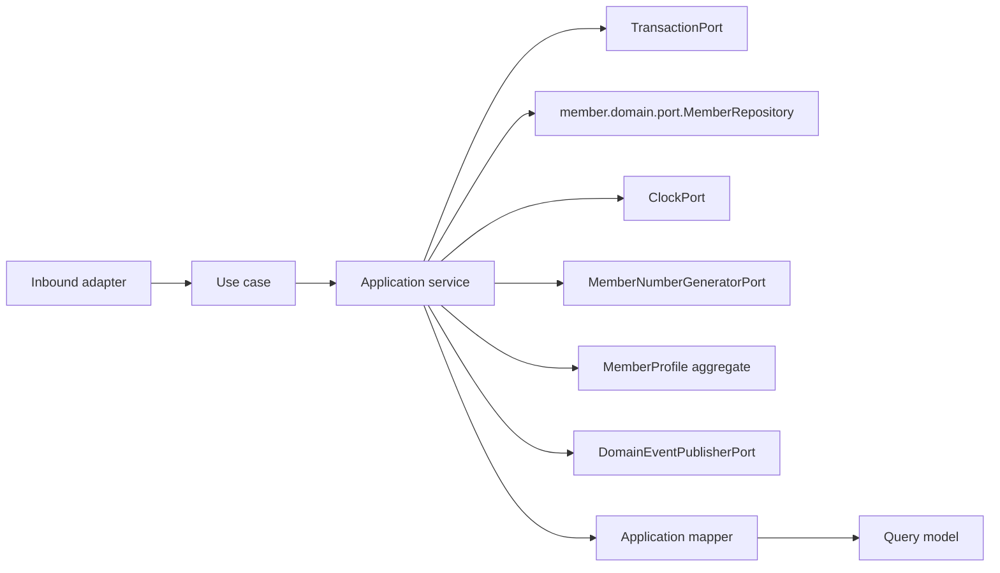

# Member Application Layer

Version: 1.0
Sprint: 10.1
Status: Implemented
Last Updated: 2026-07-07

## Purpose

The Member application layer exposes framework-neutral use cases around the `MemberProfile` aggregate
defined in the Member domain model. It coordinates the domain repository port, time, transactions, member
number generation, aggregate calls, mapping, and event publication. Business invariants remain inside
`MemberProfile` and `GroupParticipation`.

This layer has no Spring, Jakarta Persistence, REST, infrastructure, or security dependencies.

## Architecture

Dependency direction is inward: the application package depends only on the Member domain, shared domain
contracts, and Java.

## Use Cases

| Use case | Command/input | Result |
| --- | --- | --- |
| `CreateMemberProfileUseCase` | `CreateMemberProfileCommand` | `MemberProfileResult` |
| `JoinGroupParticipationUseCase` | `JoinGroupParticipationCommand` | `MemberProfileResult` |
| `GetMemberProfileUseCase` | Tenant ID and member ID | `MemberProfileResult` |

Each use case has one concrete application service. Services use constructor injection and contain
orchestration only.

## Why Creation Always Carries A Group

Sprint 10.1 discovered that the Member persistence model built in the earlier community-context sprints
has no dedicated `members` table: a `MemberProfile` is durably represented only as one or more rows in
`community.group_members`, and `MemberRepositoryAdapter.save` rejects a profile with zero participations
(there being no other row to write). Rather than redesigning that already-shipped persistence model,
`CreateMemberProfileCommand` requires a `groupId` and `role` alongside the joining user. The application
service calls `MemberProfile.create(...)` and then `member.joinGroup(...)` in the same unit of work, before
`repository.save(...)` is ever invoked, so the aggregate always has at least one participation by the time
it reaches the repository. `JoinGroupParticipationUseCase` covers the separate case of an already-persisted
member joining an additional group.

## Commands

Commands are immutable records containing domain value objects and operation context. Mutation commands
carry the tenant identifier, aggregate identifiers where applicable, and the actor identifier. Constructors
perform null validation only.

## Query Models

- `MemberProfileResult` is the complete application view, including every group participation and consent.
- `GroupParticipationResult` and `MemberConsentResult` are the nested projections used inside it.

`MemberApplicationMapper` converts the aggregate and its child entities to these models. Query models expose
scalar Java values and immutable collections, never domain aggregates or persistence entities.

## Ports

### member.domain.port.MemberRepository

Member use cases depend directly on the pre-existing domain repository port rather than introducing a
parallel `member.application.port.MemberRepository`. `SavingsGroupRepository` (Sprint 9.x) instead added a
new, tenant-scoped application port alongside the legacy domain port; Member does not repeat that pattern
here because the existing `MemberRepositoryAdapter` already implements only the domain port, and
`GENERAL_INFRASTRUCTURE_MUST_NOT_DEPEND_ON_APPLICATION_OR_INTERFACES` (see
`LayerDependencyArchitectureTest`) has no carve-out for a `member` adapter depending on `member.application`.
Reusing the domain port keeps the existing adapter's dependencies unchanged and avoids touching ArchUnit
rules. The port gained one additive method, `findById(AggregateId tenantId, AggregateId memberId)`, so
callers can perform a tenant-scoped lookup; the pre-existing `findById(AggregateId memberId)` overload is
untouched and still used by other callers.

### Additional Ports

| Port | Responsibility |
| --- | --- |
| `MemberNumberGeneratorPort` | Produces a candidate member number for a new aggregate identifier. |
| `DomainEventPublisherPort` | Publishes committed aggregate events. |
| `ClockPort` | Supplies deterministic application time. |
| `TransactionPort` | Executes one complete use case transaction. |

These four ports are structurally identical to their Savings Group counterparts (`@FunctionalInterface`),
but their adapters are composed under `member.interfaces.rest.config`/`member.interfaces.rest.adapter`
rather than a new `infrastructure.member` package — see
[Member Persistence](../persistence/member-persistence.md#adapter-placement) for why.

## Transactions

Every application service owns its transaction boundary by invoking `TransactionPort.execute(...)`. No
framework annotation is present.

Command execution order for `CreateMemberProfileUseCase` is:

1. Begin transaction abstraction.
2. Generate a member identifier and number; reject a duplicate number early.
3. Call `MemberProfile.create(...)`.
4. Call `member.joinGroup(...)` for the first participation.
5. Save the aggregate.
6. Pull and publish domain events (`MemberCreated` and `MemberJoinedGroup`).
7. Map and return the result.

Events are not pulled when persistence fails, preserving pending aggregate events for the failed unit of
work, matching the Savings Group convention.

## Application Validation

Application validation is intentionally limited to:

- Required command arguments.
- Tenant-scoped aggregate existence.
- Duplicate member number detection before creation.

Database uniqueness on `(group_id, member_number)` remains the ultimate safeguard against a concurrent
number-generation race.

## Testing

The application suite covers:

- All three service implementations and use-case contracts.
- Repository success and missing-aggregate paths.
- Duplicate member number rejection.
- Transaction execution and save-before-publish ordering.
- Aggregate event publication (`MemberCreated`, `MemberJoinedGroup`).
- Mapper and immutable query-model behavior.
- Commands, ports, exceptions, and null validation.

## Future Integration

Business authorization (for example, restricting who may create a profile on a group's behalf) was out of
scope for Sprint 10.1, mirroring how Savings Group authorization was deferred to its own sprint (9.6) after
the REST foundation existed.
