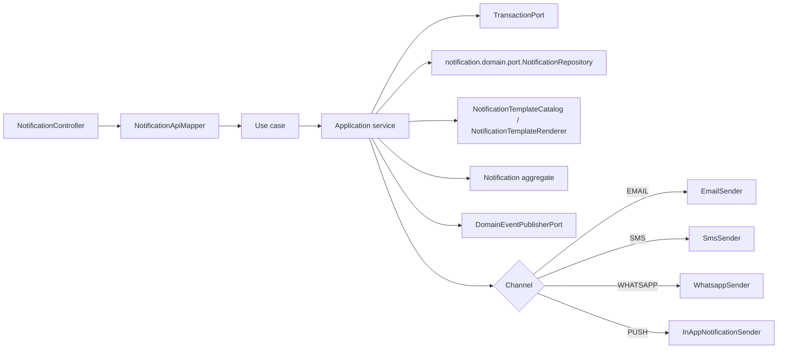
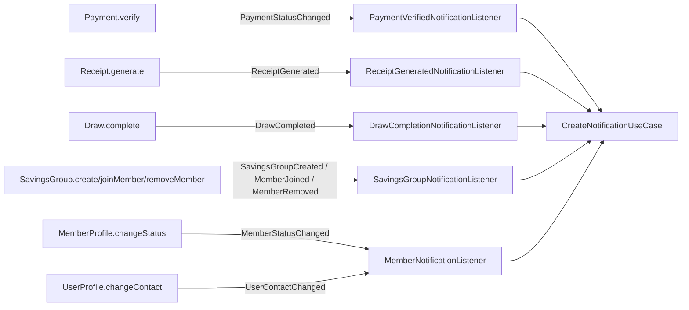

# Notification Application Layer

Version: 1.1
Sprint: 11.7 (application/REST foundation); 11.9 (domain event integration)
Status: Implemented
Last Updated: 2026-07-08

## Purpose

This sprint builds the complete application and REST layer around the `Notification` aggregate and its
persistence adapter, both of which already existed (`notification.domain.*`,
`infrastructure.persistence.{entity,mapper,repository,adapter}.*Notification*`) but were never previously
wired to an application or REST layer — the same situation Receipt was in ahead of Sprint 11.4. No business
logic on the pre-existing `Notification` aggregate was changed.

This sprint is a *foundation*: it makes notification creation, retrieval, listing, and delivery-status
tracking work end-to-end, synchronously, over four channels, with centralized message templates. It
explicitly does not add a message broker, background workers, real provider integrations, or RBAC.

## Architecture

Dependency direction is inward: the application package depends only on the Notification domain, shared
domain contracts, and Java — enforced by the same `APPLICATION_MUST_DEPEND_ONLY_ON_DOMAIN_AND_APPLICATION`
ArchUnit rule every other module's application layer already honors.

## Use Cases

| Use case | Command/input | Result |
| --- | --- | --- |
| `CreateNotificationUseCase` | `CreateNotificationCommand` | `NotificationResult` |
| `GetNotificationUseCase` | Tenant ID and notification ID | `NotificationResult` |
| `ListNotificationsUseCase` | Tenant ID and `NotificationPageRequest` | `NotificationPage<NotificationSummary>` |
| `MarkNotificationDeliveredUseCase` | `MarkNotificationDeliveredCommand` | `NotificationResult` |
| `MarkNotificationFailedUseCase` | `MarkNotificationFailedCommand` | `NotificationResult` |

## Notification Lifecycle

The pre-existing `Notification` aggregate's lifecycle is `QUEUED → SENDING → SENT → DELIVERED`, with `FAILED`
reachable from `SENDING` or `SENT`, and `SENDING` re-enterable from `FAILED` (retry). This sprint drives that
lifecycle as follows:

1. **`CreateNotificationApplicationService`** performs the *entire* synchronous flow in one request/transaction:
   render the template, `Notification.queue(...)`, `startDelivery(...)`, dispatch to the channel port, then
   `markSent(...)`. A created notification is therefore always returned in status `SENT` (or the request
   fails outright — see below) — never `QUEUED`, since nothing asynchronous exists to pick up a merely-queued
   notification later.
2. **`MarkNotificationDeliveredUseCase`** and **`MarkNotificationFailedUseCase`** are separate REST calls,
   representing a later confirmation (e.g. a delivery receipt or bounce notice) arriving after the create
   request already returned. They load the persisted notification, call `markDelivered`/`markFailed`, and
   save.

### Why Creation Bypasses `NotificationFactory`

`CreateNotificationApplicationService` calls `Notification.queue(...)` (the aggregate's own public static
factory method) directly, instead of the pre-existing `notification.domain.factory.NotificationFactory`.
`NotificationFactory.queue(...)` derives `queuedAt` from its own internally injected `Clock`, independent of
whatever `scheduledAt` the caller passes in. `Notification.queue`'s own guard,
`scheduledAt.isBefore(queuedAt)`, then rejects the call unless `scheduledAt` is at or after that independent,
slightly-later clock reading — which an application-layer caller cannot reliably arrange when it wants to
schedule "now" for immediate synchronous dispatch (two separate `Clock.instant()` calls almost never tie).
Calling `Notification.queue(...)` directly, with one `ClockPort.now()` reading reused for both `scheduledAt`
and `queuedAt`, sidesteps that race without changing `Notification` or `NotificationFactory`. This is
documented here because it is a deliberate, non-obvious choice, not an oversight — `NotificationFactory`
itself is untouched and remains available for a future scheduled/deferred creation path.

### Channel Dispatch and Failure

`CreateNotificationApplicationService` resolves one of four outbound ports based on
`Notification.channel()` and calls it synchronously, inside the same transaction:

| `NotificationChannel` | Port | REST vocabulary |
| --- | --- | --- |
| `EMAIL` | `EmailSender` | `EMAIL` |
| `SMS` | `SmsSender` | `SMS` |
| `WHATSAPP` | `WhatsappSender` | `WHATSAPP` |
| `PUSH` | `InAppNotificationSender` | `IN_APP` |

If the sender throws, the exception is wrapped as `NotificationDeliveryFailedException` and the whole
transaction rolls back — no partial `FAILED` record is persisted, since a failed dispatch during creation
means the create request itself failed and the client should retry it, not silently receive an orphaned
failure record it never confirmed. `MarkNotificationFailedUseCase` is the mechanism for recording a failure
discovered *after* a notification was already successfully created and dispatched.

### Why the REST Vocabulary Says `IN_APP` but the Domain Says `PUSH`

The pre-existing `NotificationChannel` enum and the `notification.notifications.channel` check constraint
(`ck_notifications_channel`) already model this channel as `PUSH`, not `IN_APP`. This sprint needed an
`InAppNotificationSender` port by that exact name, and the REST contract to speak `IN_APP` per the sprint's
vocabulary — but renaming the domain enum value would mean a Flyway migration to widen a check constraint,
which the sprint's "create a migration only if absolutely necessary" instruction weighs against for a
cosmetic rename. `NotificationApiMapper` translates `"IN_APP"` ⇄ `NotificationChannel.PUSH` at the REST
boundary in both directions (`toCreateCommand` and `toResponse`/`toSummaryResponse`), so REST clients never
see the word `PUSH` and the domain/schema never see the word `IN_APP`.

## Commands

`CreateNotificationCommand` carries `tenantId`, `recipientUserId`, `destination` (the channel-specific
address — email, phone number, or device reference), `channel`, `category`, a `Map<String, String>` of
template placeholders, and `actorId`. `MarkNotificationDeliveredCommand`/`MarkNotificationFailedCommand`
carry `tenantId`, `notificationId`, (`failureCode` for the failed variant), and `actorId`. All constructors
perform null validation only.

## Query Models

- `NotificationResult` is the complete application view: identifiers, channel, category, rendered
  subject/body, status, `scheduledAt`/`createdAt`/`updatedAt`, plus two *derived* fields not stored as
  independent columns — `deliveredAt` (equal to `auditInfo().updatedAt()` only when `status == DELIVERED`)
  and `failureReason` (the most recent `DeliveryAttempt.failureCode()` only when `status == FAILED`).
- `NotificationSummary` is the compact list projection used by `ListNotificationsUseCase`.

`NotificationApplicationMapper` performs this derivation; it is the only place `deliveredAt`/`failureReason`
are computed, so no other layer duplicates this logic.

## Template Rendering

Centralizing message text was an explicit sprint goal ("do not hardcode messages across services"). Two new,
framework-free domain classes accomplish this:

- **`notification.domain.model.NotificationTemplate`** — an immutable `(category, subjectTemplate,
  bodyTemplate)` record. `bodyTemplate` is required; `subjectTemplate` is optional (SMS/WhatsApp typically
  have no subject).
- **`notification.domain.service.NotificationTemplateCatalog`** — a static, in-code registry mapping each
  `NotificationCategory` value to exactly one canned template. The original six (Sprint 11.7) use the
  sprint's example placeholders (`{{memberName}}`, `{{groupName}}`, `{{amount}}`, `{{drawNumber}}`,
  `{{receiptNumber}}`) baked into fixed wording. The six added in Sprint 11.9 (`PAYMENT`, `RECEIPT`, `DRAW`,
  `AUCTION`, `GROUP`, `MEMBER`) instead use a pass-through template (`{{title}}`/`{{body}}`) — see
  [Domain Event Notification Integration](#domain-event-notification-integration-sprint-119) below for why.
- **`notification.domain.service.NotificationTemplateRenderer`** — performs simple `{{placeholder}}` string
  substitution (no template engine, per the sprint's explicit scope). A placeholder absent from the caller's
  map is left literally unreplaced in the output; this is a deliberate, minimal behavior, not an oversight.

Services that want to notify a member call `CreateNotificationUseCase` with a `category` and a `Map` of
placeholder values — they never construct message text themselves. As of Sprint 11.9, this is realized for
Payment, Receipt, Draw, Auction, Group, and Member through the domain-event listeners described below, rather
than through any direct call from those modules' own application services.

## Channel Abstractions

Four `@FunctionalInterface` outbound ports live in `notification.application.port`: `EmailSender`,
`SmsSender`, `WhatsappSender`, `InAppNotificationSender`. Each has one method,
`String send(NotificationRecipient recipient, NotificationContent content)`, returning a provider-assigned
message identifier. Depending on `NotificationRecipient`/`NotificationContent` (domain model types) directly
is permitted — application code may depend on domain — and avoids inventing parallel application-layer
value types for data the domain already models.

Four placeholder adapters — `LoggingEmailSenderAdapter`, `LoggingSmsSenderAdapter`,
`LoggingWhatsappSenderAdapter`, `LoggingInAppNotificationSenderAdapter` (all under
`notification.interfaces.rest.adapter`) — log a masked destination and a dummy generated provider message ID
(e.g. `EMAIL-<uuid>`), then return it. **No SMTP, Twilio, or WhatsApp Cloud API integration exists.** These
adapters exist solely to make the synchronous dispatch flow observable and testable until real providers are
integrated in a later sprint. Per `docs/standards/logging-standards.md`'s "mask PII by default" rule, the
destination is masked before logging (`NotificationDestinationMasking`, keeping only the first/last two
characters); the in-app sender logs the recipient's opaque user ID instead, since it has no destination
string to mask.

## Ports

### notification.domain.port.NotificationRepository

Notification use cases depend directly on the pre-existing domain repository port, following the same
resolution Payment, Receipt, and Draw adopted rather than introducing a parallel
`notification.application.port.NotificationRepository`. The port gained two additive methods this sprint:
`findById(AggregateId tenantId, AggregateId notificationId)` for tenant-scoped lookup, and
`findPage(AggregateId tenantId, NotificationPageRequest pageRequest)` for pagination. The pre-existing
`findById(notificationId)` (non-tenant-scoped) and `save` are untouched.

### Additional Ports

| Port | Responsibility |
| --- | --- |
| `ClockPort` | Supplies the current instant, used uniformly for `scheduledAt`/`queuedAt`/status-change timestamps. |
| `DomainEventPublisherPort` | Publishes committed aggregate events. |
| `TransactionPort` | Executes one complete use case transaction. |

All are `@FunctionalInterface`s, structurally identical to their Payment/Receipt/Draw counterparts, and their
adapters are composed under `notification.interfaces.rest.config`/`notification.interfaces.rest.adapter`
rather than a new `infrastructure.notification` package — `GENERAL_INFRASTRUCTURE_MUST_NOT_DEPEND_ON_APPLICATION_OR_INTERFACES`
has no carve-out for a `notification` adapter depending on `notification.application`, and this sprint
forbids modifying ArchUnit.

## Pagination

`ListNotificationsUseCase` lists tenant-scoped notifications, paginated and sorted at the persistence
boundary, following the exact shape Receipt established: a page/size/totalElements carrier with derived
`totalPages()`/`hasNext()`/`hasPrevious()`, a page request record validating `page >= 0` and
`1 <= size <= 100`, and a sort-field enum (`CREATED_AT` or `SCHEDULED_AT`, since Notification has no amount
to sort by) with a direction enum (`ASC`/`DESC`). `NotificationPage`/`NotificationPageRequest`/
`NotificationSortField`/`SortDirection` live in `notification.domain.port` for the same ArchUnit reason
described above.

## REST API

Tenant-scoped and authenticated only (`CurrentUserProvider.requireCurrentUser()`), matching every other
module. RBAC is explicitly out of scope for this sprint.

| Method | Path | Use case |
| --- | --- | --- |
| `POST` | `/api/v1/notifications` | `CreateNotificationUseCase` |
| `GET` | `/api/v1/notifications/{notificationId}` | `GetNotificationUseCase` |
| `GET` | `/api/v1/notifications` | `ListNotificationsUseCase` |
| `PATCH` | `/api/v1/notifications/{notificationId}/delivered` | `MarkNotificationDeliveredUseCase` |
| `PATCH` | `/api/v1/notifications/{notificationId}/failed` | `MarkNotificationFailedUseCase` |

`NotificationController` is gated by `bachatsetu.notification.rest.enabled` (default `true`), matching every
other module's REST-toggle convention. `NotificationExceptionHandler` maps `NotificationNotFoundException` to
404, `NotificationDeliveryFailedException` to 502 (channel dispatch failure — a genuine upstream/provider
problem, distinct from a 4xx client error), `DomainException` to 422, and validation failures to 400,
mirroring `ReceiptExceptionHandler`'s structure exactly.

## Transactions

Every application service owns its transaction boundary via `TransactionPort.execute(...)`. Command
execution order for `CreateNotificationUseCase` is:

1. Begin transaction abstraction.
2. Render the category's template with the caller's placeholders.
3. `Notification.queue(...)` (direct aggregate call — see above).
4. `startDelivery(...)`.
5. Dispatch to the resolved channel port.
6. `markSent(...)`.
7. Save the aggregate.
8. Pull and publish domain events (`NotificationQueued` plus two `NotificationStatusChanged` events, for the
   QUEUED→SENDING and SENDING→SENT transitions).
9. Map and return the result.

## Domain Event Notification Integration (Sprint 11.9)

Sprint 11.9 connects six completed-business-event families to notification creation, entirely through Spring
application events — no business module calls `CreateNotificationUseCase` (or any other Notification type)
directly, and no business module holds a compile-time dependency on the Notification module.

### Event Flow

Every arrow into a listener is a pre-existing domain event (`DrawCompleted` is reused unchanged from Draw's
own Sprint 11.2 lifecycle; `PaymentStatusChanged`, `ReceiptGenerated`, `SavingsGroupCreated`, `MemberJoined`,
`MemberRemoved`, `MemberStatusChanged`, and `UserContactChanged` all pre-date this sprint too). No new domain
event was introduced — this sprint is pure additive listening, matching its "reuse existing... do not
duplicate" scope.

### Listener Architecture

| Listener | Package | Reacts to | Notifies |
| --- | --- | --- | --- |
| `PaymentVerifiedNotificationListener` | `notification.interfaces.rest.event` | `PaymentStatusChanged` (filtered to `VERIFIED`) | The paying member and the group organizer (`PAYMENT`) |
| `ReceiptGeneratedNotificationListener` | `notification.interfaces.rest.event` | `ReceiptGenerated` | The receipt's member (`RECEIPT`) |
| `DrawCompletionNotificationListener` | `auction.interfaces.rest.event` | `DrawCompleted` | The winner (`AUCTION` if `Draw.type() == DrawType.AUCTION`, else `DRAW`) and the group organizer (`DRAW`) |
| `SavingsGroupNotificationListener` | `notification.interfaces.rest.event` | `SavingsGroupCreated`, `MemberJoined`, `MemberRemoved` | The group owner, the joining member, or the removed member (`GROUP`) |
| `MemberNotificationListener` | `notification.interfaces.rest.event` | `MemberStatusChanged`, `UserContactChanged` | The member whose status changed, or the user whose contact details changed (`MEMBER`) |

Four of the five listeners live under `notification.interfaces.rest.event`, matching this sprint's framing
("business modules publish events, the Notification module consumes them"). `DrawCompletionNotificationListener`
is the one exception: it already existed (Sprint 11.8, under `auction.interfaces.rest.event`) and already
fully covered the winner-notification half of both the "Draw Completed" and "Auction Completed" requirements
this sprint lists — since `DrawCompleted` fires once per closed draw regardless of type, adding a *second*,
separately-triggered listener for the same event would either duplicate the winner notification or require
awkward suppression logic in two places. Extending the existing listener (adding the organizer notification
and branching the winner's category/wording on `Draw#type()`) was the additive, no-duplicate-notification
choice; moving it into `notification.interfaces` would have been a same-behavior file relocation with no
functional benefit, which the sprint's "do not redesign existing architecture" instruction weighs against.

Every listener method is a `@TransactionalEventListener(phase = TransactionPhase.AFTER_COMMIT)` — the same
mechanism `DrawCompletionNotificationListener` introduced in Sprint 11.8 (the first use of Spring's
event-listener mechanism in this codebase) — so a notification is only attempted once the triggering
business transaction has durably committed, never for one that is later rolled back. Every listener class is
gated by the same `@ConditionalOnProperty(prefix = "bachatsetu.persistence.repositories", name = "enabled",
havingValue = "true", matchIfMissing = true)` every repository-backed bean in this codebase already uses, so
the minimal-context tests (`HealthEndpointTest`, `SecurityIntegrationTest`,
`AuthenticationOpenApiSmokeTest`) that disable persistence repositories continue to boot without needing a
new per-listener toggle property.

### Why Six New Pass-Through Categories

The sprint's business requirements specify exact wording per event (for example, "Payment Received" /
"Your contribution ... has been successfully verified" for a verified payment, distinct from "Receipt
Available" / "Your payment receipt is ready for download" for a generated receipt), while
`CreateNotificationApplicationService` always renders a notification's content through
`NotificationTemplateCatalog.templateFor(command.category())` — there is no way to pass literal text through
the pre-existing `CreateNotificationUseCase` API, and that service is reused completely unchanged this
sprint. Rather than add one narrow category per exact message (which would not map onto the sprint's own
"NOTIFICATION TYPES: PAYMENT, RECEIPT, DRAW, AUCTION, GROUP, MEMBER" grouping, since several of those types
cover more than one distinct wording — `GROUP` alone covers group creation, a member joining, and a member
being removed), each of the six new categories uses a pass-through template
(`subjectTemplate = "{{title}}"`, `bodyTemplate = "{{body}}"`). The triggering listener supplies the exact
required wording as the `title`/`body` placeholders; the category still determines *which* notification
family a message belongs to (visible on `NotificationResult`/`NotificationSummaryResponse` for filtering and
display), and the message still flows through the same category → template → renderer pipeline as every
other notification.

### Resolving Recipients From Bare Domain Events

Domain events deliberately carry only identifiers, not denormalized display data, so most listeners look up
the triggering aggregate through its repository before building a notification — exactly the pattern
`DrawCompletionNotificationListener` established in Sprint 11.8:

- `PaymentStatusChanged`/`ReceiptGenerated` carry only the payment/receipt id; the listener loads the
  aggregate via `PaymentRepository.findById(paymentId)`/`ReceiptRepository.findById(receiptId)` (both
  pre-existing, cross-tenant, single-argument overloads) for `tenantId`, `memberId`, and `groupId`.
- `MemberJoined`/`MemberRemoved` carry the group id as their `aggregateId` and the member's id; the listener
  loads the group via the pre-existing `group.domain.port.GroupRepository.findById(AggregateId)` (a legacy,
  cross-tenant port already implemented by `SavingsGroupRepositoryAdapter` alongside the tenant-scoped
  `group.application.port.SavingsGroupRepository`) for `tenantId` and `name()`.
- `SavingsGroupCreated` carries `tenantId` and `ownerId` directly on the event, so no repository lookup is
  needed at all.
- `MemberStatusChanged` carries the `MemberProfile`'s own id as `aggregateId`; the listener loads it via the
  pre-existing cross-tenant `MemberRepository.findById(AggregateId)` for `tenantId` and `userId()`.
- `UserContactChanged` (mapped to "Profile Updated") is raised on the User aggregate, whose `aggregateId` is
  already the recipient's own user id — but `user.domain.model.UserProfile` has no tenant of its own (unlike
  every other aggregate in this codebase), so `tenantId` cannot be read off the event or its aggregate. The
  listener instead resolves it via a new, additive `MemberRepository.findByUserId(AggregateId userId)`
  cross-tenant overload (paired with the pre-existing `findByUserId(AggregateId tenantId, AggregateId
  userId)`, mirroring the `findById`/`findById(tenantId, id)` overload pattern every repository port in this
  codebase already follows) — implemented in `MemberRepositoryAdapter` via one new derived Spring Data query,
  `findAllByUser_IdAndDeletedFalseOrderByJoinedAtAsc(UUID userId)`. A user with no member profile yet (for
  example, one who registered but has not joined any group) has no resolvable tenant and is silently skipped
  — there is nothing to notify against.

In every case, if the lookup finds nothing, the listener returns without creating a notification rather than
guessing or failing — the identical "no-op on missing aggregate" behavior `DrawCompletionNotificationListener`
already established.

### No-Duplicate-Notification Guards

Because a Savings Group's organizer is also automatically a `GroupMember` of their own group, and can
therefore also be a paying member, a bidder, or a draw winner, three listeners explicitly compare the
secondary recipient against the primary one and skip the second notification when they are the same person:
`PaymentVerifiedNotificationListener` (member vs. organizer), `DrawCompletionNotificationListener` (winner
vs. organizer). This is the mechanism this sprint's "no duplicate notifications" testing requirement
verifies.

### Failure Handling

Every listener method independently wraps its own logic in a `try`/`catch (RuntimeException)` block that
logs at `ERROR` via SLF4J and does not rethrow — a notification failure is always best-effort and must never
appear to fail, or roll back, the already-committed business transaction that triggered it. Where a single
event can produce more than one notification (`DrawCompletionNotificationListener`'s winner and organizer
notifications), each is wrapped independently, so a failure sending one does not prevent the other from being
attempted.

## Testing

- `NotificationTest` (new) — the pre-existing `Notification` aggregate itself had zero test coverage before
  this sprint (the same situation `Receipt` was in before 11.4); it now covers `queue`, the full
  `startDelivery → markSent → markDelivered` success path, `markFailed` from both `SENDING` and `SENT`,
  retrying delivery after a prior failure, and every invalid-state transition.
- `NotificationTemplateRendererTest`, `NotificationTemplateCatalogTest` — placeholder substitution, missing
  placeholders left literal, and every `NotificationCategory` has a registered template.
- `NotificationPageTest`, `NotificationPageRequestTest` — pagination math and validation.
- `ApplicationContractTest`, `ApplicationTestFixture` — command null-validation, port shape, use-case and
  exception contracts, domain port method presence.
- `NotificationApplicationMapperTest` — result/summary mapping, including the derived `deliveredAt`/
  `failureReason` fields across `QUEUED`/`DELIVERED`/`FAILED` states.
- `NotificationApplicationServiceTest` — all five services: full create-and-dispatch flow, channel routing
  (including `PUSH`), wrapping a sender failure as `NotificationDeliveryFailedException` with no persisted
  side effect, tenant-scoped get/list, mark-delivered/mark-failed, and constructor/argument null validation.
- `NotificationApiMapperTest`, `NotificationControllerTest` — REST contract mapping (including the
  `IN_APP`⇄`PUSH` translation in both directions), all five endpoints, validation errors, and
  authentication/not-found error mapping.
- `NotificationInfrastructureConfigTest`, `NotificationApplicationConfigTest` — every bean wires when
  persistence repositories are enabled and none wire when disabled.
- `NotificationInfrastructureAdapterTest` — clock/transaction/event-publisher adapters and all four
  placeholder channel senders, plus the destination-masking helper.
- `NotificationJpaMapperTest`, `NotificationRepositoryAdapterTest` — see
  `docs/persistence/notification-persistence.md`.
- `NotificationPersistencePostgreSqlIntegrationTest` (Testcontainers; skips cleanly without Docker) — full
  lifecycle round-trip against a real PostgreSQL instance, tenant isolation, and database-level pagination
  and sorting.
- `PaymentVerifiedNotificationListenerTest`, `ReceiptGeneratedNotificationListenerTest`,
  `SavingsGroupNotificationListenerTest`, `MemberNotificationListenerTest`,
  `DrawCompletionNotificationListenerTest` (Sprint 11.9, new/extended) — success paths for every integrated
  event, the missing-aggregate no-op path, the no-duplicate-notification guard (organizer/member/winner
  equality), failure-swallowing without rethrowing, and constructor null-validation for every listener.
- `MemberRepositoryAdapterTest` (Sprint 11.9, extended) — the new cross-tenant `findByUserId(AggregateId)`
  overload, both the assembled-match and no-match cases.
- `NotificationTemplateCatalogTest` (unmodified, automatically extended via `@EnumSource(NotificationCategory.class)`)
  — verifies the six Sprint 11.9 pass-through categories also have a registered, non-blank template.

## Current Limitations

- **No scheduled/deferred notifications.** Every notification is dispatched immediately, synchronously,
  within the create request. `NotificationFactory` (untouched) and `Notification.status() == QUEUED` /
  `SCHEDULED`-style semantics exist in the aggregate, but nothing in this sprint ever leaves a notification in
  `QUEUED` for later pickup — there is no scheduler or worker, per the sprint's explicit "no async processing"
  scope.
- **No real provider integrations.** All four channel adapters are logging placeholders. Integrating SMTP,
  an SMS gateway, the WhatsApp Cloud API, and a push/in-app delivery mechanism are separate, later concerns.
- **No RBAC.** Any authenticated user in a tenant can create, view, or transition any notification within
  that tenant; per-role restrictions are explicitly out of scope, mirroring how Draw sequenced authorization
  as its own later sprint.
- **`IN_APP`/`PUSH` naming divergence.** Documented above; a future sprint could rename the domain enum value
  (with a small Flyway migration) if the mismatch becomes confusing, but it does not affect behavior.
- **Event-triggered notification wording omits some illustrative detail.** The sprint's payment-verified
  example wording references a specific month ("your contribution for July"); the actual listener uses the
  group's name in place of a cycle/month label, since a payment does not cheaply resolve to a human-readable
  month without an additional `MonthlyCycle` lookup this sprint's scope did not require. Wording stays
  data-derived (never fabricated) but is not always as specific as the sprint's illustrative example.
- **`destination` is always the recipient's own identifier string, never a real email/phone/device token.**
  Every event-triggered listener follows the exact placeholder pattern `CreateNotificationApplicationService`
  itself expects (a required, non-null `destination`), matching how `DrawCompletionNotificationListener`
  already did this in Sprint 11.8. Resolving a real destination address is blocked on the same "no real
  provider integrations" limitation above.
