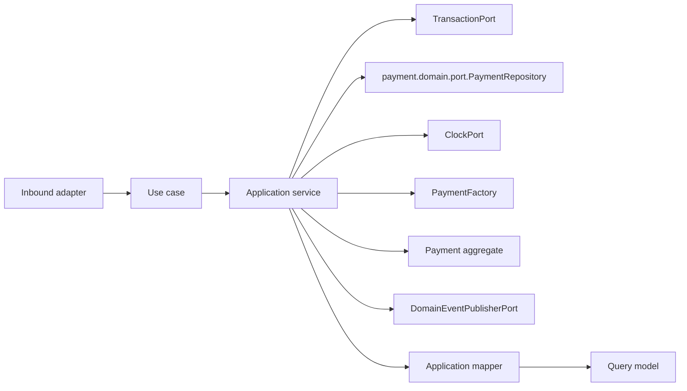

# Payment Application Layer

Version: 1.0
Sprint: 11.1
Status: Implemented
Last Updated: 2026-07-07

## Purpose

The Payment application layer exposes framework-neutral use cases around the `Payment` aggregate defined
in the pre-existing Payment domain model (`payment.domain.*`, shipped ahead of this sprint). It coordinates
the domain repository port, time, transactions, aggregate calls, mapping, and event publication. Business
invariants remain inside `Payment` and `PaymentAttempt`.

This layer has no Spring, Jakarta Persistence, REST, infrastructure, or security dependencies.

## Architecture

Dependency direction is inward: the application package depends only on the Payment domain, shared domain
contracts, and Java.

## Use Cases

| Use case | Command/input | Result |
| --- | --- | --- |
| `CreatePaymentUseCase` | `CreatePaymentCommand` | `PaymentResult` |
| `GetPaymentUseCase` | Tenant ID and payment ID | `PaymentResult` |
| `ListPaymentsUseCase` | Tenant ID and `PaymentPageRequest` | `PaymentPage<PaymentSummary>` |
| `UpdatePaymentStatusUseCase` | `UpdatePaymentStatusCommand` | `PaymentResult` |

Each use case has one concrete application service. Services use constructor injection and contain
orchestration only. No RBAC or ownership validation exists yet; every use case is reachable by any
authenticated tenant user, matching the sprint's explicit scope (Sprint 11.3 owns authorization).

## Creating A Payment Reuses The Existing PaymentFactory

Unlike Savings Group and Member — whose Sprint 9.x/10.x `CreateXApplicationService` classes bypass their
domain `*Factory` classes and call the aggregate's static factory method directly, generating a code/number
through a dedicated application port — Payment's `CreatePaymentApplicationService` calls the pre-existing
`payment.domain.factory.PaymentFactory` directly. Two things justify diverging from the Group/Member
pattern here rather than reproducing it:

1. `PaymentFactory` already generates the `PaymentReference` internally (`"PAY-" + a random UUID`) and
   already calls `Payment.initiate(...)` — reusing it is a single, already-correct dependency. Introducing
   a parallel `PaymentReferenceGeneratorPort`/`PaymentReferenceGenerator` domain service, mirroring
   `GroupCodeGeneratorPort`/`GroupCodeGenerator`, would duplicate logic `PaymentFactory` already implements
   correctly — directly contradicting "never duplicate business logic."
2. `PaymentFactory` needs only a `java.time.Clock` (a plain JDK type), which the `..application..` ArchUnit
   rule already permits application code to depend on. `PaymentInfrastructureConfig` builds one `Clock` bean
   and uses it for both the `PaymentFactory` bean and the `ClockPort` adapter, so there is exactly one clock
   instance in the composition, not two independent ones.

`ClockPort` is still used directly by `UpdatePaymentStatusApplicationService`, because
`Payment.startAttempt`/`verify`/`fail` take an explicit `Instant` parameter for the transition time — that
part of the pattern is unchanged from Group and Member.

## Idempotent Creation

`CreatePaymentApplicationService` checks `repository.findByIdempotencyKey(tenantId, idempotencyKey)` before
calling `PaymentFactory.initiate(...)`. If a payment already exists for that tenant and idempotency key, the
existing payment's result is returned immediately — no new aggregate is created, no event is published, and
`repository.save` is never called for this call. This reuses the domain port's existing
`findByIdempotencyKey` method (unmodified) rather than inventing a duplicate-key exception, and matches the
idempotency-key contract enforced at the database level (`uk_payments_tenant_idempotency`). Validating that
a *retried* request's other fields (amount, group, member) match the *original* request is intentionally out
of scope for this foundation sprint — it is a gateway-integration-adjacent concern the sprint brief excludes.

## Updating Payment Status

`Payment` exposes three specific public transition methods rather than one generic `changeStatus`:
`startAttempt(actorId, at)` (→ `PENDING_PROVIDER`), `verify(providerReference, actorId, at)` (→ `VERIFIED`),
and `fail(failureCode, actorId, at)` (→ `FAILED`). `UpdatePaymentStatusApplicationService` dispatches to the
matching method based on `UpdatePaymentStatusCommand.targetStatus()` via a `switch` with a `default` branch
that rejects any other `PaymentStatus` value (`INITIATED`, `CANCELLED`, `REFUNDED`, `DISPUTED`) with
`IllegalArgumentException` — these four have no supporting domain method and are not invented here. The REST
layer independently restricts the accepted `status` values to the same three via a validation pattern, so
the `default` branch is a defensive assertion against direct application-layer callers, not the primary
guard.

`verify` requires a `ProviderReference` (provider + transaction id) and `fail` requires a failure code;
`UpdatePaymentStatusCommand` carries both as nullable fields, and the REST mapper enforces that the field
matching the requested target status is present before the command is even constructed (see
[Payment Persistence](../persistence/payment-persistence.md#known-limitations) for why the supplied provider
reference is not currently persisted).

## Commands

Commands are immutable records containing domain value objects and operation context. Mutation commands
carry the tenant identifier, aggregate identifiers where applicable, and the actor identifier. Constructors
perform null validation only; `UpdatePaymentStatusCommand.providerReference()`/`.failureCode()` are
intentionally nullable, since exactly one is relevant depending on the target status.

## Query Models

- `PaymentResult` is the complete application view, including every recorded attempt.
- `PaymentAttemptResult` is the nested per-attempt projection used inside it.
- `PaymentSummary` is the compact list projection used by `ListPaymentsUseCase`.

`PaymentApplicationMapper` converts the aggregate and its child entities to these models. Query models
expose scalar Java values and immutable collections, never domain aggregates or persistence entities.

## Ports

### payment.domain.port.PaymentRepository

Payment use cases depend directly on the pre-existing domain repository port, following the same
resolution Member adopted in Sprint 10.1/10.2 rather than introducing a parallel
`payment.application.port.PaymentRepository`: `GENERAL_INFRASTRUCTURE_MUST_NOT_DEPEND_ON_APPLICATION_OR_INTERFACES`
(see `LayerDependencyArchitectureTest`) has no carve-out for a `payment` adapter depending on
`payment.application`, and the sprint brief forbids modifying ArchUnit. The port gained two additive
methods this sprint: `findById(AggregateId tenantId, AggregateId paymentId)` for tenant-scoped lookup, and
`findPage(AggregateId tenantId, PaymentPageRequest pageRequest)` for pagination. Every pre-existing method
(`findById(paymentId)`, `findByReference`, `findByIdempotencyKey`, `findByProviderReference`, `save`) is
untouched.

### Additional Ports

| Port | Responsibility |
| --- | --- |
| `DomainEventPublisherPort` | Publishes committed aggregate events. |
| `ClockPort` | Supplies deterministic application time. |
| `TransactionPort` | Executes one complete use case transaction. |

These three ports are structurally identical to their Savings Group and Member counterparts
(`@FunctionalInterface`), and — for the same ArchUnit reason described above — their adapters are composed
under `payment.interfaces.rest.config`/`payment.interfaces.rest.adapter` rather than a new
`infrastructure.payment` package, exactly mirroring Member's Sprint 10.1 resolution.

## Pagination

`ListPaymentsUseCase` lists tenant-scoped payments, paginated and sorted at the persistence boundary,
following the same shape Member's Sprint 10.2 established: a page/size/totalElements carrier with derived
`totalPages()`/`hasNext()`/`hasPrevious()`, a page request record validating `page >= 0` and
`1 <= size <= 100`, and a sort-field enum (`CREATED_AT` or `AMOUNT`) with a direction enum (`ASC`/`DESC`).
No status filter exists, matching the sprint brief's literal scope (page, size, sort, direction only).

For the same reason described above, `PaymentPage`/`PaymentPageRequest`/`PaymentSortField`/`SortDirection`
live in `payment.domain.port` rather than `payment.application.port`, and
`PaymentApiMapper.listPayments(useCase, currentUser, page, size, sort, direction)` fully consolidates page
construction, use-case invocation, and response mapping so the controller never touches a domain-port type
directly (`*Controller`-named classes may not depend on `..domain..`).

## Transactions

Every application service owns its transaction boundary by invoking `TransactionPort.execute(...)`. No
framework annotation is present. Command execution order for `CreatePaymentUseCase` is:

1. Begin transaction abstraction.
2. Check for an existing payment with the same idempotency key; short-circuit if found.
3. Call `PaymentFactory.initiate(...)`.
4. Save the aggregate.
5. Pull and publish domain events (`PaymentInitiated`).
6. Map and return the result.

For `UpdatePaymentStatusUseCase`: load the payment, dispatch to the matching domain transition method, save,
publish (`PaymentStatusChanged`), map and return. Events are not pulled when persistence fails, preserving
pending aggregate events for the failed unit of work, matching the existing convention.

## Application Validation

Application validation is intentionally limited to:

- Required command arguments.
- Tenant-scoped aggregate existence.
- Idempotency-key short-circuit before creation.
- Presence of the companion field (`providerReference` or `failureCode`) required by the requested target
  status, enforced in the REST mapper before the command is constructed.

Database constraints (`uk_payments_reference`, `uk_payments_tenant_idempotency`) remain the ultimate
safeguard against concurrent reference-generation or idempotency-key races.

## Testing

The application suite covers:

- All four service implementations and use-case contracts.
- Repository success and missing-aggregate paths.
- Idempotent creation short-circuit (existing payment returned, no save, no publish).
- Transaction execution and save-before-publish ordering.
- Aggregate event publication (`PaymentInitiated`, `PaymentStatusChanged`).
- All three supported status transitions (`PENDING_PROVIDER`, `VERIFIED`, `FAILED`) and rejection of
  unsupported targets and invalid domain-level transitions.
- Paginated, sorted tenant-scoped listing.
- Mapper and immutable query-model behavior.
- Commands, ports, exceptions, and null validation.

## Future Integration

Business authorization (restricting who may view, list, or update a payment) is explicitly out of scope —
Sprint 11.3 owns it, mirroring how Group deferred to 9.6 and Member deferred to 10.3. Payment Gateway
integration, provider callback handling, receipt generation, and scheduled reconciliation are separate,
later sprints; this sprint deliberately stops at the point where a payment's lifecycle can be driven
manually through the REST API.
