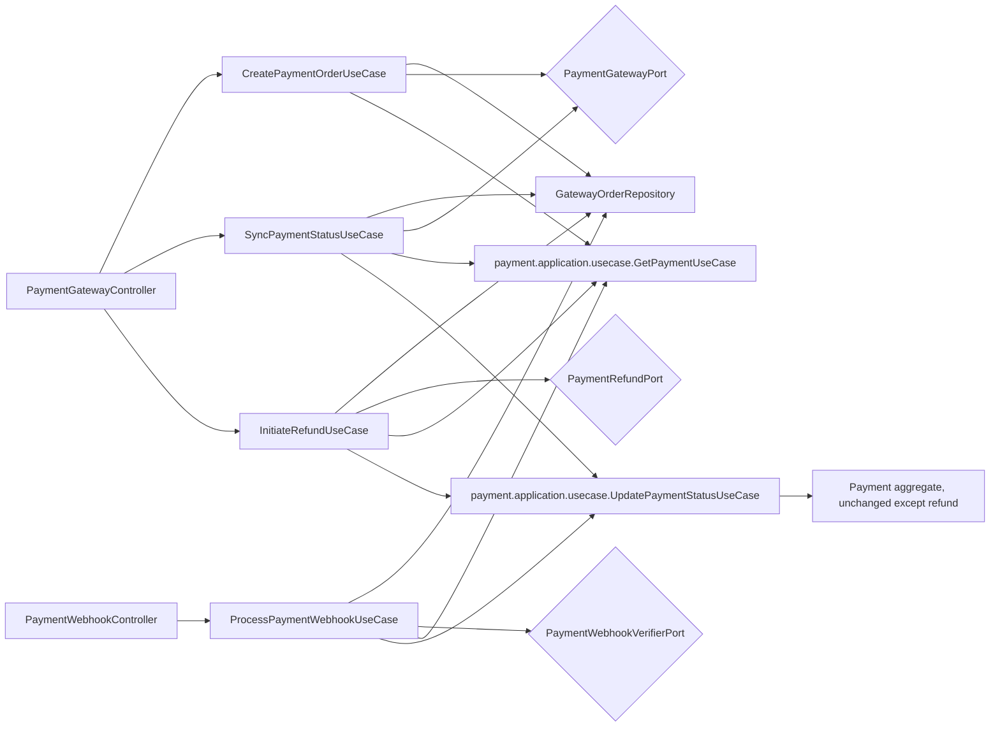

# Payment Gateway Integration

Version: 1.0
Sprint: 12.2
Status: Implemented
Last Updated: 2026-07-08

## Purpose

Sprint 12.2 introduces a new `paymentgateway` module that integrates the pre-existing Payment aggregate with
three external payment gateways — Razorpay, Stripe, and Cashfree — for order creation, status
synchronization, webhook-driven status updates, and refunds. The `Payment` aggregate itself is touched only
minimally and additively: one new method, `Payment.refund(...)`, was added (mirroring the shape of the
pre-existing `verify`/`fail` methods) so a verified payment has a way to reach the `REFUNDED` status this
aggregate's own `PaymentStatus` enum already declared but had no path to before this sprint. Every other
Payment behavior — `initiate`, `startAttempt`, `verify`, `fail`, and their business rules — is unchanged.

## Architecture



`paymentgateway.domain` is entirely provider-agnostic: `GatewayType`, `GatewayOrder` (a new aggregate — new,
not a redesign of `Payment` — tracking one payment's provider-side order, its most recently observed raw
provider status, and its refund id, if any), and `GatewayOrderRepository`. Nothing in `paymentgateway.domain`
or `paymentgateway.application` imports a provider SDK; there is no provider SDK dependency in this project
at all (see [Simulated Provider Adapters](#simulated-provider-adapters) below). Every provider-specific class
lives under `paymentgateway.interfaces.rest.adapter`, matching the hexagonal boundary every other module in
this codebase already follows.

## Providers

`GatewayType` has exactly three values: `RAZORPAY`, `STRIPE`, `CASHFREE`. Three ports abstract every
provider-facing capability:

| Port | Responsibility |
| --- | --- |
| `PaymentGatewayPort` | Creates a provider order; fetches a provider's current status for an order |
| `PaymentWebhookVerifierPort` | Verifies an inbound webhook's signature |
| `PaymentRefundPort` | Initiates a refund with the provider |

Each port has one implementation per provider (`supportedProvider()` identifies which). Application code
never references a concrete provider class — a small `GatewayPortResolver` selects the correct adapter out
of the full `List<PaymentGatewayPort>` (etc.) Spring wires, by `GatewayType` alone. This is the mechanism
behind "provider abstraction" and "provider switching": swapping which provider handles a payment is a
matter of which adapter's `supportedProvider()` matches, controlled by
`bachatsetu.payment.gateway.default-provider` for new orders (webhooks/refunds/sync always use whichever
provider created the order, recorded on its `GatewayOrder`).

Application code operates only on `PaymentOrderResult`, `PaymentStatusResult`, and `RefundResult` — plain,
provider-agnostic records — never a provider-specific type.

### Simulated Provider Adapters

**No Razorpay, Stripe, or Cashfree SDK is used anywhere in this codebase.** The six order/refund adapters
(`Simulated{Razorpay,Stripe,Cashfree}GatewayAdapter`, `Simulated{Razorpay,Stripe,Cashfree}RefundAdapter`)
generate a realistic-looking but entirely fake provider order id and payment link (or refund id), and log
what a real integration would do — exactly the same placeholder pattern Notification's
`LoggingEmailSenderAdapter`/etc. established in Sprint 11.7 for outbound channels this project cannot
exercise against a real provider in this environment. Real SDK integration (API keys, actual HTTP calls to
Razorpay/Stripe/Cashfree) is explicitly out of scope for this sprint and is future work; this module's entire
orchestration (order creation, status sync, refund initiation, and their interaction with `Payment`) is fully
implemented, wired, and tested against these placeholders so that swapping them for real SDK-backed adapters
later requires no change above the `PaymentGatewayPort`/`PaymentRefundPort` boundary.

Webhook signature verification is **not** simulated — `HmacSha256Signer` (package-private, shared by all
three verifiers) performs genuine HMAC-SHA256 computation and constant-time comparison using only the JDK's
`javax.crypto`, matching how all three providers sign real webhooks in practice.

## Order Creation

`CreatePaymentOrderUseCase` takes a payment id and a caller-confirmed amount. The service:

1. Returns the existing `GatewayOrder` unchanged if one already exists for this payment (idempotent — no
   second provider call, no second row; `finance.payment_gateway_orders` also enforces one order per payment
   at the database level via `uk_gateway_orders_payment`).
2. Otherwise, loads the payment via the pre-existing `GetPaymentUseCase` and validates the confirmed amount
   against the payment's own recorded amount, throwing `AmountMismatchException` (422) if they differ.
3. Calls `PaymentGatewayPort.createOrder(...)` for the configured default provider.
4. Persists a new `GatewayOrder` recording the provider's order id and payment link.

`Payment` itself is never modified during order creation — it remains in whatever status it already was
(typically `INITIATED`) until a webhook or sync call later reports a definite outcome.

## Gateway Metadata Storage

A new, additive Flyway migration (`V7__payment_gateway_orders.sql`) creates `finance.payment_gateway_orders`
— a brand-new table, not a modification of `finance.payments`. It references `finance.payments(id)` by
foreign key and stores `gateway_type`, `provider_order_id`, `payment_link`, `provider_status`, and
`provider_refund_id`. No column was added to, removed from, or renamed on any pre-existing table.

## Webhook Flow

`POST /api/v1/payments/webhooks/{razorpay|stripe|cashfree}` — public endpoints, listed under
`bachatsetu.authentication.security.public-endpoints` (`/api/v1/payments/webhooks/**`) so a provider's
webhook call, which never carries a bearer token, is exempted from JWT authentication at the security
*configuration* level — an additive entry in an existing config-driven list, not a new
`SecurityFilterChain` or filter class.

1. **Signature verification is mandatory and happens first**, before any payment or order is looked up.
   `PaymentWebhookVerifierPort.verifySignature` is called with the exact raw request body and the
   provider's signature header; a failed check throws `InvalidWebhookSignatureException`, mapped to **401**.
2. **The payment is resolved only via its `GatewayOrder`.** A webhook identifies a *provider* order id, never
   one of this system's internal payment ids (this mirrors how real Razorpay/Stripe/Cashfree webhooks work —
   they only know their own order/payment identifiers). `GatewayOrderRepository.findByProviderOrderId(...)`
   resolves it; no match throws `GatewayOrderNotFoundException`, mapped to **404**.
3. **The payment status transition is delegated entirely to the pre-existing `UpdatePaymentStatusUseCase`** —
   this module never calls `Payment.verify`/`Payment.fail` directly, and never touches
   `PaymentRepository`. A successful webhook triggers `UpdatePaymentStatusCommand` targeting `VERIFIED`; a
   failure webhook targets `FAILED`.
4. **Duplicate webhooks are idempotent.** Before calling `UpdatePaymentStatusUseCase`, the service compares
   the payment's *current* status (via `GetPaymentUseCase`) against the status the webhook reports. If the
   payment is already in that target status, the transition call is skipped — calling
   `Payment.verify`/`Payment.fail` a second time would otherwise throw `InvalidPaymentStateException`, since
   both require the payment to still be pending. The webhook still returns **200** with the same successful
   result either way.

Publishing the existing `PaymentStatusChanged` event happens exactly as it always did, inside
`UpdatePaymentStatusApplicationService` — this module adds no new event type and never bypasses that
application service.

### The Webhook Payload Contract

Real Razorpay, Stripe, and Cashfree webhooks each use their own, differing JSON payload shape. Since no real
SDK or provider account exists in this environment, all three endpoints instead accept this module's own
normalized contract (`GatewayWebhookPayload`): `{"providerOrderId": "...", "status": "SUCCESS"|"FAILED",
"providerReferenceId": "..."}`. Mapping each provider's actual webhook schema onto this contract (or
replacing it with three provider-specific parsers) is future work once real SDK integration begins; this
sprint's webhook *processing logic* (signature verification, order resolution, idempotent status
transition) does not depend on the payload's shape and requires no change when that mapping is added later.

## Refund Flow

`POST /api/v1/payments/{paymentId}/refunds` — authenticated, manual-only (no scheduled refund job exists or
is planned by this module). `InitiateRefundUseCase`:

1. Loads the payment's `GatewayOrder`; no order throws `GatewayOrderNotFoundException` (404).
2. **Checks idempotency first**: if `GatewayOrder.providerRefundId()` is already set, returns that same
   result immediately without calling the provider again. This check runs *before* the VERIFIED-status
   check, deliberately — once a refund succeeds, `Payment.refund(...)` moves the payment out of `VERIFIED`
   into `REFUNDED`, so a naive "check VERIFIED first" ordering would reject a legitimate duplicate refund
   request with `RefundNotAllowedException` instead of returning the original success. The two checks answer
   different questions ("did we already do this?" vs. "is this a legal new attempt?") and must run in that
   order.
3. Only for a genuinely new refund: loads the payment via `GetPaymentUseCase` and requires
   `PaymentStatus.VERIFIED`, throwing `RefundNotAllowedException` (422) otherwise.
4. Calls `PaymentRefundPort.initiateRefund(...)`, records the returned provider refund id on the
   `GatewayOrder`, and — only if the provider reports success — calls `UpdatePaymentStatusUseCase` targeting
   `REFUNDED`, which invokes the new `Payment.refund(...)` method.

## Configuration

```yaml
bachatsetu:
  payment:
    gateway:
      enabled: ${PAYMENT_GATEWAY_ENABLED:true}
      default-provider: ${PAYMENT_GATEWAY_DEFAULT_PROVIDER:RAZORPAY}
      razorpay:
        key-id: ${RAZORPAY_KEY_ID:}
        secret: ${RAZORPAY_SECRET:}
        webhook-secret: ${RAZORPAY_WEBHOOK_SECRET:}
      stripe:
        api-key: ${STRIPE_API_KEY:}
        webhook-secret: ${STRIPE_WEBHOOK_SECRET:}
      cashfree:
        client-id: ${CASHFREE_CLIENT_ID:}
        client-secret: ${CASHFREE_CLIENT_SECRET:}
        webhook-secret: ${CASHFREE_WEBHOOK_SECRET:}
```

`PaymentGatewayProperties` (a `@ConfigurationProperties` record, mirroring the established
`AuthenticationSecurityProperties` pattern) binds this. Every secret defaults to an empty string via its
`${ENV_VAR:}` placeholder — never a hardcoded value. A blank webhook secret does not disable verification or
throw; `HmacSha256Signer.matches` simply always returns `false` for a blank secret or missing header, so
signature verification fails safely closed until a real secret is supplied through the environment.

`bachatsetu.payment.gateway.enabled` gates both REST controllers (`PaymentGatewayController` and
`PaymentWebhookController`); `bachatsetu.persistence.repositories.enabled` gates every port/use-case bean,
matching every other module's two-tier `@ConditionalOnProperty` convention.

## Testing

- `GatewayOrderTest` — the new aggregate's lifecycle (`create`, `updateProviderStatus`, `recordRefund`
  exactly once, blank-input rejection).
- `PaymentTest`, `PaymentApplicationServiceTest` (extended) — `Payment.refund()`'s VERIFIED-only guard and
  its wiring into `UpdatePaymentStatusApplicationService`'s `REFUNDED` case.
- `CreatePaymentOrderApplicationServiceTest`, `ProcessPaymentWebhookApplicationServiceTest`,
  `SyncPaymentStatusApplicationServiceTest`, `InitiateRefundApplicationServiceTest` — success paths, amount
  mismatch, invalid signature, unknown provider order, not-VERIFIED refund rejection, and idempotency for
  both duplicate webhooks and repeated refund calls.
- `WebhookVerifierTest` — genuine HMAC-SHA256 verification for all three providers: correct signature
  accepted, wrong signature/payload rejected, blank secret and missing header both fail safely.
- `SimulatedGatewayAdapterTest` — every simulated order/refund adapter reports the correct `GatewayType` and
  a plausible result.
- `PaymentGatewayInfrastructureAdapterTest` — clock/transaction/event-publisher adapters.
- `PaymentGatewayApiMapperTest` — command/response mapping, including webhook payload parsing and malformed
  body rejection.
- `PaymentGatewayControllerTest`, `PaymentWebhookControllerTest` — every endpoint, including duplicate
  webhook idempotency, invalid signature (401), unknown order (404), and amount mismatch/refund-not-allowed
  (422).
- `PaymentGatewayApplicationConfigTest`, `PaymentGatewayInfrastructureConfigTest` — bean wiring, including
  that exactly three beans exist per provider port and none wire when persistence repositories are disabled.
- `GatewayOrderRepositoryAdapterTest` — adapter mapping over mocked Spring Data calls.
- `PaymentGatewayPersistencePostgreSqlIntegrationTest` (Testcontainers; skips cleanly without Docker) — full
  persistence round-trip, provider-status/refund updates surviving a reload, and tenant isolation.

## Limitations

- **No real provider SDK integration.** All six order/refund adapters are simulated placeholders (see
  above); only webhook signature verification is genuinely implemented.
- **The webhook payload contract is this module's own normalization**, not any real provider's actual
  webhook JSON shape.
- **No automatic refund jobs.** Refunds are manual-API-only, per this sprint's explicit scope.
- **Same-day/duplicate protections rely on `GatewayOrder`'s own recorded state** (one order per payment, one
  refund id per order) rather than a general-purpose idempotency-key mechanism; a second, different order or
  refund attempt against the same payment after the first is still prevented by the unique database
  constraint and the refund idempotency check described above, not by a separate deduplication table.
- **No distributed lock.** As with automation (Sprint 12.1), this module assumes single-node operation;
  concurrent webhook/refund calls for the same payment rely on the database's own unique constraints and
  optimistic version checks to prevent corruption, not an application-level lock.
