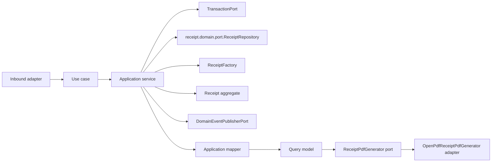

# Receipt Application Layer

Version: 1.1
Sprint: 11.5 (extends the Sprint 11.4 foundation)
Status: Implemented
Last Updated: 2026-07-08

## Purpose

The Receipt application layer exposes framework-neutral use cases around the `Receipt` aggregate defined in
the pre-existing Receipt domain model (`receipt.domain.*`, shipped ahead of this sprint alongside Payment and
Draw, but never previously wired to an application or REST layer). It coordinates the domain repository port,
transactions, aggregate calls, mapping, and event publication. Business invariants remain inside `Receipt`.

This layer has no Spring, Jakarta Persistence, REST, infrastructure, or security dependencies.

Sprint 11.4 was metadata-only: it created immutable receipt *records*. Sprint 11.5 adds the ability to
render an existing receipt's metadata as a downloadable PDF document. Cloud storage, email delivery, and
payment gateway integration remain explicitly out of scope.

## Architecture



The PDF flow (Sprint 11.5) fits the same shape: `GetReceiptPdfApplicationService` calls the existing
`GetReceiptUseCase` to obtain a `ReceiptResult` (application query model), then hands that same, already
framework-neutral model to `ReceiptPdfGenerator` — nothing new flows from the domain or persistence layer.

Dependency direction is inward: the application package depends only on the Receipt domain, shared domain
contracts, and Java.

## Use Cases

| Use case | Command/input | Result |
| --- | --- | --- |
| `CreateReceiptUseCase` | `CreateReceiptCommand` | `ReceiptResult` |
| `GetReceiptUseCase` | Tenant ID and receipt ID | `ReceiptResult` |
| `ListReceiptsUseCase` | Tenant ID and `ReceiptPageRequest` | `ReceiptPage<ReceiptSummary>` |
| `GetReceiptPdfUseCase` | Tenant ID and receipt ID | `ReceiptPdfResult` (PDF bytes + file name) |

Each use case has one concrete application service. Services use constructor injection and contain
orchestration only. No RBAC or ownership validation exists yet, matching the sprint's explicit scope.
`Receipt.markDelivered`/`Receipt.cancel` (pre-existing domain lifecycle transitions) have no REST endpoint or
use case — the API scope remains exactly four endpoints (create, get, list, and now the PDF download).

## PDF Generation (Sprint 11.5)

### Flow

`GetReceiptPdfApplicationService` has exactly the responsibilities the sprint specifies, and no others:

1. **Load receipt / validate tenant** — delegates entirely to the pre-existing `GetReceiptUseCase`
   (`GetReceiptApplicationService`), which already performs the tenant-scoped repository lookup and throws
   `ReceiptNotFoundException` if the receipt does not exist for that tenant. No new repository access, no new
   tenant-scoping logic, and no new transaction boundary were introduced — `GetReceiptUseCase` already owns
   its own `TransactionPort.execute(...)` boundary, so wrapping it in a second, outer transaction would be
   redundant, since PDF rendering itself performs no persistence access.
2. **Generate PDF** — passes the resulting `ReceiptResult` (an existing, already framework-neutral query
   model) to `ReceiptPdfGenerator.generate(receipt)`.
3. **Return PDF bytes** — wraps the rendered `byte[]` and a derived file name
   (`receipt.number()` with `/` replaced by `-`, plus `.pdf`) in `ReceiptPdfResult`.

```java
public final class GetReceiptPdfApplicationService implements GetReceiptPdfUseCase {
    public ReceiptPdfResult execute(AggregateId tenantId, AggregateId receiptId) {
        ReceiptResult receipt = getReceipt.execute(tenantId, receiptId); // load + tenant validation
        byte[] content = pdfGenerator.generate(receipt);                // render
        return new ReceiptPdfResult(content, fileNameFor(receipt));     // return bytes
    }
}
```

### The ReceiptPdfGenerator Port

`receipt.application.port.ReceiptPdfGenerator` is a single-method `@FunctionalInterface`
(`byte[] generate(ReceiptResult receipt)`) — structurally identical in spirit to `TransactionPort`/
`DomainEventPublisherPort`. It depends only on `ReceiptResult`, an application query model that already
exists; it does not, and must not, depend on `Receipt` (the domain aggregate), any persistence entity, or any
PDF library type. `ApplicationContractTest.pdfGeneratorPortIsAFunctionalAbstractionOverBytes` asserts the
interface exposes exactly one method.

### The OpenPDF Implementation

`receipt.interfaces.rest.adapter.OpenPdfReceiptPdfGenerator` implements `ReceiptPdfGenerator` using
[OpenPDF](https://github.com/LibrePDF/OpenPDF) (`com.github.librepdf:openpdf`), an actively maintained,
Apache-Central-published fork of iText 4 (dual MPL 2.0 / LGPL 2.1 licensed). OpenPDF was chosen over Apache
PDFBox for two concrete reasons specific to this sprint's formatting requirements:

- **Native auto-table layout.** OpenPDF's `PdfPTable`/`PdfPCell` automatically compute column widths (from
  relative weights) and wrap multi-line cell content without any manual coordinate math. PDFBox 3.x has no
  equivalent table API in its core module — a table would have to be hand-rolled with manual text
  positioning and line-wrapping, which is a much weaker fit for the sprint's explicit "auto table layout" and
  "multi-line descriptions" requirements.
- **Simpler dependency footprint.** `com.github.librepdf:openpdf:1.3.42` resolves with **zero** transitive
  dependencies. Apache PDFBox 3.0.3 (the alternative evaluated) transitively pulls in
  `commons-logging:commons-logging`, which this project's Maven Enforcer `bannedDependencies` rule explicitly
  bans project-wide; using PDFBox would have required an explicit `<exclusion>` just to satisfy the existing,
  unmodified build gate. OpenPDF requires no such workaround.

Following the exact resolution already established for every other Receipt/Payment/Draw outbound port, the
adapter lives under `receipt.interfaces.rest.adapter` (not a new `infrastructure.receipt` package), because
`GENERAL_INFRASTRUCTURE_MUST_NOT_DEPEND_ON_APPLICATION_OR_INTERFACES` has no carve-out for a `receipt`
adapter depending on `receipt.application`, and the sprint forbids modifying ArchUnit. It is registered as an
unconditional `@Bean` in `ReceiptInfrastructureConfig` (gated only by the class's existing
`@ConditionalOnBean(PlatformTransactionManager.class)`), exactly like the Transaction/EventPublisher
adapters.

### PDF Layout

The rendered document (A4, 54pt margins on all sides) contains, top to bottom: a centered "BachatSetu" title
and "Payment Receipt" subtitle; a two-column, borderless details table (Receipt Number, Receipt Date, Member,
Payment Reference, Payment Amount, Currency); a bordered, auto-widthed three-column line-items table (Type,
Description, Amount) with a branded header row; a right-aligned bold Total line; a Generated timestamp line;
and a centered italic footer reading "This receipt was generated electronically by BachatSetu." Currency
values are formatted with a thousands-separated two-decimal `DecimalFormat` (`#,##0.00`) alongside the ISO
currency code (e.g. `5,000.00 INR`) rather than a currency symbol, since the Base-14 PDF fonts used
(Helvetica) do not include the ₹ glyph in their standard encoding and would throw at render time if asked to
draw it. Dates use `dd MMM yyyy` (receipt date) and `dd MMM yyyy, HH:mm:ss 'UTC'` (generated timestamp),
both fixed to UTC for determinism. No QR codes, digital signatures, or branding images are present, per the
sprint's explicit exclusions.

### Download Endpoint

`GET /api/v1/receipts/{receiptId}/pdf` — authenticated (`CurrentUserProvider.requireCurrentUser()`, matching
every other Receipt endpoint) and tenant-scoped (the receipt lookup is tenant-scoped before any byte is
rendered, so cross-tenant requests receive the same `404 receipt-not-found` response as the existing `GET
/api/v1/receipts/{receiptId}` endpoint — tenant existence is never leaked). The endpoint overrides the
controller's class-level `produces = application/json` with its own `produces = application/pdf`; the
response sets `Content-Disposition: attachment; filename="<receipt-number-with-slashes-as-dashes>.pdf"` via
Spring's `ContentDisposition` builder (avoiding manual header-string construction). No new DTOs, no new
routes beyond this one, and no changes to `create`/`get`/`list`.

## No ClockPort This Sprint

Unlike Payment and Draw, the Receipt application layer does not define a `ClockPort`. Payment's and Draw's
`ClockPort` exist solely to supply the current instant to lifecycle-transition services
(`UpdatePaymentStatusApplicationService`, `ConductDrawApplicationService`/`CloseDrawApplicationService`) that
this sprint does not implement for Receipt. `ReceiptFactory` still needs a `java.time.Clock` (a plain JDK
type), so `ReceiptInfrastructureConfig` still builds one `Clock` bean for the factory — there is simply no
service left over that needs a `ClockPort` adapter. Adding one anyway would be dead, unused code.

## Generating A Receipt Reuses The Existing ReceiptFactory

Following the precedent Payment (11.1) and Draw (11.2) established, `CreateReceiptApplicationService` calls
the pre-existing `receipt.domain.factory.ReceiptFactory` directly rather than introducing a parallel
generator port. `ReceiptFactory` already builds a unique `ReceiptNumber` internally
(`"RCT/" + yyyyMMdd + "/" + 8-hex-character UUID suffix`) and calls `Receipt.generate(...)`; reusing it is a
single, already-correct dependency, and it needs only a `java.time.Clock`, exactly like `PaymentFactory` and
`DrawFactory`.

## Idempotent Creation

`CreateReceiptApplicationService` checks `repository.findByPaymentId(command.paymentId())` before calling
`ReceiptFactory.generate(...)`. If a receipt already exists for that payment, the existing receipt's result
is returned immediately — no new aggregate is created, no event is published, and `repository.save` is never
called. This mirrors Payment's idempotency-key short-circuit (11.1) and is additionally backed by the
database's own `uk_receipts_payment` unique constraint (one receipt per payment), consistent with the
business rule that a payment is receipted at most once.

## Commands

`CreateReceiptCommand` is an immutable record carrying the tenant, payment, member, actor, and a
`List<ReceiptLine>` — `ReceiptLine` is itself an existing domain value object, so the REST mapper constructs
it directly (assigning each line a fresh `AggregateId`) exactly as `CreateDrawCommand` carries a `DrawNumber`
and `DrawType` value object constructed by its own REST mapper. The constructor performs null validation
only; line-level validation (positive amount, description length) lives in `ReceiptLine`/`ReceiptDescription`
and is not duplicated here.

## Query Models

- `ReceiptResult` is the complete application view, including every line.
- `ReceiptLineResult` is the nested per-line projection used inside it.
- `ReceiptSummary` is the compact list projection used by `ListReceiptsUseCase`.

`ReceiptApplicationMapper` converts the aggregate and its lines to these models. Query models expose scalar
Java values and immutable collections, never domain aggregates or persistence entities. `Receipt` has no
independent `generatedAt` field; `ReceiptResult.generatedAt()`/`ReceiptSummary.generatedAt()` map from
`receipt.auditInfo().createdAt()`, since `Receipt.generate(...)` sets that audit timestamp to the generation
time.

## Ports

### receipt.domain.port.ReceiptRepository

Receipt use cases depend directly on the pre-existing domain repository port, following the same resolution
Member, Payment, and Draw adopted rather than introducing a parallel
`receipt.application.port.ReceiptRepository`: `GENERAL_INFRASTRUCTURE_MUST_NOT_DEPEND_ON_APPLICATION_OR_INTERFACES`
has no carve-out for a `receipt` adapter depending on `receipt.application`, and the sprint brief forbids
modifying ArchUnit. The port gained two additive methods this sprint: `findById(AggregateId tenantId,
AggregateId receiptId)` for tenant-scoped lookup, and `findPage(AggregateId tenantId, ReceiptPageRequest
pageRequest)` for pagination. Every pre-existing method (`findById(receiptId)`, `findByNumber`,
`findByPaymentId`, `save`) is untouched.

### Additional Ports

| Port | Responsibility |
| --- | --- |
| `DomainEventPublisherPort` | Publishes committed aggregate events. |
| `TransactionPort` | Executes one complete use case transaction. |

Both are structurally identical to their Savings Group, Member, Payment, and Draw counterparts
(`@FunctionalInterface`), and — for the same ArchUnit reason described above — their adapters are composed
under `receipt.interfaces.rest.config`/`receipt.interfaces.rest.adapter` rather than a new
`infrastructure.receipt` package.

## Pagination

`ListReceiptsUseCase` lists tenant-scoped receipts, paginated and sorted at the persistence boundary,
following the same shape Payment established: a page/size/totalElements carrier with derived
`totalPages()`/`hasNext()`/`hasPrevious()`, a page request record validating `page >= 0` and
`1 <= size <= 100`, and a sort-field enum (`CREATED_AT` or `AMOUNT`) with a direction enum (`ASC`/`DESC`) —
deliberately identical field names to Payment's `PaymentSortField`, per the sprint's instruction to mirror
Payment's sorting.

For the same reason described above, `ReceiptPage`/`ReceiptPageRequest`/`ReceiptSortField`/`SortDirection`
live in `receipt.domain.port` rather than `receipt.application.port`, and
`ReceiptApiMapper.listReceipts(useCase, currentUser, page, size, sort, direction)` fully consolidates page
construction, use-case invocation, and response mapping so the controller never touches a domain-port type
directly.

## Transactions

Every application service owns its transaction boundary by invoking `TransactionPort.execute(...)`. No
framework annotation is present. Command execution order for `CreateReceiptUseCase` is:

1. Begin transaction abstraction.
2. Check for an existing receipt for the same payment; short-circuit if found.
3. Call `ReceiptFactory.generate(...)`.
4. Save the aggregate.
5. Pull and publish domain events (`ReceiptGenerated`).
6. Map and return the result.

## Application Validation

Application validation is intentionally limited to:

- Required command arguments.
- Tenant-scoped aggregate existence (for `get`).
- Idempotency short-circuit before creation (one receipt per payment).

Database constraints (`uk_receipts_tenant_number`, `uk_receipts_payment`) remain the ultimate safeguard
against concurrent number-generation or duplicate-receipt races.

## Testing

The application suite covers:

- All three service implementations and use-case contracts.
- Repository success and missing-aggregate paths.
- Idempotent creation short-circuit (existing receipt returned, no save, no publish).
- Receipt number format and uniqueness across successive `generate` calls.
- Transaction execution and save-before-publish ordering.
- Aggregate event publication (`ReceiptGenerated`).
- Paginated, sorted tenant-scoped listing.
- Mapper and immutable query-model behavior, including line mapping.
- Commands, ports, exceptions, and null validation.
- The pre-existing `Receipt` aggregate itself (`generate`, `markDelivered`, `cancel`, and their invalid
  transitions), which had no test coverage before Sprint 11.4.

Sprint 11.5 adds, on top of the above:

- `OpenPdfReceiptPdfGeneratorTest` — PDF generation tests: output is non-empty, starts with the `%PDF-`
  magic bytes and ends with `%%EOF`, renders successfully for receipts with multiple lines, long
  (multi-line-wrapping) descriptions, and a cancelled status with a reason; rejects a null receipt; produces
  different bytes for different receipts.
- `ReceiptApplicationServiceTest` (extended) — unit tests for `GetReceiptPdfApplicationService`: delegates to
  `GetReceiptUseCase` then `ReceiptPdfGenerator`, derives the correct file name, propagates
  `ReceiptNotFoundException` unchanged, and rejects null constructor/method arguments.
- `ReceiptPdfIntegrationTest` (new) — wires the *real* `GetReceiptApplicationService` and the *real*
  `OpenPdfReceiptPdfGenerator` together (only the repository is mocked, standing in for persistence) to
  verify the full chain renders a genuine, non-empty PDF and — the tenant isolation test — that a
  cross-tenant lookup is rejected with `ReceiptNotFoundException` *before* any PDF rendering is attempted.
- `ReceiptApiMapperTest` (extended) — `getReceiptPdf` delegates to the use case with the parsed tenant and
  receipt identifiers.
- `ReceiptControllerTest` (extended) — download API tests: 200 with `Content-Type: application/pdf`, the
  exact `Content-Disposition: attachment; filename="..."` header, and the expected byte body; 404 for a
  missing/cross-tenant receipt; 401 when unauthenticated.
- `ReceiptInfrastructureConfigTest`/`ReceiptApplicationConfigTest` (extended) — the `ReceiptPdfGenerator` and
  `GetReceiptPdfUseCase` beans are wired when a transaction manager is present and absent otherwise.
- `ApplicationContractTest` (extended) — the `ReceiptPdfGenerator` port contract (single method) and
  `ReceiptPdfResult`'s defensive-copy behavior (mutating the caller's array after construction, or the
  returned array after calling `content()`, does not affect the stored bytes).

## Current Limitations

- **No member name or human-facing payment reference on the PDF.** `ReceiptResult` carries `memberId` and
  `paymentId` as opaque `UUID`s — it does not carry a member display name or the `Payment` aggregate's
  human-facing `PaymentReference` string (e.g. `PAY-1A2B3C4D...`). The PDF's "Member" and "Payment Reference"
  fields therefore print the raw UUIDs. Enriching these would require either adding fields to `Receipt`
  (a domain redesign, out of scope) or a new cross-module lookup into the Member/Payment repositories from
  `GetReceiptPdfApplicationService` (an in-scope architectural option — Draw's Sprint 11.3 already
  established that cross-module application-layer reads are permitted — but a larger change than "load
  receipt, generate PDF, return bytes" calls for). Documented here rather than implemented, per the sprint's
  minimal-footprint instruction.
- **No cloud storage or caching of rendered PDFs.** Every download request re-renders the PDF from the
  current receipt metadata; nothing is persisted or cached. This is intentional — Sprint 11.5 explicitly
  excludes AWS S3, Azure Blob, and Google Cloud Storage — but it does mean repeated downloads of the same
  receipt cost a fresh render each time (a small, in-memory, single-page-of-text operation, not a performance
  concern at current scale).
- **No email delivery, QR codes, digital signatures, or password protection**, per the sprint's explicit
  exclusions. `Receipt.markDelivered()` (which would represent "the receipt was handed to the member") still
  has no REST trigger; downloading the PDF does not change the receipt's `status`.

## Future Integration

Cloud storage of rendered PDFs, email/WhatsApp delivery notifications, QR codes, and digital signatures are
separate, later concerns not addressed here. Business authorization (restricting who may create, view, or
download a receipt) is also not addressed, mirroring how it was sequenced as its own sprint for Draw. This
sprint deliberately stops at the point where a receipt's metadata can be generated, retrieved, listed, and
downloaded as a PDF through the REST API.
