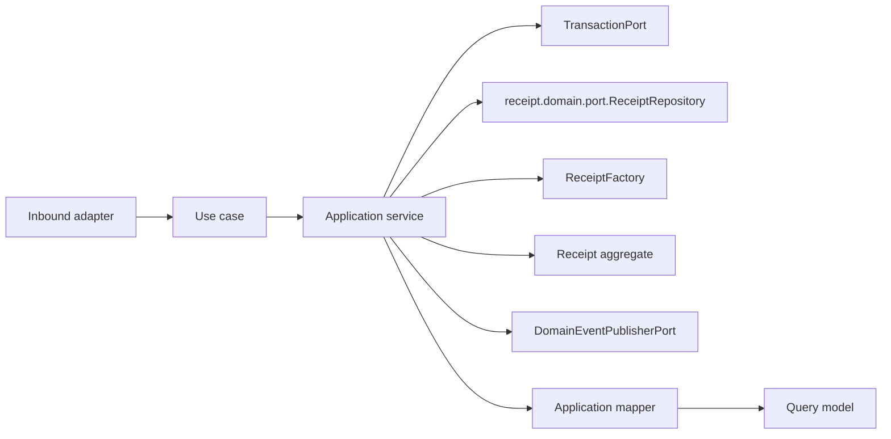

# Receipt Application Layer

Version: 1.0
Sprint: 11.4
Status: Implemented
Last Updated: 2026-07-07

## Purpose

The Receipt application layer exposes framework-neutral use cases around the `Receipt` aggregate defined in
the pre-existing Receipt domain model (`receipt.domain.*`, shipped ahead of this sprint alongside Payment and
Draw, but never previously wired to an application or REST layer). It coordinates the domain repository port,
transactions, aggregate calls, mapping, and event publication. Business invariants remain inside `Receipt`.

This layer has no Spring, Jakarta Persistence, REST, infrastructure, or security dependencies.

This sprint is metadata-only: it creates immutable receipt *records*. PDF rendering and cloud storage are
explicitly out of scope (Sprint 11.5).

## Architecture

Dependency direction is inward: the application package depends only on the Receipt domain, shared domain
contracts, and Java.

## Use Cases

| Use case | Command/input | Result |
| --- | --- | --- |
| `CreateReceiptUseCase` | `CreateReceiptCommand` | `ReceiptResult` |
| `GetReceiptUseCase` | Tenant ID and receipt ID | `ReceiptResult` |
| `ListReceiptsUseCase` | Tenant ID and `ReceiptPageRequest` | `ReceiptPage<ReceiptSummary>` |

Each use case has one concrete application service. Services use constructor injection and contain
orchestration only. No RBAC or ownership validation exists yet, matching the sprint's explicit scope.
`Receipt.markDelivered`/`Receipt.cancel` (pre-existing domain lifecycle transitions) have no REST endpoint or
use case in this sprint — the sprint's API scope is exactly three endpoints (create, get, list).

## No ClockPort This Sprint

Unlike Payment and Draw, the Receipt application layer does not define a `ClockPort`. Payment's and Draw's
`ClockPort` exist solely to supply the current instant to lifecycle-transition services
(`UpdatePaymentStatusApplicationService`, `ConductDrawApplicationService`/`CloseDrawApplicationService`) that
this sprint does not implement for Receipt. `ReceiptFactory` still needs a `java.time.Clock` (a plain JDK
type), so `ReceiptInfrastructureConfig` still builds one `Clock` bean for the factory — there is simply no
service left over that needs a `ClockPort` adapter. Adding one anyway would be dead, unused code.

## Generating A Receipt Reuses The Existing ReceiptFactory

Following the precedent Payment (11.1) and Draw (11.2) established, `CreateReceiptApplicationService` calls
the pre-existing `receipt.domain.factory.ReceiptFactory` directly rather than introducing a parallel
generator port. `ReceiptFactory` already builds a unique `ReceiptNumber` internally
(`"RCT/" + yyyyMMdd + "/" + 8-hex-character UUID suffix`) and calls `Receipt.generate(...)`; reusing it is a
single, already-correct dependency, and it needs only a `java.time.Clock`, exactly like `PaymentFactory` and
`DrawFactory`.

## Idempotent Creation

`CreateReceiptApplicationService` checks `repository.findByPaymentId(command.paymentId())` before calling
`ReceiptFactory.generate(...)`. If a receipt already exists for that payment, the existing receipt's result
is returned immediately — no new aggregate is created, no event is published, and `repository.save` is never
called. This mirrors Payment's idempotency-key short-circuit (11.1) and is additionally backed by the
database's own `uk_receipts_payment` unique constraint (one receipt per payment), consistent with the
business rule that a payment is receipted at most once.

## Commands

`CreateReceiptCommand` is an immutable record carrying the tenant, payment, member, actor, and a
`List<ReceiptLine>` — `ReceiptLine` is itself an existing domain value object, so the REST mapper constructs
it directly (assigning each line a fresh `AggregateId`) exactly as `CreateDrawCommand` carries a `DrawNumber`
and `DrawType` value object constructed by its own REST mapper. The constructor performs null validation
only; line-level validation (positive amount, description length) lives in `ReceiptLine`/`ReceiptDescription`
and is not duplicated here.

## Query Models

- `ReceiptResult` is the complete application view, including every line.
- `ReceiptLineResult` is the nested per-line projection used inside it.
- `ReceiptSummary` is the compact list projection used by `ListReceiptsUseCase`.

`ReceiptApplicationMapper` converts the aggregate and its lines to these models. Query models expose scalar
Java values and immutable collections, never domain aggregates or persistence entities. `Receipt` has no
independent `generatedAt` field; `ReceiptResult.generatedAt()`/`ReceiptSummary.generatedAt()` map from
`receipt.auditInfo().createdAt()`, since `Receipt.generate(...)` sets that audit timestamp to the generation
time.

## Ports

### receipt.domain.port.ReceiptRepository

Receipt use cases depend directly on the pre-existing domain repository port, following the same resolution
Member, Payment, and Draw adopted rather than introducing a parallel
`receipt.application.port.ReceiptRepository`: `GENERAL_INFRASTRUCTURE_MUST_NOT_DEPEND_ON_APPLICATION_OR_INTERFACES`
has no carve-out for a `receipt` adapter depending on `receipt.application`, and the sprint brief forbids
modifying ArchUnit. The port gained two additive methods this sprint: `findById(AggregateId tenantId,
AggregateId receiptId)` for tenant-scoped lookup, and `findPage(AggregateId tenantId, ReceiptPageRequest
pageRequest)` for pagination. Every pre-existing method (`findById(receiptId)`, `findByNumber`,
`findByPaymentId`, `save`) is untouched.

### Additional Ports

| Port | Responsibility |
| --- | --- |
| `DomainEventPublisherPort` | Publishes committed aggregate events. |
| `TransactionPort` | Executes one complete use case transaction. |

Both are structurally identical to their Savings Group, Member, Payment, and Draw counterparts
(`@FunctionalInterface`), and — for the same ArchUnit reason described above — their adapters are composed
under `receipt.interfaces.rest.config`/`receipt.interfaces.rest.adapter` rather than a new
`infrastructure.receipt` package.

## Pagination

`ListReceiptsUseCase` lists tenant-scoped receipts, paginated and sorted at the persistence boundary,
following the same shape Payment established: a page/size/totalElements carrier with derived
`totalPages()`/`hasNext()`/`hasPrevious()`, a page request record validating `page >= 0` and
`1 <= size <= 100`, and a sort-field enum (`CREATED_AT` or `AMOUNT`) with a direction enum (`ASC`/`DESC`) —
deliberately identical field names to Payment's `PaymentSortField`, per the sprint's instruction to mirror
Payment's sorting.

For the same reason described above, `ReceiptPage`/`ReceiptPageRequest`/`ReceiptSortField`/`SortDirection`
live in `receipt.domain.port` rather than `receipt.application.port`, and
`ReceiptApiMapper.listReceipts(useCase, currentUser, page, size, sort, direction)` fully consolidates page
construction, use-case invocation, and response mapping so the controller never touches a domain-port type
directly.

## Transactions

Every application service owns its transaction boundary by invoking `TransactionPort.execute(...)`. No
framework annotation is present. Command execution order for `CreateReceiptUseCase` is:

1. Begin transaction abstraction.
2. Check for an existing receipt for the same payment; short-circuit if found.
3. Call `ReceiptFactory.generate(...)`.
4. Save the aggregate.
5. Pull and publish domain events (`ReceiptGenerated`).
6. Map and return the result.

## Application Validation

Application validation is intentionally limited to:

- Required command arguments.
- Tenant-scoped aggregate existence (for `get`).
- Idempotency short-circuit before creation (one receipt per payment).

Database constraints (`uk_receipts_tenant_number`, `uk_receipts_payment`) remain the ultimate safeguard
against concurrent number-generation or duplicate-receipt races.

## Testing

The application suite covers:

- All three service implementations and use-case contracts.
- Repository success and missing-aggregate paths.
- Idempotent creation short-circuit (existing receipt returned, no save, no publish).
- Receipt number format and uniqueness across successive `generate` calls.
- Transaction execution and save-before-publish ordering.
- Aggregate event publication (`ReceiptGenerated`).
- Paginated, sorted tenant-scoped listing.
- Mapper and immutable query-model behavior, including line mapping.
- Commands, ports, exceptions, and null validation.
- The pre-existing `Receipt` aggregate itself (`generate`, `markDelivered`, `cancel`, and their invalid
  transitions), which had no test coverage before this sprint.

## Future Integration

PDF rendering and cloud storage of the rendered document are explicitly out of scope — Sprint 11.5 owns
them. Business authorization, email/WhatsApp delivery notifications, QR codes, and digital signatures are
separate, later concerns not addressed here. This sprint deliberately stops at the point where a receipt's
metadata can be generated, retrieved, and listed through the REST API.
