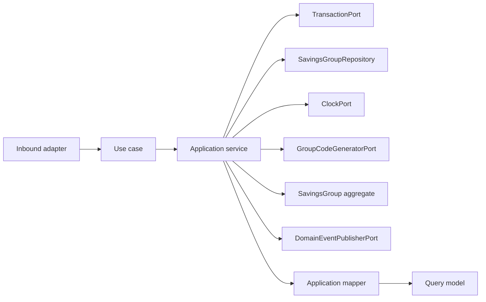

# Savings Group Application Layer

Version: 1.0  
Sprint: 9.2  
Status: Implemented  
Last Updated: 2026-07-06

## Purpose

The Savings Group application layer exposes framework-neutral use cases around the domain model defined in [Savings Group Domain](../domain/savings-group-domain.md). It coordinates repositories, time, transactions, code generation, aggregate calls, mapping, and event publication. Business invariants remain inside `SavingsGroup`.

This layer has no Spring, Jakarta Persistence, REST, infrastructure, or security dependencies.

## Architecture



Dependency direction is inward: the application package depends only on the Savings Group domain, shared domain contracts, and Java.

## Use Cases

| Use case | Command/input | Result |
| --- | --- | --- |
| `CreateSavingsGroupUseCase` | `CreateSavingsGroupCommand` | `SavingsGroupResult` |
| `JoinGroupUseCase` | `JoinGroupCommand` | `SavingsGroupResult` |
| `RemoveMemberUseCase` | `RemoveMemberCommand` | `SavingsGroupResult` |
| `ActivateGroupUseCase` | `ActivateGroupCommand` | `SavingsGroupResult` |
| `SuspendGroupUseCase` | `SuspendGroupCommand` | `SavingsGroupResult` |
| `CloseGroupUseCase` | `CloseGroupCommand` | `SavingsGroupResult` |
| `GetSavingsGroupUseCase` | Tenant ID and group ID | `SavingsGroupResult` |
| `ListSavingsGroupsUseCase` | Tenant ID | List of `SavingsGroupSummary` |

Each use case has one concrete application service. Services use constructor injection and contain orchestration only.

## Commands

Commands are immutable records containing domain value objects and operation context. Mutation commands carry the tenant identifier, aggregate identifier where applicable, and actor identifier. Constructors perform null validation only.

The application layer deliberately does not validate lifecycle state, membership uniqueness, owner removal, capacity, contribution limits, or transitions. Those rules remain aggregate responsibilities.

## Query Models

- `SavingsGroupResult` is the complete application view, including immutable membership history.
- `GroupMemberResult` represents active or removed membership without exposing `GroupMember`.
- `SavingsGroupSummary` is the compact list projection.

`SavingsGroupApplicationMapper` converts aggregates to these models. Query models expose scalar Java values and immutable collections, never domain aggregates or persistence entities.

## Ports

### SavingsGroupRepository

The repository boundary provides:

- `save`
- `findById`
- `findByGroupCode`
- `existsByGroupCode`
- `findAll`
- `delete`

All lookups and deletion are tenant-scoped to prevent accidental cross-tenant access. This sprint provides only the interface; no repository adapter is implemented.

### Additional Ports

| Port | Responsibility |
| --- | --- |
| `GroupCodeGeneratorPort` | Produces a candidate code for a new `GroupId`. |
| `DomainEventPublisherPort` | Publishes committed aggregate events. |
| `ClockPort` | Supplies deterministic application time. |
| `TransactionPort` | Executes one complete use case transaction. |

## Transactions

Every application service owns its transaction boundary by invoking `TransactionPort.execute(...)`. No framework annotation is present.

Command execution order is:

1. Begin transaction abstraction.
2. Validate application prerequisites or load the aggregate.
3. Invoke aggregate behavior.
4. Save the aggregate.
5. Pull and publish domain events.
6. Map and return the result.

Events are not pulled when persistence fails, preserving pending aggregate events for the failed unit of work. A concrete transaction adapter will determine commit and rollback behavior in a later infrastructure sprint.

## Event Publishing

The application layer publishes events already emitted by the aggregate:

- `SavingsGroupCreated`
- `MemberJoined`
- `MemberRemoved`
- `GroupActivated`
- `GroupSuspended`
- `GroupClosed`

Application services do not construct lifecycle or membership events. Publication receives the immutable list returned by `pullDomainEvents()`.

## Application Validation

Application validation is intentionally limited to:

- Required command and query arguments.
- Tenant-scoped aggregate existence.
- Generated code presence.
- Duplicate group code detection before creation.

Database uniqueness remains necessary to protect against concurrent code-generation races.

## Example Flow

```text
JoinGroupCommand
  -> transaction.execute
  -> repository.findById(tenantId, groupId)
  -> SavingsGroup.joinMember(...)
  -> repository.save(group)
  -> publisher.publish(group.pullDomainEvents())
  -> mapper.toResult(group)
```

## Testing

The application suite covers:

- All eight service implementations and use-case contracts.
- Repository success and missing-aggregate paths.
- Duplicate group-code rejection.
- Transaction execution.
- Save-before-publish ordering.
- Aggregate event publication.
- Mapper and immutable query-model behavior.
- Commands, ports, exceptions, and null validation.

JaCoCo enforces 100% line coverage for `group.application` during `mvn clean verify`.

## Future Integration

Later sprints may provide Spring transaction, persistence, clock, code-generation, and event-publication adapters. Those adapters must implement these ports without changing application services or moving business rules out of the aggregate.
