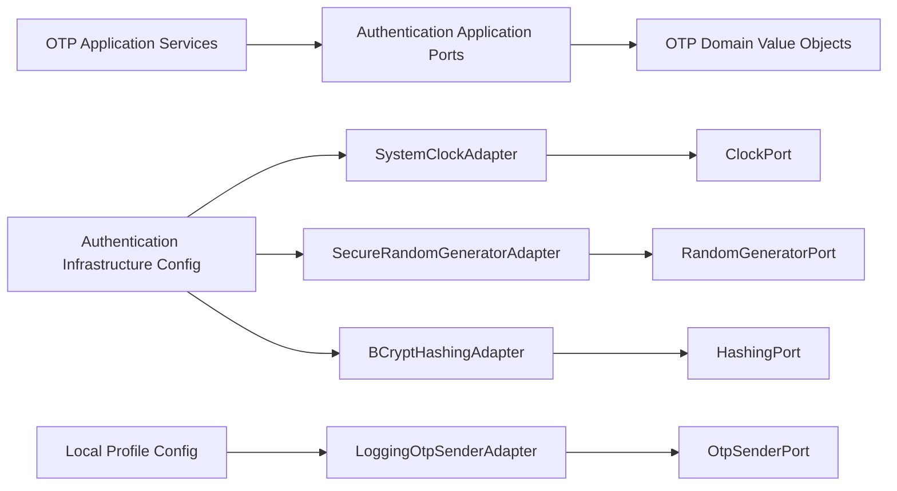

# Authentication Infrastructure

Version: 1.1
Sprint: 8.4, composition amendment by Sprint 8.5
Status: Implemented

## Purpose

Authentication infrastructure supplies production-safe technical implementations for the OTP engine's outbound application ports. It does not change the domain rules described by [Identity Domain](identity-domain.md) or the orchestration described by [OTP Engine](otp-engine.md).

## Architecture



The executable architecture rule permits `infrastructure.auth` to implement only `auth.application.port` contracts. It may use authentication domain value objects required by those signatures, Java, SLF4J, and Spring. Commands, queries, events, application services, use cases, interfaces, and controllers remain forbidden dependencies.

## Adapter Responsibilities

| Adapter | Port | Responsibility |
| --- | --- | --- |
| `SystemClockAdapter` | `ClockPort` | Delegates to an injected `java.time.Clock`; runtime configuration uses UTC. |
| `SecureRandomGeneratorAdapter` | `RandomGeneratorPort` | Uses injected `SecureRandom` and an unbiased bounded draw to produce values from 100000 through 999999. |
| `BCryptHashingAdapter` | `HashingPort` | Produces salted BCrypt hashes and verifies candidates through `BCryptPasswordEncoder`. |
| `LoggingOtpSenderAdapter` | `OtpSenderPort` | Local-only delivery substitute that logs masked destination, generated correlation ID, and UTC timestamp without reading or logging the OTP value. |

All collaborators are required through constructors. No field injection, static mutable credential state, controller dependency, or provider SDK is introduced.

## Configuration

`AuthenticationInfrastructureConfig` creates:

- `Clock.systemUTC()` and `SystemClockAdapter`
- `SecureRandom` and `SecureRandomGeneratorAdapter`
- `BCryptPasswordEncoder` and `BCryptHashingAdapter`

`LocalOtpSenderConfig` is guarded by the `local` profile and creates the logging sender. No sender bean is exposed in `dev` or `prod`, preventing accidental metadata logging from masquerading as real OTP delivery.

Configuration uses the `bachatsetu.authentication` prefix:

| Property | Required value or range | Default |
| --- | --- | --- |
| `otp-validity` | Exactly five minutes | `5m` |
| `resend-limit` | Exactly three | `3` |
| `verify-limit` | Exactly five | `5` |
| `hash-strength` | BCrypt cost from 10 through 16 | `12` |

The first three properties are strongly typed operational declarations and are validated against domain constants. They cannot be used to silently change business policy. Hash strength is configurable with `AUTH_OTP_BCRYPT_STRENGTH` and rejects unsafe or operationally excessive values.

## Security Decisions

- `SecureRandom`, not `Random`, supplies OTP entropy.
- Generated OTPs always contain six digits and never begin with zero.
- BCrypt generates a fresh salt for every hash; equal OTPs do not produce equal persisted values.
- Hash comparison uses `BCryptPasswordEncoder.matches`.
- The local sender validates the ephemeral code reference but never calls `OtpCode.value()`.
- Logs contain only `+91******NNNN`, a random correlation ID, and timestamp.
- Full mobile numbers, OTP codes, and OTP hashes are absent from sender logs.
- BCrypt is introduced through `spring-security-crypto`; no Spring Security filter chain or authentication framework is configured.

## Dependency Graph

```text
infrastructure.auth.adapter
  -> auth.application.port
  -> auth.domain.model (port signature values only)
  -> Java / SLF4J / Spring Security Crypto

infrastructure.auth.config
  -> infrastructure.auth.adapter
  -> Spring configuration and typed property binding
```

There is no dependency on controllers, interfaces, JPA entities, repositories, JWT, or delivery-provider SDKs.

## Testing

- Adapter tests verify deterministic clock delegation, secure six-digit range, random variability, salted BCrypt output, positive/negative hash verification, destination masking, and absence of OTP/mobile plaintext in captured logs.
- Configuration tests verify UTC clock, secure random, BCrypt cost, all port bindings, local sender availability, and nonlocal sender absence.
- Property-binding tests reject changes to fixed business limits and BCrypt costs outside the approved range.
- ArchUnit enforces the narrow application-port dependency and rejects broader application or interface access.
- JaCoCo enforces 100% line coverage for `infrastructure.auth`.

## Known Limitations

- `LoggingOtpSenderAdapter` confirms local generation only; it does not deliver an OTP.
- No SMS, Twilio, Firebase, AWS SNS, email, queue, broker, or scheduled task is included.
- Dev and production intentionally have no `OtpSenderPort` implementation until an approved delivery-provider sprint.
- Application-service composition is provided by the outer REST configuration described in [Authentication REST API](auth-rest-api.md); it activates only when every required outbound port exists.
