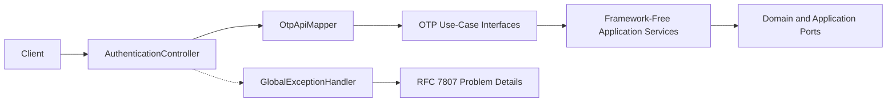
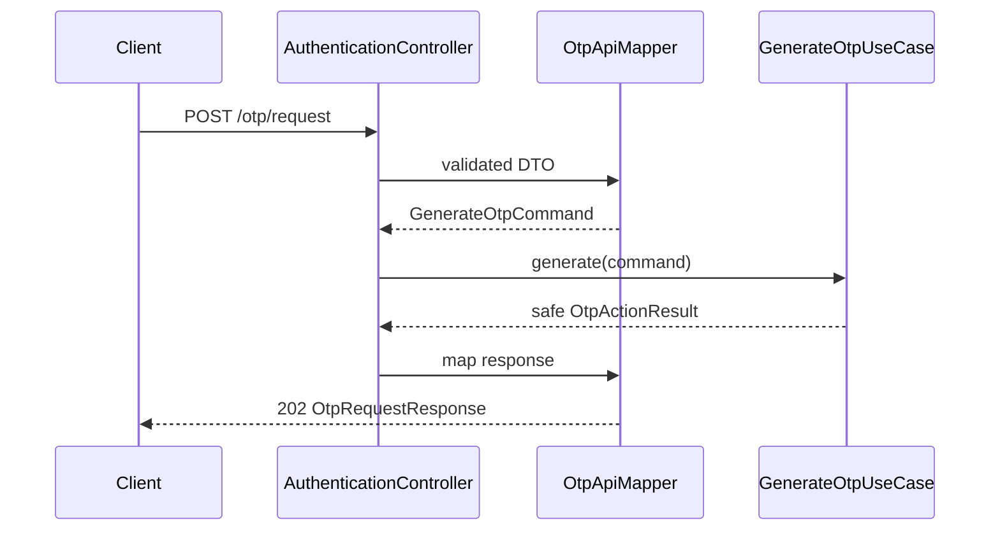
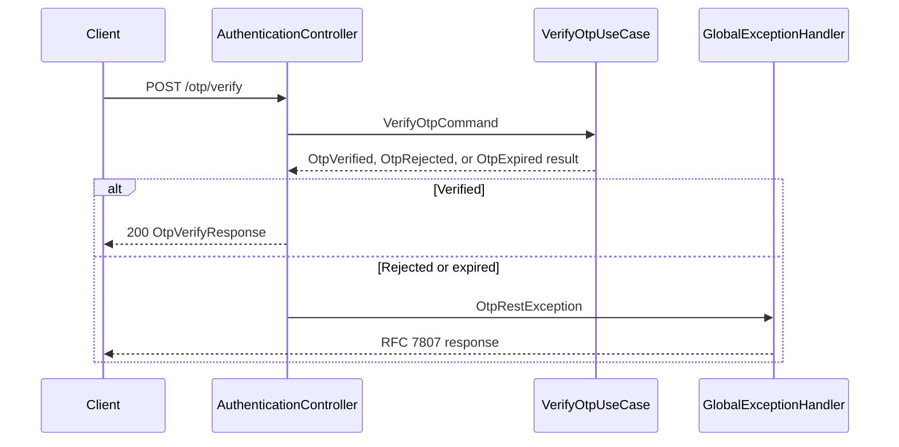

# Authentication REST API

Version: 1.0
Sprint: 8.5
Status: Implemented

## Purpose

This HTTP delivery adapter exposes the framework-free OTP use cases described in [OTP Engine](otp-engine.md). It validates transport input, maps DTOs to application commands, maps safe application results to DTOs, and translates failures to RFC 7807 Problem Details. It does not expose domain models, JPA entities, OTP hashes, or internal events.

## Architecture



Controllers depend on use-case interfaces and API mapping only. `AuthenticationApplicationConfig` is the outer composition root: it creates application services only when the user repository, OTP repository, clock, random generator, hashing, and sender ports are present. `bachatsetu.authentication.rest.enabled` controls controller registration and defaults to `true`.

For unauthenticated OTP commands, the validated `userId` is also used as the audit actor. A later authenticated API may obtain the actor from a trusted security context without changing domain behavior.

## Endpoints

| Method | Path | Success | Request | Response |
| --- | --- | --- | --- | --- |
| POST | `/api/v1/auth/otp/request` | `202 Accepted` | `OtpRequestRequest` | `OtpRequestResponse` |
| POST | `/api/v1/auth/otp/verify` | `200 OK` | `OtpVerifyRequest` | `OtpVerifyResponse` |
| POST | `/api/v1/auth/otp/resend` | `202 Accepted` | `OtpResendRequest` | `OtpRequestResponse` |
| POST | `/api/v1/auth/otp/invalidate` | `200 OK` | `OtpInvalidateRequest` | `OtpRequestResponse` |

OpenAPI JSON is available at `/v3/api-docs`; Swagger UI uses Springdoc's standard `/swagger-ui.html` entry point when enabled by deployment configuration.

## Requests And Responses

Request or resend:

```json
{
  "userId": "123e4567-e89b-12d3-a456-426614174000",
  "purpose": "SIGN_IN"
}
```

Accepted challenge:

```json
{
  "verificationId": "9b7ee98d-4935-4d24-aafa-58048e559f1d",
  "purpose": "SIGN_IN",
  "status": "PENDING",
  "expiresAt": "2026-07-05T10:05:00Z",
  "resendCount": 0
}
```

Verification request and successful response:

```json
{
  "userId": "123e4567-e89b-12d3-a456-426614174000",
  "purpose": "SIGN_IN",
  "code": "482913"
}
```

```json
{
  "verificationId": "9b7ee98d-4935-4d24-aafa-58048e559f1d",
  "status": "VERIFIED",
  "verified": true,
  "verificationAttempts": 1
}
```

Responses never contain an OTP, hash, mobile number, domain event, or persistence representation.

## Validation

| Field | Rules |
| --- | --- |
| `userId` | Required, exactly 36 characters, canonical UUID shape |
| `purpose` | Required; `REGISTRATION`, `SIGN_IN`, `PASSWORD_RESET`, or `MOBILE_CHANGE` |
| `code` | Required for verification; exactly six ASCII digits |
| body | Required JSON and validated with Jakarta Bean Validation |

Malformed JSON and field violations return `400` before a use case is called.

## Error Responses

Every error uses `application/problem+json` with standard `type`, `title`, `status`, `detail`, and `instance` members. Extensions include a stable `code`, UTC `timestamp`, and sorted `violations` for validation failures.

```json
{
  "type": "urn:bachatsetu:problem:otp-invalid",
  "title": "Unprocessable Entity",
  "status": 422,
  "detail": "The supplied OTP is invalid.",
  "instance": "/api/v1/auth/otp/verify",
  "code": "otp-invalid",
  "timestamp": "2026-07-05T10:01:00Z"
}
```

| Condition | Status | Code |
| --- | --- | --- |
| Validation failure or malformed JSON | `400` | `validation-error`, `malformed-request` |
| User or OTP challenge not found | `404` | `user-not-found`, `otp-not-found` |
| Active challenge already exists | `409` | `active-otp-exists` |
| OTP expired | `410` | `otp-expired` |
| OTP does not match | `422` | `otp-invalid` |
| Verification or resend limit reached | `429` | `otp-verification-limit-exceeded`, `otp-resend-limit-exceeded` |
| Unexpected server failure | `500` | `internal-error` |

Unexpected errors are logged with request path and stack trace, while the response hides internal exception details. Request bodies and OTP values are never logged by this layer.

## Sequences





## OpenAPI And Testing

Swagger annotations define summaries, response codes, schemas, and representative validation errors. MockMvc tests cover all four success paths, DTO validation, malformed JSON, every application failure reason, expiry, invalid OTP, attempt exhaustion, and unexpected errors. A full Spring context smoke test validates the generated OpenAPI paths and responses. JaCoCo includes the complete authentication interface package in the enforced 100% per-class coverage set.

## Known Limitations

- No JWT, Spring Security filter chain, login endpoint, refresh-token endpoint, or authorization policy is introduced.
- No distributed IP/device rate limiter exists; aggregate attempt and resend limits remain enforced by the OTP engine.
- Dev and production require an approved `OtpSenderPort` implementation before the application-service composition activates.
- The existing tenant-aware user repository requires a deployment-provided `TenantScopeProvider`; this sprint does not infer tenancy from untrusted request fields.
- OpenAPI endpoint access controls belong to the future security sprint.
