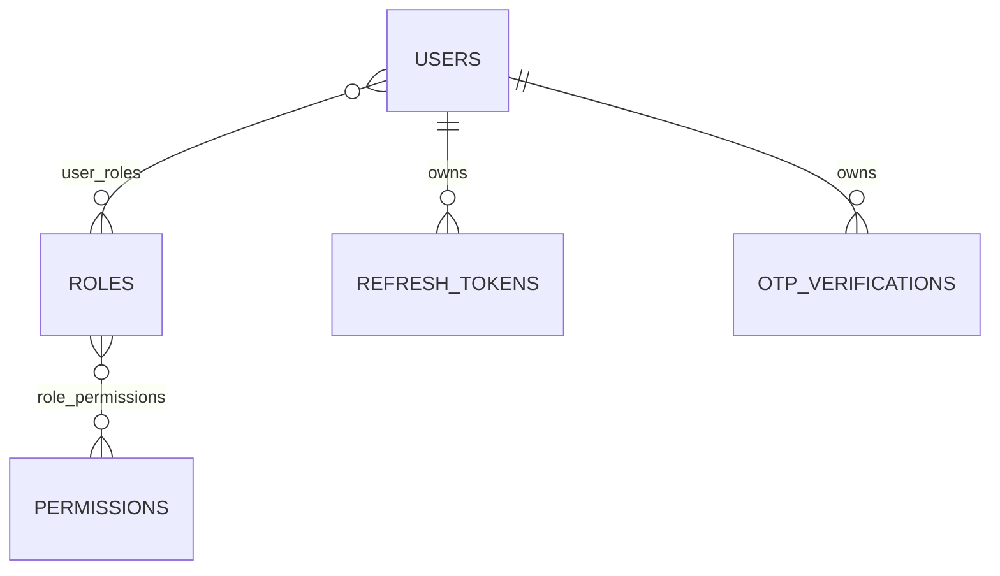

# Identity Persistence

Version: 1.0  
Sprint: 8.2  
Status: Implemented

## Purpose

This layer connects the framework-independent authentication domain to the existing PostgreSQL/JPA persistence boundary. It reuses canonical identity records and adds only authentication state that was absent after Sprint 8.1. Domain behavior remains defined by [Identity Domain](identity-domain.md); shared persistence conventions remain defined by [Repository Layer](../persistence/repository-layer.md) and [Database Migrations](../persistence/database-migrations.md).

## Reused Components

| Component | Authentication use |
| --- | --- |
| `UserJpaEntity` | Canonical user/profile record extended with password hash, authentication status, and role associations |
| `RoleJpaEntity` | Canonical platform or tenant role extended with permission associations |
| `PermissionJpaEntity` | Canonical permission record; database code maps to the lowercase domain name |
| Existing Spring Data repositories | Extended with tenant-aware user lookups and global-role lookup |
| `BaseJpaEntity` | UUID identity, audit metadata, optimistic locking, and soft deletion |
| JPA auditing and MapStruct configuration | Applied without authentication-specific framework policy |

No duplicate user, role, or permission entity, repository, or table is introduced.

## New Components

- `RefreshTokenJpaEntity` persists lifecycle identity, owner, issue/expiry times, and status. It never stores token credential material.
- `OtpVerificationJpaEntity` persists OTP verification state, purpose, owner, expiry, and status.
- Five authentication repository adapters implement ports owned by `auth.domain.port`.
- Authentication-specific MapStruct mappers reconstruct aggregates through event-free `rehydrate(...)` methods.
- `V3__identity_persistence.sql` adds authentication columns, two join tables, and the missing refresh-token and OTP tables.

## Entity Relationships

All associations are lazy. Cascaded removal and orphan removal are intentionally disabled. Foreign keys use `ON DELETE RESTRICT`; lifecycle deletion is explicit and compatible with the shared soft-delete model.

## Mapping Strategy

- `AuthUserJpaMapper` maps only authentication-owned columns and role identifiers. Profile fields remain untouched.
- Authentication user writes require an existing canonical `identity.users` row. The adapter rejects a missing row instead of inventing tenant, name, or language data that the authentication aggregate does not own.
- User lookups and writes are tenant-scoped through `TenantScopeProvider`, preventing cross-tenant access by contact value or UUID.
- Role lookup prefers the current tenant and falls back to a platform role; assigned role identifiers are rejected when they belong to another tenant. Role codes map directly to uppercase domain names, while permission codes map case-insensitively to lowercase domain names.
- Role and permission references are resolved before association writes. Missing or soft-deleted references fail with `PersistenceResourceNotFoundException`.
- Refresh-token and OTP adapters preserve JPA audit, soft-delete, and optimistic-lock state on updates.
- Rehydration restores persisted status, associations, audit metadata, and version with an empty domain-event queue.

## Repository Adapters

| Adapter | Port | Transaction policy |
| --- | --- | --- |
| `AuthUserRepositoryAdapter` | `auth.domain.port.UserRepository` | Read-only default; transactional authentication update |
| `RoleRepositoryAdapter` | `RoleRepository` | Read-only default; transactional association upsert |
| `PermissionRepositoryAdapter` | `PermissionRepository` | Read-only default; transactional upsert |
| `RefreshTokenRepositoryAdapter` | `RefreshTokenRepository` | Read-only default; transactional lifecycle upsert |
| `OtpVerificationRepositoryAdapter` | `OtpVerificationRepository` | Read-only default; transactional lifecycle upsert |

Adapters translate optimistic-lock and integrity failures through the existing persistence exception hierarchy. They contain no authentication workflow or authorization decisions.

## Database Migration

Migration V3 is append-only and leaves V1/V2 unchanged. It:

- Adds nullable `password_hash` and `auth_status` columns so existing profile rows remain valid until enrolled for authentication.
- Creates composite-primary-key join tables for user roles and role permissions.
- Creates lifecycle tables with UUID keys, audit columns, versions, soft-delete checks, expiry checks, enum checks, restrictive foreign keys, and partial operational indexes.
- Does not seed associations or credentials.

## Persistence Rules

- JPA entities never cross the persistence boundary.
- Domain models remain free of Spring, Hibernate, Jakarta Persistence, and MapStruct.
- Raw passwords and refresh-token credentials are never persisted.
- Existing profile ownership and tenancy fields cannot be changed through authentication mappers.
- Every aggregate load excludes soft-deleted root records.
- Optimistic locking is provided by the inherited `@Version` field.

## Testing

- Domain tests verify event-free reconstruction and exact restoration of status, associations, audit metadata, and version.
- Mapper tests verify canonical names, role associations, auth-only user updates, and token/OTP mapping.
- Architecture and repository tests verify adapter-to-port assignment, transaction boundaries, entity placement, lazy associations, and Spring Data query derivation.
- Migration contract tests verify the append-only V3 shape and absence of duplicate canonical identity tables.
- `IdentityPersistencePostgreSqlIntegrationTest` exercises the ports against Flyway-managed PostgreSQL through Testcontainers. It skips when Docker is unavailable, matching the repository's established integration-test policy.

## Known Limitation

The Sprint 8.1 domain must rehydrate an `OtpCode` to perform its constant-time comparison, so V3 stores the six-digit value in the OTP record. Before production credential traffic, the authentication application/infrastructure sprint must introduce a protected OTP representation or transparent encryption with managed key rotation; logging and events already exclude the value. No JWT, Spring Security, credential generation, OTP delivery, or authentication workflow is introduced here.
