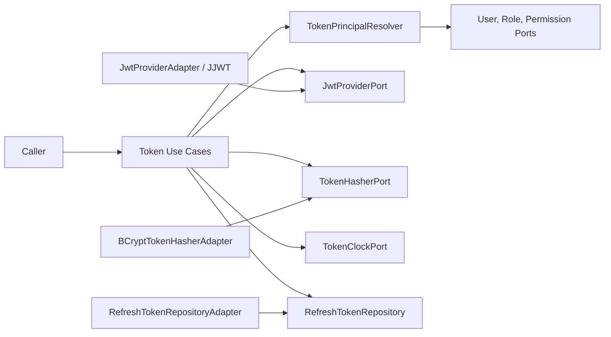
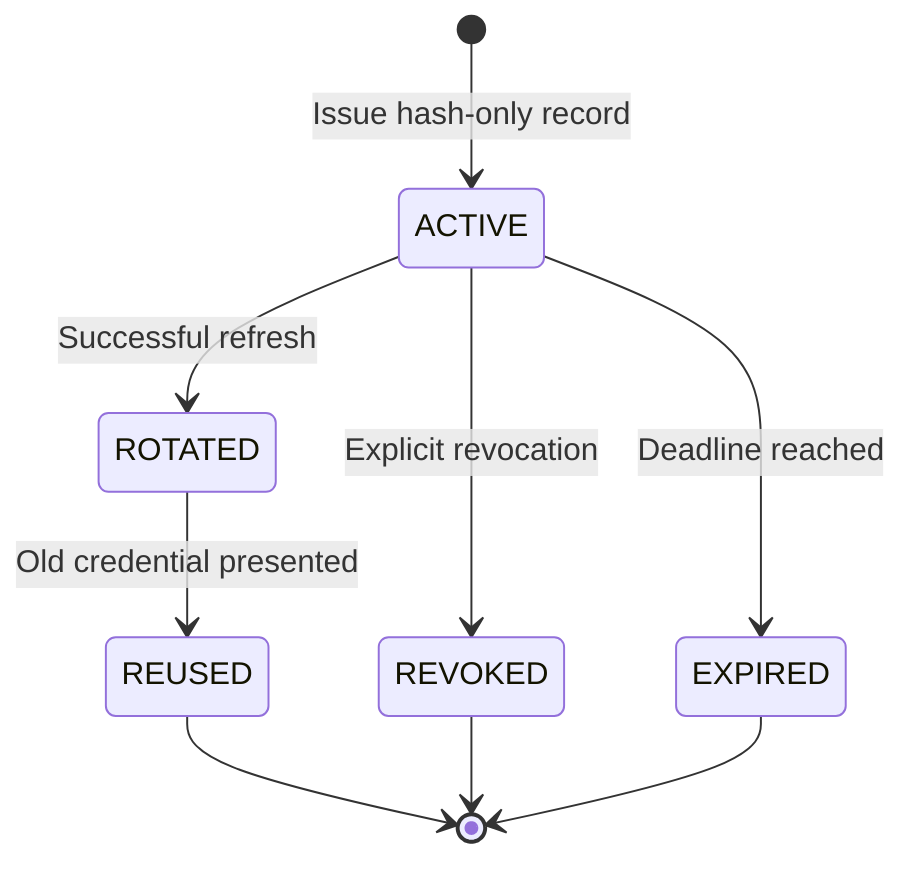
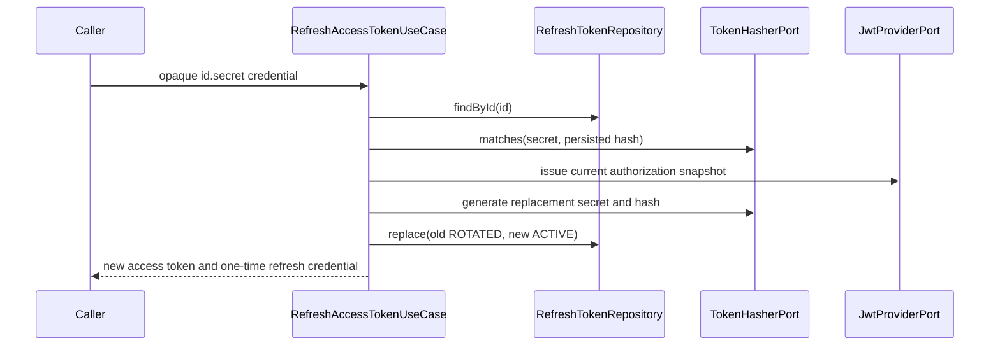

# JWT And Refresh Token Engine

Version: 1.1
Sprint: 8.6, integration amendment by Sprint 8.7
Status: Implemented

## Purpose

The token engine issues and validates short-lived JWT access tokens and manages opaque, rotating refresh credentials. It extends the identity model without changing OTP behavior, adding no REST endpoint, Spring Security filter, or authorization framework.

## Architecture

Application and domain code remain framework independent. `JwtProviderPort` carries trusted claims but contains no algorithm concept, allowing a future asymmetric adapter to replace HS512 without changing use cases. `AuthenticationTokenApplicationConfig` is the outer composition root.

## Use Cases

| Use case | Responsibility |
| --- | --- |
| `GenerateAccessTokenUseCase` | Resolves current user roles/permissions and issues a signed access token. |
| `GenerateRefreshTokenUseCase` | Creates one hash-only refresh record for a user/device session. |
| `RefreshAccessTokenUseCase` | Validates, rotates, and atomically replaces a refresh token, then returns a new pair. |
| `RevokeRefreshTokenUseCase` | Revokes an active refresh token and detects rotated-token presentation. |
| `ValidateAccessTokenUseCase` | Verifies signature, algorithm, issuer, audience, expiry, version, and claim shape. |

## Access Token Claims

| Claim | Value |
| --- | --- |
| `sub` | Authentication `UserId` |
| `mobile_number` | Canonical Indian mobile number |
| `tenant_id` | Tenant aggregate identifier |
| `roles` | Sorted current role names |
| `permissions` | Sorted current permission names |
| `iat`, `exp` | UTC issue and expiry instants |
| `iss`, `aud` | Configured issuer and audience |
| `ver` | Accepted JWT schema version |
| `jti` | Unique access-token identifier |

Role and permission claims are rebuilt from authoritative repositories whenever an access token is issued or refreshed. JJWT parsing accepts only HS512, verifies the configured issuer/audience and signature, and applies bounded clock skew before returning claims.

## Token Lifecycle

### Refresh Flow

Rotation is mandatory. The old row links to the replacement and becomes unusable before the new credential is returned. `replace` is a repository transaction, and PostgreSQL's partial unique index permits only one `ACTIVE` row for each user/session.

## Reuse And Revocation

The refresh value uses `tokenId.randomSecret`. The identifier supports indexed lookup; only a BCrypt hash of the 256-bit random secret is stored. A matching credential presented after rotation changes the old row to `REUSED`, finds the current active row for that session, and revokes or expires it in the same repository operation. Missing identifiers and hash mismatches return the same invalid-token failure to avoid lookup disclosure.

Explicit revocation is idempotent for an already revoked credential. Expired credentials are rejected. Presenting a rotated credential to either refresh or revoke triggers reuse handling.

## Configuration

Token infrastructure is disabled until `AUTH_TOKEN_ENABLED=true` and a secret is supplied.

| Property | Default | Validation |
| --- | --- | --- |
| `access-token-expiry` | `15m` | Positive |
| `refresh-token-expiry` | `30d` | Greater than access expiry |
| `issuer` | `bachatsetu` | Nonblank |
| `audience` | `bachatsetu-api` | Nonblank |
| `signing-secret` | No default | Base64-decoded value of at least 512 bits |
| `clock-skew` | `30s` | Zero through two minutes |
| `hash-strength` | `12` | BCrypt cost 10 through 16 |
| `jwt-version` | `1` | Positive |

Secrets must come from the deployment secret store. Property string rendering redacts the signing secret.

## Security Decisions

- Access JWTs use HS512 and an explicitly restricted parser algorithm registry.
- Refresh values are 256-bit `SecureRandom` secrets encoded with unpadded Base64 URL encoding.
- JWTs, refresh credentials, signing secrets, and hashes are never logged.
- Raw refresh credentials are returned once and are absent from domain events, JPA, Flyway seed data, and exception messages.
- Access and refresh value types redact `toString()` output.
- V5 revokes legacy lifecycle-only rows before adding required hash/session state.
- No token is accepted solely because its payload can be decoded; signature and claims are always validated.

## RS256 Migration Strategy

1. Add an RS256 `JwtProviderPort` adapter backed by private signing and public verification keys from AWS KMS/Secrets Manager.
2. Add a non-sensitive key identifier (`kid`) and key-rotation resolver inside infrastructure.
3. Run dual verification for the HS512 retirement window while issuing RS256 only.
4. Switch adapter composition after the maximum access-token lifetime, then remove HS512 verification and its secret.

Application commands, use cases, claims, refresh persistence, and REST layers remain unchanged because signing is isolated behind `JwtProviderPort`.

## Testing

Tests cover claim generation/extraction, HS512 enforcement, tampering, malformed and unsigned input, issuer/version/claim failures, expiration, clock-skew boundaries, secure random generation, BCrypt matching, refresh issuance, rotation, revocation, reuse detection, stale-session invalidation, property binding, migration contracts, mapper compatibility, and PostgreSQL repository behavior. JaCoCo enforces 100% line coverage for authentication domain, application, interface, and infrastructure classes.

## Known Limitations

- Spring Security consumes validated access tokens through the existing use case as documented in [Spring Security](spring-security.md); no login, logout, or refresh REST endpoint is included.
- HS512 uses one symmetric deployment secret; the RS256 migration above is required before independent verification services receive keys.
- Session/device attestation and distributed token revocation caching are not included.
- Access JWT revocation is bounded by the configured short expiry; refresh revocation is immediate in PostgreSQL.
- Token infrastructure remains disabled until production secret and deployment properties are supplied.
