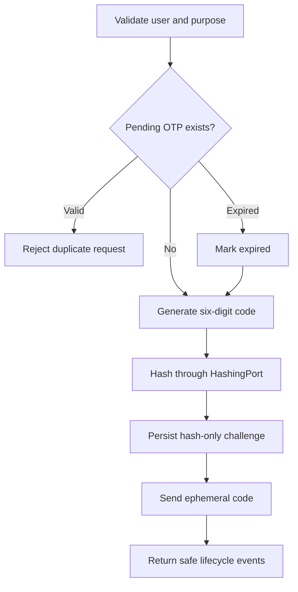
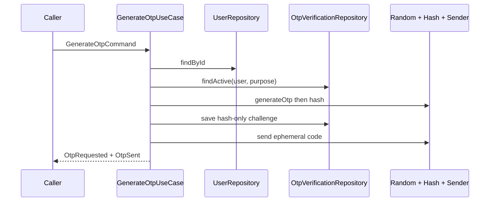
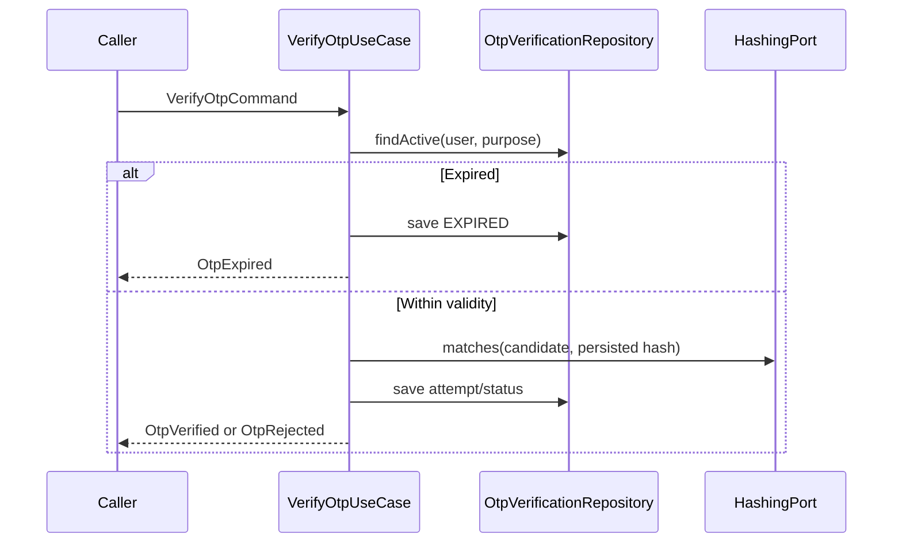

# OTP Authentication Engine

Version: 1.1
Sprint: 8.3, infrastructure amendment by Sprint 8.4
Status: Implemented

## Purpose

The OTP engine coordinates generation, secure hashing, delivery, verification, resend, expiration, and invalidation without exposing REST APIs or depending on Spring. Aggregate details are defined in [Identity Domain](identity-domain.md), while hash persistence and database constraints are defined in [Identity Persistence](identity-persistence.md).

## Architecture

```text
Caller
  -> OTP use-case interface
    -> framework-free application service
      -> user and OTP domain repository ports
      -> OtpPolicyService and OtpVerification aggregate
      -> ClockPort / RandomGeneratorPort / HashingPort / OtpSenderPort
```

Commands enter through `GenerateOtpUseCase`, `VerifyOtpUseCase`, `ResendOtpUseCase`, and `InvalidateOtpUseCase`. Safe `OtpActionResult` projections return lifecycle state and application events, never codes or hashes. Application services remain plain Java; Sprint 8.4 configures their outbound adapter dependencies without annotating the use cases.

## Flow



## Business Rules

| Rule | Enforcement |
| --- | --- |
| Code format | `OtpCode` accepts exactly six digits |
| Validity | `OtpPolicyService.VALIDITY` is exactly five minutes |
| Expiry | Every generate, verify, and resend decision evaluates the port-supplied current time |
| Verification attempts | Each mismatch increments the counter; attempt five changes status to `FAILED` |
| Resends | A chain permits three replacements; the fourth request is rejected |
| Replacement | The previous OTP becomes `INVALIDATED`, or `EXPIRED` when its deadline has passed |
| Successful verification | Status becomes terminal `VERIFIED` immediately |
| Active uniqueness | Repository lookup plus a PostgreSQL unique partial index allows one `PENDING` row per user/purpose |
| User validation | Every command requires an existing authentication user with a validated domain mobile number |

## Generate Sequence



## Verify Sequence



## Retry And Resend

- Verification failures one through four retain `PENDING` and return `OtpRejected(INVALID_CODE)`.
- Failure five changes the aggregate to `FAILED` and returns `OtpRejected(ATTEMPT_LIMIT)`.
- Resend creates a fresh identifier, code, hash, five-minute deadline, and zero verification attempts.
- The resend count is inherited and incremented; it cannot exceed three.
- `replace(current, replacement)` is one repository operation so the old state and new hash are persisted atomically.

## Application Events

`OtpRequested`, `OtpSent`, `OtpVerified`, `OtpExpired`, `OtpRejected`, and `OtpResent` contain identifiers, purpose, reason where applicable, and time only. They are returned with the use-case result for a future delivery boundary; this sprint does not publish them to a broker.

## Security Decisions

- Plain OTPs exist only as redacting `OtpCode` instances between random generation, hashing, sender invocation, and candidate verification.
- The aggregate, JPA entity, repository, database, result projections, and events retain no plain OTP.
- V4 hashes legacy V3 values with bcrypt through `pgcrypto` before removing `otp_code`.
- Hash comparison is delegated to `HashingPort`; production adapters must use a password-grade, timing-safe implementation and calibrated work factor.
- No OTP or hash is logged. No logger exists in the engine.
- Mobile validation remains centralized in the existing Indian `MobileNumber` value object.

## Testing

Unit tests cover generation, duplicate-active rejection, expiration boundaries, successful verification, all five failed attempts, three-resend enforcement, replacement before/after expiry, explicit invalidation, missing users/challenges, safe result events, hash-only persistence shape, and fixed five-minute policy. JaCoCo enforces 100% line coverage for authentication domain and application packages.

## Known Limitations

- System-clock, secure-random, BCrypt, and local metadata-only sender adapters are documented in [Authentication Infrastructure](auth-infrastructure.md).
- No SMS, email, or push delivery provider is included.
- Delivery is synchronous after persistence. A later infrastructure sprint should add transactional outbox delivery and provider failure recovery.
- Expiration is enforced whenever an OTP command is handled; no background cleanup scheduler is introduced.
- No REST API, Spring Security, JWT, rate limiter, or runtime dependency wiring is included.
