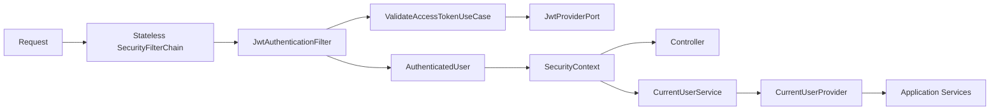
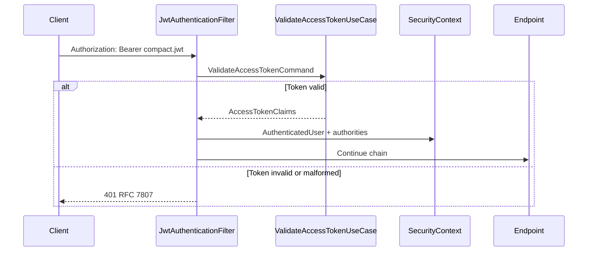

# Spring Security Integration

Version: 1.0
Sprint: 8.7
Status: Implemented

## Purpose

Spring Security now protects the HTTP boundary and exposes validated JWT identity to application services. It reuses `ValidateAccessTokenUseCase` from [JWT Authentication](jwt-authentication.md) and adds no authentication business logic, token parsing, repository access, login workflow, or permission policy.

## Architecture



`AuthenticatedUser` and `CurrentUserProvider` belong to the framework-independent application boundary. `CurrentUserService` is the Spring adapter. Security configuration depends on application use cases; application and domain code do not depend on Spring Security.

## Filter Flow



The filter performs transport work only:

- reads the configured header;
- validates the configured, case-insensitive bearer prefix;
- calls the existing validation use case;
- maps trusted claims to an immutable principal and Spring authorities;
- creates a fresh `SecurityContext` for the request;
- delegates invalid credentials to the configured entry point.

It never parses JWTs, evaluates domain permissions, accesses repositories, logs credentials, or refreshes tokens.

## Authentication Principal

`AuthenticatedUser` contains:

- `UserId`
- canonical Indian mobile number
- tenant aggregate identifier
- immutable role names
- immutable permission names

Roles become Spring authorities with the `ROLE_` prefix, such as `ROLE_GROUP_MEMBER`. Permission names remain canonical authorities such as `group.read`. These authorities enable Spring's standard method annotations but do not define BachatSetu business authorization rules.

`CurrentUserProvider.currentUser()` returns an optional identity. `requireCurrentUser()` fails when no authenticated principal exists. Application services consume this port rather than reading `SecurityContextHolder` directly.

## SecurityContext Lifecycle

The filter chain uses `SessionCreationPolicy.STATELESS`. Each valid bearer request receives a new `SecurityContext`; no HTTP session stores authentication, and no session cookie is created. Spring clears request security state after the chain completes, preventing thread reuse from leaking identity.

CSRF is disabled because authentication is stateless and bearer credentials are supplied explicitly in a request header. This does not authorize browser origins; CORS remains a separate configurable policy.

## Public Endpoints

The default permit list is:

| Pattern | Purpose |
| --- | --- |
| `/actuator/health` | Orchestrator and load-balancer health checks |
| `/v3/api-docs/**` | OpenAPI document |
| `/swagger-ui/**` | Swagger UI assets |
| `/swagger-ui.html` | Swagger UI entry point |
| `/api/v1/auth/**` | Authentication bootstrap APIs |

CORS preflight `OPTIONS` requests are permitted. Public routes remain available without a token. When a bearer header is supplied, it is still validated so malformed credentials cannot silently establish an ambiguous request state.

## Protected Endpoints

Every route not on the configured public list requires authentication. Missing or invalid credentials return:

```json
{
  "type": "urn:bachatsetu:problem:authentication-required",
  "title": "Authentication required",
  "status": 401,
  "detail": "A valid bearer access token is required.",
  "instance": "/protected-resource",
  "code": "authentication-required",
  "timestamp": "2026-07-06T00:00:00Z"
}
```

An authenticated request denied by Spring method or request authorization receives the corresponding `403` `access-denied` Problem Detail. Handler responses never expose token values, validation failure details, or stack traces.

## Method Security

`@EnableMethodSecurity(prePostEnabled = true)` activates `@PreAuthorize` and `@PostAuthorize`. Sprint 8.7 verifies that standard role and authority expressions work, but production business methods receive no authorization annotations or custom evaluators yet.

Sprint 8.8 owns:

- domain-specific RBAC rules;
- permission-to-operation mapping;
- tenant/resource ownership checks;
- custom authorization managers or permission evaluators;
- policy tests for organizer, member, administrator, and auditor behavior.

## Configuration

Configuration uses `bachatsetu.authentication.security`:

| Property | Default | Validation |
| --- | --- | --- |
| `header-name` | `Authorization` | Valid HTTP header-name characters |
| `bearer-prefix` | `Bearer ` | Nonblank and whitespace terminated |
| `clock-skew` | `30s` | Zero through two minutes; shares `AUTH_JWT_CLOCK_SKEW` with token validation |
| `password-hash-strength` | `12` | BCrypt cost 10 through 16 |
| `public-endpoints` | Listed above | Nonempty absolute route patterns |
| `cors.allowed-origins` | `http://localhost:3000` | Nonempty; wildcard forbidden with credentials |
| `cors.allowed-methods` | Common REST verbs and `OPTIONS` | Nonempty |
| `cors.allowed-headers` | Authorization and standard API headers | Nonempty |
| `cors.exposed-headers` | `X-Request-ID` | May be empty |
| `cors.allow-credentials` | `false` | Explicit deployment choice |
| `cors.max-age` | `1h` | Nonnegative |

`SecurityBeansConfiguration` creates the generic BCrypt `PasswordEncoder`, `AuthenticationManager`, UTC security clock, current-user adapter, and JWT filter. `SecurityExceptionConfiguration` owns RFC 7807 writers and handlers. `SecurityConfiguration` owns the filter chain, stateless policy, route policy, CORS, CSRF setting, and method-security activation.

## Testing

Tests cover:

- header absence, malformed schemes, empty bearer values, unavailable validation, invalid JWTs, and invalid claims;
- principal construction, role/permission authorities, existing-context preservation, and context clearing;
- current-user presence, absence, unauthenticated tokens, and foreign principal types;
- direct `401` and `403` RFC 7807 serialization;
- public authentication routes and protected routes;
- stateless GET and POST behavior with CSRF disabled;
- CORS preflight responses;
- `@PreAuthorize` and `@PostAuthorize` allow/deny paths;
- properties, password encoder, authentication manager, CORS source, and bean composition.

JaCoCo enforces 100% line coverage for application security contracts and every class under `in.bachatsetu.backend.security`.

## Known Limitations

- No login, logout, refresh-token REST endpoint, OAuth2, social login, API key, MFA, or external identity provider is included.
- No business permission evaluation, ownership policy, or custom authorization rule is implemented before Sprint 8.8.
- No distributed rate limiting or token-revocation cache is included.
- Swagger and OpenAPI are public by current sprint requirement; production exposure should be reassessed with deployment policy.
- CORS defaults permit only the local React development origin and must be explicitly configured for deployed clients.
