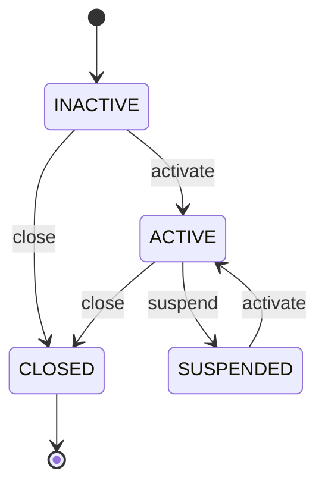

# Savings Group Domain

Version: 1.0  
Sprint: 9.1  
Status: Implemented  
Last Updated: 2026-07-06

## Purpose

The Savings Group bounded context models the rules for creating and governing a Bhishi committee. It is a pure Java domain model: it has no Spring, Jakarta Persistence, transport, database, or infrastructure dependencies.

## Aggregate Design

`SavingsGroup` is the aggregate root and consistency boundary. All lifecycle and membership changes pass through it. The aggregate owns:

- Group identity, tenant identity, owner, code, name, and description.
- Monthly contribution and maximum-member constraints.
- Current lifecycle status.
- Current and removed membership history.
- Pending domain events.
- Audit timestamps and optimistic-lock version inherited from the shared aggregate base.

The aggregate never exposes its mutable membership collection. `members()` returns an immutable snapshot.

## Group Member Entity

`GroupMember` is identified by the member's aggregate identifier. It records join and optional removal timestamps. Removal produces a new immutable entity state, allowing the aggregate to retain membership history and prevent the same member from joining twice.

The owner is inserted as the first active member during group creation and cannot be removed.

## Value Objects

| Value object | Responsibility |
| --- | --- |
| `GroupId` | Strongly typed aggregate identity. |
| `GroupName` | Required, trimmed name containing 3 to 100 characters. |
| `GroupDescription` | Trimmed owner-provided description; an empty description is supported. |
| `ContributionAmount` | Positive INR amount no greater than INR 100,000. |
| `MaximumMembers` | Capacity from 2 through 500 members. |
| `MemberCount` | Non-negative count of active members. |
| `OwnerId` | Strongly typed owner identity. |
| `GroupCode` | Uppercase, normalized human-facing code. |
| `CreatedAt` | Immutable creation or joining timestamp. |
| `UpdatedAt` | Immutable latest-change or removal timestamp. |

`GroupStatus` is the lifecycle enum and contains only `INACTIVE`, `ACTIVE`, `SUSPENDED`, and `CLOSED` behavior states.

## State Machine

New groups begin as `INACTIVE`. The owner is enrolled before the creation event is emitted.



`CLOSED` is terminal. Any transition not shown above raises `InvalidGroupStateException`.

## Business Rules

1. A group has exactly one non-null owner.
2. The owner automatically becomes the first active member.
3. Contributions are monthly, positive, INR-denominated, and capped at INR 100,000.
4. Maximum membership is between 2 and 500.
5. Only an `ACTIVE` group accepts new members.
6. Joining cannot exceed maximum membership.
7. A member identifier can occur only once in membership history, including after removal.
8. The owner cannot be removed.
9. A `CLOSED` group cannot add or remove members and cannot reopen.
10. Membership and status mutations update audit metadata and aggregate version.
11. Rehydration validates all invariants and emits no domain events.

## Domain Events

| Event | Trigger |
| --- | --- |
| `SavingsGroupCreated` | An inactive group is created with its owner enrolled. |
| `MemberJoined` | A unique member joins an active group. |
| `MemberRemoved` | A non-owner active member is removed. |
| `GroupActivated` | An inactive or suspended group becomes active. |
| `GroupSuspended` | An active group becomes suspended. |
| `GroupClosed` | An active or inactive group is permanently closed. |

Events carry identifiers and timestamps only. They do not expose mutable aggregate state.

## Factories And Services

`SavingsGroupFactory` creates aggregate identifiers, delegates human-facing code creation to `GroupCodeGenerator`, validates creation rules through `GroupValidationService`, and invokes the aggregate constructor.

`GroupValidationService` validates monthly configuration and reconstructed membership consistency. It remains stateless and framework-independent. The aggregate still enforces operation-specific invariants; the service does not turn the model into an anemic data container.

## Usage Example

```text
Create group -> INACTIVE with owner member
Activate group -> ACTIVE
Join unique members until capacity
Optionally remove non-owner members
Suspend and reactivate when operationally required
Close group -> terminal CLOSED state
```

## Reconstruction

`SavingsGroup.rehydrate(...)` restores status, membership history, audit information, and version without publishing creation or lifecycle events. The existing constructor used by the persistence mapper is retained as an event-free compatibility boundary for this domain-only sprint.

## Future Extensions

- Invitation and approval lifecycle for prospective members.
- Member roles beyond owner and participant.
- Group configuration for fixed-order, draw, and auction payout policies.
- Explicit group-code uniqueness reservation through an application port.
- Persistence mapping for description and complete membership history.
- Domain policies for contribution-cycle commencement and closure eligibility.

These extensions require separate sprints and must not weaken the aggregate invariants defined here.

## Persistence Follow-Up

Sprint 9.1 intentionally does not modify persistence or Flyway. The existing database status constraint still reflects the earlier lifecycle vocabulary and does not yet accept `INACTIVE` or `CLOSED`. A future persistence migration must align that constraint and map the new description and membership-history representation before this aggregate is written through JPA.
