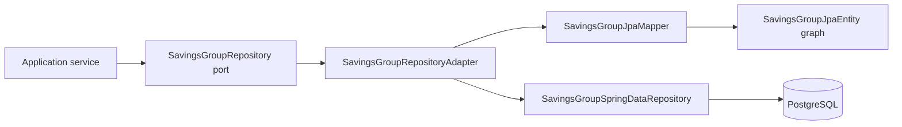

# Savings Group Persistence

Version: 1.1  
Sprint: 9.3, pagination amended by Sprint 9.7  
Status: Implemented  
Last Updated: 2026-07-07

## Purpose

This persistence infrastructure implements the outbound repository contract described by the [Savings Group application layer](../application/savings-group-application.md). It maps the aggregate defined in [Savings Group domain](../domain/savings-group-domain.md) to PostgreSQL without moving business behavior into JPA entities.

## Architecture



The adapter implements both the current application output port and the earlier domain repository port. The latter remains temporarily supported so existing infrastructure callers continue to compile while the application port becomes canonical.

## Entity Design

### SavingsGroupJpaEntity

`SavingsGroupJpaEntity` is the canonical mapping for `community.groups`. It stores:

- Tenant, owner, code, name, and description.
- Lifecycle status and group type.
- Contribution schedule and amount.
- Member-capacity and payout configuration.
- Audit, optimistic-lock, and soft-delete state inherited from `BaseJpaEntity`.

It owns the persistence relationship to group members with persist and merge cascading. Physical cascade deletion is deliberately disabled.

### GroupMemberJpaEntity

`GroupMemberJpaEntity` maps `community.group_members`. It retains compatibility columns used by the broader community persistence model while representing aggregate membership through:

- Group and user references.
- Stable deterministic persistence identity.
- Join and removal timestamps.
- Owner/member role and active/removed status.
- Membership-history entries.

The deterministic row identifier is derived from group ID and member ID. This keeps updates stable even though the domain entity intentionally has no separate persistence identifier.

### MembershipHistoryJpaEntity

`MembershipHistoryJpaEntity` maps `community.membership_history`. Each membership may contain one `JOINED` and one `REMOVED` record. A unique constraint on membership and event type prevents duplicate lifecycle facts.

History rows use deterministic identifiers and are never physically removed by aggregate synchronization. Existing `group_members` rows are backfilled by `V6`.

## Repository Design

`SavingsGroupSpringDataRepository` provides:

- Tenant-scoped lookup by group ID.
- Tenant-scoped lookup and existence checking by code.
- Database-paginated, sortable, optionally status-filtered tenant listing.
- Legacy identifier lookup.
- Version-incrementing soft deletion.

Entity graphs load the owner, memberships, and member users for aggregate reconstruction while leaving unrelated cycles, installments, draws, and payments lazy.

`SavingsGroupRepositoryAdapter` translates between repository ports and Spring Data. Writes pass through the existing persistence exception translator. Read methods always exclude soft-deleted groups.

## Pagination (Sprint 9.7)

`findPage` replaced the earlier unpaged `findAll`. `SavingsGroupSpringDataRepository.findPageByTenantIdAndOptionalStatus`
is an explicit `@Query` (combined with the same `@EntityGraph` used by every other aggregate-loading
query) rather than a derived method, because the optional status filter needs a single
`(:status IS NULL OR groupEntity.status = :status)` predicate instead of two near-duplicate derived
queries. `RepositoryQueryDerivationTest` skips `@Query`-annotated methods, so this method is verified
by `SavingsGroupPersistencePostgreSqlIntegrationTest` against a real database instead.

`SavingsGroupRepositoryAdapter` is the only class that knows Spring Data's `Pageable`/`Sort`/`Page`
exist: it builds a `Pageable` from the framework-free `GroupPageRequest` (documented in
[Savings Group Application Layer](../application/savings-group-application.md)), maps
`GroupSortField.NAME`/`CREATED_AT` to the JPA entity properties `name`/`createdAt`, and converts the
returned Spring Data `Page<SavingsGroupJpaEntity>` back into the framework-free `GroupPage<SavingsGroup>`
using the existing `SavingsGroupJpaMapper`. Neither the application layer nor the domain model
references Spring Data pagination types.

Sorting relies on `idx_groups_tenant_active_created (tenant_id, created_at, id)` for the default
`createdAt` sort and `idx_groups_tenant_status (tenant_id, status)` for the status filter, both from
existing migrations. Sorting by `name` does not yet have a dedicated index; tenant-scoped group counts
are expected to remain small enough that this is acceptable until a future sprint proves otherwise.

## Mapping And Rehydration

`SavingsGroupJpaMapper` maps in both directions:

```text
SavingsGroup -> SavingsGroupJpaEntity -> group_members -> membership_history
SavingsGroupJpaEntity graph -> SavingsGroup.rehydrate(...)
```

Rehydration calls `SavingsGroup.rehydrate(...)`, restoring:

- Aggregate identity and tenant.
- Owner and all membership states.
- Description and group rules.
- Lifecycle status.
- Audit metadata and domain version.

Rehydration emits no domain events. Persistence history is reconstructed from member timestamps rather than replayed as domain behavior.

For updates, the mapper synchronizes managed entities by deterministic identity. Existing JPA audit and version state remains attached to managed rows.

## Optimistic Locking

All three persistence entities inherit a `@Version` column. Before updating a group, the adapter requires the mutated domain version to be exactly one revision ahead of the persisted version. This detects stale aggregate instances before applying state.

Hibernate then performs the database-level version check during flush. Soft deletion increments the group version atomically.

## Soft Delete

Groups use inherited `is_deleted`, `deleted_at`, and `deleted_by` columns. Repository reads filter on `is_deleted = false`. Deletion performs an update rather than physical removal and increments the optimistic-lock version.

The active group-code unique index excludes deleted rows, allowing a code to be reused only after its previous group is soft deleted.

## Migration V6

`V6__savings_group_schema.sql` evolves the canonical tables created by `V1`; it does not create duplicate group tables.

The migration:

- Adds group descriptions.
- Aligns group names with the 100-character domain limit.
- Converts legacy lifecycle values to `INACTIVE` or `CLOSED`.
- Enforces the four-state lifecycle and 500-member limit.
- Replaces code uniqueness with a soft-delete-aware partial unique index.
- Creates and backfills `community.membership_history`.
- Adds tenant, group, member, status, and time-oriented indexes.

## Indexes

| Index | Purpose |
| --- | --- |
| `uk_groups_tenant_code` | Active group-code uniqueness within a tenant. |
| `idx_groups_tenant_status` | Tenant dashboard filtering by lifecycle state. |
| `idx_groups_tenant_active_created` | Ordered active group listing. |
| `idx_group_members_group_active_joined` | Aggregate membership loading. |
| `idx_group_members_user_status` | User membership lookup. |
| `idx_membership_history_group_time` | Group history timeline. |
| `idx_membership_history_member_time` | Member history timeline. |
| `idx_membership_history_tenant_event` | Tenant event reporting and archival. |

## Transaction Boundaries

Application services remain the use-case transaction owners. Adapter write annotations provide the Spring transaction implementation boundary and safely join an existing application transaction when one is present.

## Testing

The persistence suite includes:

- Bidirectional mapper and event-free rehydration tests.
- Repository adapter tests for every port operation.
- Stale-version and soft-delete tests.
- Hibernate metadata and Spring Data query validation.
- Migration contract validation.
- PostgreSQL Testcontainers coverage for migration, history persistence, rehydration, optimistic locking, and soft deletion.
- PostgreSQL Testcontainers coverage for real database-level pagination, sorting by name and by
  creation time, and status filtering (Sprint 9.7).

## Operational Limitations

Event publication and an outbox are outside this persistence sprint. Sorting by group name has no
dedicated index yet; see [Pagination](#pagination-sprint-97) above.
